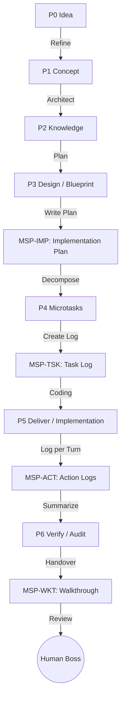

# FRAMEWORK_MASTER_SPEC.md

> **Universal Multi-Agent Framework Boilerplate**
> สถาปัตยกรรมตั้งต้น (Meta-Architecture) สำหรับโปรเจกต์ที่ขับเคลื่อนด้วย Multi-Agent + Doc-Before-Code
> สกัดจาก GKS v3 — ลบ business logic ออกทั้งหมด คงไว้เฉพาะ "กฎของระบบ" ที่ใช้ซ้ำได้กับทุกโปรเจกต์
>
> **Version:** 1.3.0 (Master Block — 3-tier knowledge model loader)
> **License intent:** Boilerplate — fork แล้วแทนที่ `YourProject` / `ExampleFeature` ได้ทันที
> **สถานะ:** ACTIVE — Master Reference สำหรับแตกออกเป็น Atomic (ADR / Protocol) ต่อไป
> **Last updated:** 2026-05-09 — added Master Block (§3.6: 3-tier knowledge model + `msp:master compose` loader)

> 📌 **Companion document (exploratory):** [`SPEC--ARCHITECTURE-V2.md`](./SPEC--ARCHITECTURE-V2.md) — alternate cognitive-concerns framing (`msp_observe` hot-path extraction, MSP-only MCP layer, named-project registry). Status `🟡 draft, pending review`. **This doc (CORE_FRAMEWORK) remains the active master**; SPEC v2 is sibling exploration not yet adopted.

---

## 0. วิธีใช้เอกสารนี้ (How to use)

ไฟล์นี้คือ **คู่มือตั้งต้น (Master Reference)** ไม่ใช่เอกสารสำหรับรัน
ใช้ขั้นตอนดังนี้เพื่อเริ่มโปรเจกต์ใหม่:

1. อ่านทั้งไฟล์ตั้งแต่ §1 – §13
2. แตกแต่ละ section ออกเป็น Atomic Notes เพื่อจัดเก็บตาม Type:
   - §3 – §4 → `gks/frameworks/FRAME--gks-v3-architecture.md`
   - §5 → `PROTO--agent-protocol.md`
   - §6 → `ADR--doc-to-code-workflow.md`
   - §7 → `ADR--msp-gatekeeper.md`
   - §8 → `PROTO--microtask-codegen.md`
   - §9 → `ADR--component-size-limit.md`, `ADR--changelog-sliding-window.md`
   - §10 → `ADR--multi-agent-branch-strategy.md`
   - §11 → `PROTO--id-naming.md`
3. แทนที่ placeholder ทั้งหมด:
   - `YourProject` → ชื่อโปรเจกต์จริง
   - `YRP` → Project codename (2–4 ตัวพิมพ์ใหญ่)
   - `ExampleFeature` → ชื่อฟีเจอร์แรกที่จะลอง
   - path `D:\yourproject` / `D--yourproject` → path จริงของคุณ
4. Git init → commit baseline → เริ่ม Phase 1

**กฎเหล็ก:** ไฟล์นี้ไม่มี business logic. ถ้าคุณเจอคำที่ดูเหมือน domain ใดโดยเฉพาะ (POS/CRM/payment/user) ให้ถือว่าเป็น bug แล้วลบทิ้ง

---

## 1. วิสัยทัศน์ (Vision)

สถาปัตยกรรมนี้มองการพัฒนาโปรเจกต์ใดก็ตามว่าเป็น **"สายพานการผลิตข้อมูล" (Information Assembly Line)** ที่แปลง:

```
Human Concept  →  Atomic Knowledge  →  Technical Blueprint  →  Code
 (คลุมเครือ)     (โครงสร้างชัด)       (แห้ง/ไร้น้ำ)         (รันได้)
```

เพื่อให้ AI แต่ละระดับทำงานในจุดที่ตัวเองเก่งที่สุด:

- **Large LLM (Opus/Gemini Pro)** ออกแบบสถาปัตยกรรม / ตัดสินใจ
- **Medium LLM (Sonnet/Flash)** แปลงเอกสาร / composer / validator
- **Small Local SLM (Qwen/Llama 4–14B)** เขียนโค้ดระดับ micro-task

ผลลัพธ์: **ประหยัด token, ลด hallucination, ทำงานแบบ parallel ได้**

**หลักการแกนกลาง:** *Context Isolation → High Precision + Low Cost*

---

## 2. ศัพท์กลาง (Vocabulary)

| คำ | ความหมาย | ตัวอย่าง |
|---|---|---|
| **YourProject** | ชื่อโปรเจกต์ตัวจริง | placeholder เท่านั้น |
| **YRP** | codename 2–4 ตัว uppercase — prefix ของทุก ID | `YRP` |
| **ExampleFeature** | ฟีเจอร์ตัวอย่าง — ห้ามใช้ใน production | placeholder |
| **GKS** | Genesis/Global Knowledge System — "สมอง" ของโปรเจกต์ | `gks/` |
| **MSP** | Memory & Soul Passport — gatekeeper ที่ validate ทุกสิ่งก่อนเข้า GKS | `msp/`, `.brain/msp/` |
| **SSOT** | Single Source of Truth — ข้อมูลมีจริง 1 ที่เท่านั้น | โฟลเดอร์ Type ย่อยใน `gks/` |
| **Atomic Note** | ความรู้หน่วยเล็กสุด 1 เรื่อง 1 ไฟล์ — มี frontmatter | `ADR--xxx.md`, `FLOW--yyy.md` |
| **Blueprint** | YAML คำสั่งงานทางเทคนิค — ไร้น้ำ ไว้ให้ SLM อ่าน | `gks/blueprints/BLUEPRINT--FEAT-NNN.yaml` |
| **Micro-task** | 1 concern 1 ไฟล์ YAML — หน่วยย่อยสุดของ codegen | `gks/microtasks/FEAT-NNN/T*.task.yaml` |
| **Tier (T1/T2/T3)** | ระดับของ agent ตาม responsibility | T3=Architect, T2=Implementer, T1=Executor |

---

## 3. The Five Pillars (5 เสาหลักของระบบ)

ระบบแยก concern เป็น 5 layer เพื่อความปลอดภัย + scalable กับหลาย agent:

### 🤖 3.1 Agent Layer — คนทำงาน
Agent แต่ละตัวมี identity และ scratchpad ของตัวเอง
- **Worker isolation:** อยู่คนละ directory ใน home folder
- **Short-term memory:** scratchpad สำหรับ session ปัจจุบัน
- **ตัวอย่างโครง:** `~/.claude/`, `~/.gemini/`, `~/.eva/` (ไม่บังคับชื่อ — ขึ้นกับ tool)

### 🛡️ 3.2 Manager — MSP (`.brain/msp/`)
**Gatekeeper** ของความรู้ระยะยาว ทุกอย่างที่จะเข้า GKS ต้องผ่าน MSP ก่อน
- **Validation:** เช็ค schema + forbidden fields + link integrity + atom contradiction (Layer 0 human rule + supersession enforcement)
- **Write paths to canon (`gks/<type>/`):**
  - **Candidates layer (current):** runtime agent ใช้ `msp_candidate` MCP tool → `.brain/msp/projects/<ns>/candidates/<TYPE>--<SLUG>.md`. Promotion to canon = human PR + CI (no CLI auto-promote).
- **Contract file:** `.brain/msp/LLM_Contract/atomic_contract.yaml`

### 📚 3.3 Storage — GKS (`gks/`)
คลังความรู้ระยะยาว (SSOT) — แบ่ง 3 Phase Vault (ดู §4)

### 👁️ 3.4 Viewer — Obsidian (`.obsidian/`)
GUI และ API สำหรับ agent อ่านเขียน
- Agent อ่าน GKS ผ่าน Obsidian REST/MCP เพื่อป้องกัน hallucination
- Plugin บังคับ: `obsidian-local-rest-api` (port 27124)

### 🚀 3.5 Workflow — Five Phases, Four Gates
ลำดับงาน Discover → Define → Design → Deliver → Verify (ดู §4 + §6)

### 🧠 3.6 Master Block — Cross-cutting Knowledge Loader

**Definition:** Master atoms are the stable, cross-cutting knowledge layer of the **3-tier knowledge model** (Safety / Master / Genesis) — see [`FRAME--KNOWLEDGE-3-TIER`](./gks/frame/FRAME--KNOWLEDGE-3-TIER.md) for the full contract. They carry **absolute meaning** — true regardless of session, project, or context — and are intended for **prompt injection at session start**.

**Where they live:** `gks/master/<MASTER--ID>.md`. Frontmatter must include `tier: master`, `promoted_from`, `promoted_at`, `promotion_adr`.

**Body schema (5 H2 sections, fixed order):**

```markdown
## Intent       <!-- 1–2 sentences — what behavior this Master enforces -->
## Why          <!-- rationale — for human review -->
## Directives   <!-- numbered, imperative — what agent must do -->
## Apply when   <!-- triggers — when this Master is relevant -->
## Conflicts with <!-- atom IDs that may contradict — for resolution -->
```

**Token cap:** body ≤ **400 tokens warn** / ≤ **600 tokens error** (heuristic: whitespace-split words × 1.3, rounded). Master atoms must stay prompt-injectable — keep them short.

**Promotion (not authoring):** Master atoms are **promoted from Genesis** via an `ADR--MASTER-PROMOTION-<SLUG>` evidence ADR — they are *not* authored directly. See `ADR--MASTER-PROMOTION-*` atoms and §3.6 of `FRAME--KNOWLEDGE-3-TIER` for the rationale (cross-context stability over time). The Genesis atom keeps the audit trail; Master itself is treated as origin-less ("instinct").

**How to compose at session start:**

```bash
npm run msp:master compose MASTER--FOO MASTER--BAR
# or, after build:
msp-master compose MASTER--FOO MASTER--BAR --root=<dir>
```

The composer reads each id from `gks/master/<id>.md`, validates `tier: master`, concatenates bodies with `\n\n---\n\n` separators (each prefixed with `<!-- {id} -->`), writes the fragment to **stdout**, and writes a summary line + any missing-ids list to **stderr**. Exit code: `0` on full success, `1` if any id is missing or non-Master, `2` on internal error.

**Auto-injection:** out of scope for v1 — the loader is the foundation; downstream auto-inject hooks (Claude Code / Gemini CLI / Codex) are post-roadmap. Today, copy the stdout fragment into your agent's system prompt.

---

## 4. GKS v3: Information Assembly Line

### 4.1 ภาพรวมประเภทองค์ความรู้ (Knowledge Types)

ระบบ GKS ไม่ยึดติดกับโครงสร้างโฟลเดอร์แบบ Phase แต่จะใช้ **ID Prefix** และ **Frontmatter** ในการกำกับดูแล เพื่อจำแนกประเภทความรู้

| Phase | ID Prefix (Type) | Content / คำอธิบาย | Scaling Level (Min) | Main Actor |
|---|---|---|---|---|
| **P0** | `IDEA--` | ไอเดียดิบ, พรอมต์เริ่มต้น | L3 | Human / PM |
| **P1** | `CONCEPT--` | PRD, User Story, Roadmap | L2 | Human / PM |
| **P2** | `ALGO--` | ขั้นตอนการคำนวณและลอจิก | L3 | Architect |
| **P2** | `ENTITY--` | นิยามข้อมูลและ Schema | L2 | Architect |
| **P2** | `API--` | **OpenAPI Master Hub** (Technical SSOT) | **L2** | Architect |
| **P2** | `ENDPOINT--` | รายละเอียดราย 1 API Path/Method (Atomic) | **L2** | Architect |
| **P2** | `ENTRYPOINT--` | นิยาม Logic การเข้าถึง (Auth/Middleware) | **L2** | Architect |
| **P2** | `FLOW--` | เส้นทางการไหลของข้อมูล/UI | L3 | Architect |
| **P2** | `FEAT--` | รายละเอียดฟีเจอร์และพฤติกรรม | L2 | Architect |
| **P2** | `PARAMS--` | ตัวเลข, ค่าคงที่, Config ธุรกิจ | L2 | Architect |
| **P2** | `FRAME--` | มาตรฐานโค้ดและสถาปัตยกรรม | L3 | Architect |
| **P3** | `BLUEPRINT--` | แผนการแก้ไขโค้ด (YAML) | L2 | Tech Lead |
| **P4** | `T*` (tasks) | Decomposed tasks (YAML) | L2 | Implementer |
| **P5** | `src/` | Implementation & Integration | L1 | Coder Agent |
| **P6** | `AUDIT--` | รายงานคุณภาพและ Test Results | L3 | Watchdog |
| **P7** | `ops/` | Deployment, CI/CD, Ops | L3 | DevOps |

**Scaling Key:**
- **L1 (Trivial):** งานเล็กน้อย/จุกจิก (Quick Task เท่านั้น)
- **L2 (Standard):** ฟีเจอร์ใหม่/โมดูลทั่วไป (ต้องมี API Contract)
- **L3 (Critical):** ระบบหลัก/สถาปัตยกรรมซับซ้อน (ต้องมีเอกสารครบถ้วน)


### 4.2 โครงโฟลเดอร์มาตรฐาน (Canonical Layout)

```text
[GLOBAL — ~/ home folder]
├── .<agent>/                        # scratchpad ของ agent แต่ละตัว
└── .brain/
    ├── gks/global/                  # ความรู้ข้ามโปรเจกต์
    └── msp/                         # Memory processing engine
        └── projects/<path-encoded>/ # project-specific session data & memory
            ├── candidates/          # 🟢 atom-shaped drafts (msp_candidate output) — current
            ├── sessions/            # turn-by-turn JSONL
            └── memory/              # episodic memory (consolidated)

[PROJECT — D:\yourproject\]
├── CLAUDE.md                        # instruction สำหรับ T3 agent
├── GEMINI.md                        # instruction สำหรับ T2 agent
├── registry.yaml                    # Master Registry & ID Standards
├── system_config.yaml               # master config (ROLES ONLY — no business config)
├── .agents/                         # project-specific skills & hooks
├── gks/                             # 🧠 The Shared Brain
│   ├── 00_index/                    # L0 search index (atomic_index.jsonl)
│   │   ├── MOC.md
│   │   ├── agent-protocol.md
│   │   ├── atomic_index.jsonl       # ← agents scan THIS first (~22 KB)
│   │   └── atomic_validation_report.json
│   ├── 00_MASTER_DASHBOARD.md       # command center
│   ├── ideas/                       # ⚪ (IDEA--)
│   ├── concepts/                    # 🟢 (CONCEPT--)
│   ├── adrs/                        # 🟡 (ADR--)
│   ├── algorithms/                  # 🟡 (ALGO--)
│   ├── entities/                    # 🟡 (ENTITY--)
│   ├── features/                    # 🟡 (FEAT--)
│   ├── flows/                       # 🟡 (FLOW--)
│   ├── frameworks/                  # 🟡 (FRAME--)
│   ├── modules/                     # 🟡 (MOD--)
│   ├── parameters/                  # 🟡 (PARAMS--)
│   ├── blueprints/                  # 🔴 (BLUEPRINT--)
│   ├── microtasks/                  # 🟣 (T* tasks)
│   │   ├── _SCHEMA.yaml
│   │   ├── _templates/
│   │   └── FEAT-NNN/
│   │       ├── manifest.yaml
│   │       ├── Tn_*.task.yaml
│   │       └── _outputs/            # SLM outputs
│   ├── audits/                      # 🟠 (AUDIT--)
│   ├── ops/                         # 🔵 deployment configs, IaC & live ops
│   └── 14_devlog/
│       ├── task/                    # daily task logs (TSK)
│       ├── implement/               # MSP-IMP-*.md
│       ├── walkthrough/             # MSP-WKT-*.md (wktId)
│       ├── incidents/
│       ├── reviews/
│       └── experiment/              # benchmark / pilot reports
├── msp/                             # 🛡️ Project Governance & Contracts (Local SSOT)
│   ├── ARCHITECTURE_OVERVIEW.md     # วิสัยทัศน์และแผนผังเชิงเทคนิคของโปรเจกต์
│   ├── LLM_Contract/                # Schema contracts (phase2, codegen) - บังคับติดไปกับ Git
│   └── rules/                       # กฎและข้อจำกัดเฉพาะของ Agent ในโปรเจกต์นี้
├── scripts/msp/                     # index + validate + codegen + compose
├── src/                             # 🟥 generated + hand-written code
└── CHANGELOG.md                     # sliding window v2.X.Y
```

### 4.2.1 ประเภทความรู้: Ideas (`ideas/`)
- **ID Prefix:** `IDEA--` (Phase 0)
- **เป้าหมาย:** เก็บ Raw Prompts และไอเดียตั้งต้น (The Spark)
- **ผู้ใช้หลัก:** Human / PM

### 4.3 ประเภทความรู้: Concepts (`concepts/`)
- **ID Prefix:** `CONCEPT--` (Phase 1)
- **เป้าหมาย:** เก็บความต้องการในรูปแบบที่มนุษย์อ่านง่าย
- **ผู้ใช้หลัก:** Boss / PM + AI วิเคราะห์ (Opus / Gemini Pro)
- **Artifacts (ตัวอย่าง):**
  - `CONCEPT--PRD.md` — Product Requirements
  - `CONCEPT--REQ.md` — Functional + Non-functional requirements (FR/NFR)
  - `CONCEPT--ROADMAP.md` — milestones
  - `CONCEPT--SECURITY.md` — ข้อกำหนด data privacy / compliance
  - `CONCEPT--POC.md` — proof of concept สำหรับเทคโนโลยีใหม่
  - `CONCEPT--JOURNEY.md` — journey map
  - `CONCEPT--UI.md` — component list (ถ้ามี UI)

### 4.4 ประเภทความรู้ระดับอะตอม (Atomic Knowledge)
- **เป้าหมาย:** สกัดความรู้จาก Concept เป็น "อะตอม" — 1 ไฟล์ 1 เรื่อง เพื่อให้ AI ค้นแม่นยำ
- **ผู้ใช้หลัก:** Architect agent ผ่าน Obsidian MCP
- **หน้าที่:** **SSOT** ของระบบ
- **โครงสร้างโฟลเดอร์ตาม Types:** แยกเก็บในโฟลเดอร์ของตัวเองเพื่อความชัดเจน

| Type | โฟลเดอร์ | ชนิด | ความหมาย |
|---|---|---|---|
| `ADR--` | `adrs/` | Architecture Decision Record | การตัดสินใจทางสถาปัตยกรรม |
| `MOD--` | `modules/` | Module Manifest | ขอบเขต + ความรับผิดชอบของ module |
| `FEAT--` | `features/` | Feature Spec | รายละเอียดฟีเจอร์และพฤติกรรมระบบ |
| `ALGO--` | `algorithms/` | Algorithm | ขั้นตอนการคำนวณและลอจิก |
| `FLOW--` | `flows/` | Data Flow | เส้นทางการไหลของข้อมูล/UI |
| `ENTITY--`| `entities/` | Entity Definition | นิยามข้อมูลและ Schema |
| `PARAMS--`| `parameters/`| Parameters | ตัวเลข, ค่าคงที่, Config ทางธุรกิจ |
| `FRAME--` | `frameworks/`| Framework Rules | มาตรฐานโค้ด (เช่น `FRAME--TECH_STACK`) |

### 4.5 ประเภทความรู้: Blueprints (`blueprints/`)
- **ID Prefix:** `BLUEPRINT--` (Phase 3)
- **เป้าหมาย:** แปลงความรู้ → คำสั่งที่รัดกุมที่สุด (pure YAML, ไร้น้ำ)
- **ผู้ใช้หลัก:** SLM codegen workers
- **Artifacts:**
  - `BLUEPRINT--FEAT-NNN.yaml` — implementation plan (ต้องมี security tasks)

- **Required fields ใน blueprint:**
  ```yaml
  metadata: { id, name, module, status, version, author }
  architectural_pattern: { ... }
  data_logic: { ... }
  geography:           # path ของ code output — 1:1 กับ code จริง
    components: []
    repositories: []
    routes: []
  api_contracts: []    # endpoint + request + response schema
  verification_plan:
    automated: []
    manual: []
  ```

### 4.6 ประเภทความรู้: Micro-tasks (`microtasks/`)
- **ID Prefix:** `T*` (Phase 3.5)
รายละเอียดเต็มใน §8

### 4.7 โค้ดที่รันได้: Code (`src/`)
- **Phase 4**
- Path ต้องตรงกับ `geography` ที่ประกาศใน Blueprint (1:1 mapping, บังคับ)
- ไฟล์ที่ AUTO-GENERATED ห้ามแก้มือ — แก้ task YAML แล้วรัน codegen ใหม่
- ทุก commit ต้อง link กลับไปที่ task ID / implementation record

### 4.8 ประเภทความรู้: Audits (`audits/`)
- **ID Prefix:** `AUDIT--` (Phase 5)
- **เป้าหมาย:** ตรวจสอบความถูกต้องระหว่าง Doc และ Code, ทำ Unit/Integration Test เพื่ออนุมัติก่อนปล่อยจริง
- **ผู้ใช้หลัก:** Watchdog Agent / CI/CD Pipeline

### 4.9 ประเภทความรู้: Ops & Deployment (`ops/`)
- **Phase 6**
- **เป้าหมาย:** ผลักดันโค้ดขึ้น Server จริง (Staging/Production Server), การทำ CI/CD, Monitor ประสิทธิภาพ และรับ Feedback
- **Key Output:** Live Application, Infrastructure as Code (IaC), Monitoring Dashboard

### 4.10 กลไกเชื่อมโยง — Master Dashboard
`gks/00_MASTER_DASHBOARD.md` ทำหน้าที่เป็น:
- **Global visibility:** สถานะของแต่ละ FEAT ข้ามทั้ง 7 Phase
- **Cross-vault linkage:** relative path หรือ absolute URI เชื่อม vault
- **Multi-vault integration:** เปิด vault ย่อย (`phase3/`) ได้เฉพาะเมื่อต้องการ

### 4.11 Environment Isolation (การแบ่งแยกสภาวะแวดล้อม)
ระบบ GKS v3 บังคับให้มีการแยกสภาวะแวดล้อมเพื่อความมั่นใจในความปลอดภัยและคุณภาพ:
1. **Development (GKS Local):** พื้นที่ทำงานของ Agent ใน Phase 0 ถึง Phase 4
2. **Staging (Audit Area):** พื้นที่สำหรับ Phase 5 เพื่อทดสอบให้มั่นใจก่อนที่จะปล่อยขึ้นระบบจริง
3. **Production (Live System):** พื้นที่สำหรับ Phase 6 ที่ผู้ใช้จริงเข้าถึง (ห้าม Agent เข้าไปแก้ไขโค้ดตรงๆ ในนี้เด็ดขาด ต้องผ่าน pipeline เสมอ)

---

## 5. Agent Protocol (กฎของ Agent ทุกตัว)

### 5.1 Session Startup (บังคับทุก agent)

```
1. อ่าน MOC ก่อน            → gks/00_index/MOC.md
2. สแกน L0 index            → gks/00_index/atomic_index.jsonl  (~22 KB)
3. โหลด full atomic ≤ 3 ไฟล์ ต่อ query (เว้นแต่งานต้องการมากกว่า)
4. อ่าน architecture doc     → msp/ARCHITECTURE_OVERVIEW.md
```

**ห้าม bulk-read โฟลเดอร์ระดับอะตอมพร้อมกันทั้งหมดเด็ดขาด** — scan index ก่อนเสมอ

### 5.2 Reading Rules (Epistemic-aware)

Atomic note ทุกใบมี `epistemic.confidence` + `epistemic.source_type` — treat them like citations:

| Signal | การปฏิบัติ |
|---|---|
| `confidence ≥ 0.8` + `direct_experience` | **ASSERT** ได้เลย |
| `confidence 0.6–0.8` + `inferred` | **CAVEAT** ก่อน assert |
| `confidence < 0.6` หรือ `external` | **VERIFY** ด้วย code จริงก่อน assert |
| `duration: temporary` + `valid_until` หมด | ถือเป็น **deprecated** |
| `status: draft` / `stub` | unstable — flag ให้ user ก่อนใช้ |

**Citation format:** `(ref: MOD--<name>)` หรือ `(ref: ADR-NNN)` เมื่อตอบโดยอ้าง vault

**Knowledge web:** ต้องอ้างอิงความสัมพันธ์ใน metadata (`crosslinks`) เพื่อตรวจสอบผลกระทบและหาบริบทที่กว้างขึ้น เช่น `implements`, `used_by`, `references`, `contradicts` ในการทำ impact analysis

**Knowledge gap:** ตอบ "Knowledge not found in GKS" — **ห้ามแต่งเอง** แต่เสนอ atomic ใหม่ผ่าน `msp_candidate` MCP tool ได้

### 5.3 Writing Rules (ดู §7 เต็ม)

| ประเภทไฟล์ | เขียนตรงได้ไหม | วิธีที่ถูก |
|---|---|---|
| `algorithms/*`, `entities/*` ฯลฯ | ❌ ไม่ได้ | `msp_candidate` MCP tool (current) |
| `blueprints/*` | ✅ ได้ (T3 เท่านั้น) | human review required |
| `microtasks/*` | ✅ ได้ (T2/T3) | runner validates at execution |
| `src/` (AUTO-GENERATED) | ❌ ห้ามแก้มือ | แก้ task YAML → rerun codegen |
| `src/` (hand-written) | ✅ ได้ | ตาม blueprint |
| `gks/14_devlog/*` | ✅ free-write | — |

### 5.4 Token Efficiency

1. L0 index ก่อนเสมอ → filter by tag/type/module → load เฉพาะที่ match
2. อย่า repeat ADR content ใน response — cite แล้วสรุป
3. Micro-task prompt ≤ 400 tokens, 1 concern ต่อ task
4. วาง stable prefix (CLAUDE.md, MOC.md, LAWS) ไว้ต้น system prompt เพื่อ cache hit สูง
5. **Audit-Only History:** ห้ามโหลด Episodic Memory/Session History ทั้งหมดเข้ามาในทุกรอบ (Ref: §7.5) ให้ใช้การดึงแบบเป้าหมาย (Targeted Retrieval) เท่านั้นเพื่อรักษาประสิทธิภาพ Token

### 5.5 Maintenance (ตรวจทุก session)

1. `status: draft/stub` → caveat
2. `updated_at > 90 วัน` + `duration ≠ universal` → surface ให้ user
3. เจอ 2 note ขัดกัน → flag ทันที
4. Duplicate filename → รัน `npm run msp:validate`

---

## 6. Doc-Before-Code Workflow (Three-Phase Gate)

**กฎเหล็ก:** **ห้าม implement ก่อน spec + ADR ได้รับการ approve**

### 6.1 Phase flow (The Assembly Line)

การไหลของข้อมูลใน GKS v3 จะเป็นแบบ "Assemble & Log" โดยมีความจำในอดีต (Registry) และรอยจารึก (Devlog) ควบคุมอยู่เสมอ:



### 6.2 รายละเอียดการผลิดและจดบันทึก (Step-by-Step Logging)

| Phase | กิจกรรมหลัก (Main Activity) | Artifact ที่ต้องเกิด (Primary) | Devlog ที่ต้องบันทึก (Traceability) |
|---|---|---|---|
| **P1** | กำหนดความต้องการธุรกิจ & Technical Draft | `CONCEPT--` | - |
| **P2** | ออกแบบโครงสร้าง & API Spec | `ADR--`, `ENTITY--`, `API--` | - |
| **P3** | วางแผนการแก้โค้ดเชิงลึก (Instruction) | `BLUEPRINT--` | **`MSP-IMP-`** (แผนเทคนิครายชิ้น) |
| **P4** | แตกงานย่อย (Task Decomposition) | `T*.task.yaml` | **`MSP-TSK-`** (สมุดบันทึกรายภารกิจ) |
| **P5** | ลงมือเขียนโค้ดจริง (Real Implementation) | `src/` | **`MSP-ACT-`** (บันทึกสิ่งที่ทำราย Turn) |
| **P6** | ตรวจสอบคุณภาพและ Acceptance Test | `AUDIT--` | **`MSP-WKT-`** (บทสรุปงานเพื่อรอตรวจ) |

### 6.3 Agent Rule (บังคับทุก agent ก่อนเขียนโค้ด)

```
1. Check FEAT--<name>.md หรือ FEAT-NNN.yaml มีอยู่จริง
2. Check status == APPROVED
3. Check ADR ที่ถูก reference มี status == APPROVED
4. เท่านั้นจึงเริ่ม implement
```

ถ้าไม่มี หรือยังไม่ APPROVED → **STOP + request one**

### 6.4 Hotfix Escape Hatch

กรณีเร่งด่วน (prod down):
- tag commit `HOTFIX`
- ต้อง **backfill phase 1–3 artifacts ภายใน 48 ชม.**
- เกิน 48 ชม. → blocked by pre-commit

### 6.5 CLI Enforcement (แนะนำ)

```bash
<yourproject-cli> new-feature          # scaffold FEAT-*.md จาก template
<yourproject-cli> verify-flow          # lint spec completeness
<yourproject-cli> pre-commit           # block commit ถ้า src/ ไม่มี approved spec
```

---

## 7. MSP Gatekeeper — Write Contract

### 7.1 ทำไมต้องมี MSP
ป้องกัน:
- Agent เขียนทับ SSOT ด้วยข้อมูลผิด
- ID ซ้ำ (เช่น ADR number ซ้ำ)
- Frontmatter hallucination (agent แต่งฟิลด์ที่ไม่มีจริง)
- Link เสีย (wikilink ชี้ไปที่ไม่มี)

### 7.2 Write Paths (Candidates)

MSP รองรับ 2 paths สำหรับ agent ที่จะ propose atom — **ห้ามเขียน `gks/<type>/` ตรง** ไม่ว่าทางใด

#### 7.2.1 Candidates path (current — `msp_candidate` MCP tool)

```
Runtime agent  ──►  msp_candidate(proposed_id, type, title, body, rationale?, confidence?)
                                  │
                                  ▼
            .brain/msp/projects/<path-encoded>/candidates/<TYPE>--<SLUG>.md
                                  │
                                  ▼
                       Knowledge Browser UI
                    ┌──────────────┐
                    │ list / preview / copy markdown / delete
                    │ (no auto-promote — promotion = human PR)
                    └──────────────┘
                                  │
                                  ▼
              human copies markdown → opens PR → CI validates → merge to gks/<type>/
```

**คุณสมบัติ:**
- Agent ไม่ต้องมี GitHub auth — เขียน candidate ที่ filesystem ได้เลย
- Promotion เป็น manual PR action — ไม่มี CLI auto-promote
- Validator ทำงานตอน CI (PR check)

### 7.3 Frontmatter Contract (ย่อ)

```yaml
# .brain/msp/LLM_Contract/atomic_contract.yaml
required_fields:
  - id          # เช่น CONCEPT--POS-SYSTEM
  - phase       # 0 - 6
  - type        # idea, concept, algorithm, entity, framework
  - status      # stub, raw, stable, verified, deprecated
  - vault_id    # ID ของโมดูล (เช่น POS-001)

validation_rules:  # ກฎการตรวจสอบความสัมพันธ์
  - phase_must_exist: true
  - missing_derived_from_in_p1_is_orphan: true
  - missing_implements_in_p2_is_orphan: true

forbidden_fields:   # agent แต่งไม่ได้ — MSP เป็นคนเซ็ต
  - commit_hash
  - promotion_level
  - reviewer_approved_at

anti_hallucination:
  - wikilinks_must_resolve: true
  - adr_id_must_be_max_plus_one: true
  - no_future_dates: true

epistemic:          # บังคับระบุระดับความมั่นใจและที่มา
  confidence: 0.0 – 1.0
  source_type: direct_experience | documented_source | inferred | external | axiom
  duration: permanent | temporary | deprecated  # หากเป็น temporary ต้องระบุ valid_until
crosslinks:         # ความเชื่อมโยงแบบ Knowledge Web
  implements: []    # ADR หรือกฏหมายที่ความรู้นี้ไปรองรับ
  used_by: []       # ใครพึ่งพา component นี้
  references: []    # บริบทอื่นๆ ที่เกี่ยวข้อง
  contradicts: []   # ลิงก์ไปยังข้อมูลที่มีความขัดแย้งกัน (ถ้ามี)
```

### 7.4 Codegen Contract (Phase 3.5)

`.brain/msp/LLM_Contract/codegen_microtask_contract.yaml`

**Forbidden in generated code:**
- `export default` ใน framework ที่ใช้ named export (เช่น Next.js App Router)
- Fabricated imports (`lodash`, `moment`, `uuid`, `zod`, `joi`, `yup`, `axios`) **ยกเว้น** อยู่ใน `package.json`
- `console.log`, `TODO`, `FIXME`, `XXX` markers

**Required per slot:** ขึ้นกับ framework — ประกาศใน template

### 7.5 MSP Conversation & Session Memory

MSP มีบทบาทในการดูแลจัดการความจำข้าม session, project และ workspace ด้วยระบบที่เรียบง่ายแต่ผูกพันธ์กับ Atomic Knowledge ที่เกิดขึ้นระหว่างทาง

- **Project Path Encoding:** กำหนด `<path-encoded>` ตาม location เช่น `D:/company/ProA` จะถูกตั้งค่าเป็น `D--ProA`
- **Candidates Path:** `.brain/msp/projects/<path-encoded>/candidates/<TYPE>--<SLUG>.md` — runtime atom drafts ที่รอ human PR ส่งเข้า canon

> [!IMPORTANT]
> **หลักการ Memory for Audit (ไม่ใช่ Full Context Reload):**
> ความจำในระดับ Session History และ Episodic Memory มีไว้เพื่อการ **ตรวจสอบ (Audit)**, การสืบสวนหาที่มา (Traceability), และการทำสรุปผล (Summarization) เท่านั้น **ห้ามโหดลย้อนอ่านกลับไปถึงจุดเริ่มต้นในทุกเซสชัน** เพื่อประหยัด Token และป้องกัน Context Overflow ให้ใช้การเข้าถึงแบบ Selective (ผ่าน ID อ้างอิง) เมื่อจำเป็นเท่านั้น
#### 7.5.1 Linear Session History (JSONL)
จัดเก็บประวัติการสนทนาในรูปแบบ `.jsonl` แยกตาม session เพื่อใช้ไล่เรียงเหตุการณ์ราย Turn
- **Path:** `.brain/msp/projects/<path-encoded>/sessions/<episodicId>.jsonl`
- **Schema:**
  ```json
  {
    "sessionId": "<string>",       // รหัสกลุ่มการสนทนา
    "episodicId": "<string>",      // รหัสของรอบการสนทนาย่อย/Episode
    "turnId": "<number>",          // ลำดับ turn ในการสนทนา
    "msgId": "<string>",           // รหัสข้อความ
    "speakerId": "<string>",       // ผู้พูด เช่น 'user' หรือ 'MSP-AGT-XXX'
    "content": "<string>",         // ข้อความที่ใช้สนทนา
    "learnId": "<string>"          // ID ของความรู้ที่เพิ่มขึ้นมาระหว่างบทสนทนา
  }
  ```

#### 7.5.2 Rich Episodic Memory (JSON)
จัดเก็บสรุปเหตุการณ์สำคัญ (Episodes) ในรูปแบบ Rich Metadata เพื่อการสืบค้นและทำความเข้าใจบริบทในระดับสูง
- **Path:** `.brain/msp/projects/<path-encoded>/memory/episodic_memory.json`
- **Schema:**
  ```json
  {
    "episodicId": "ep_001",
    "sessionId": "sess_001",
    "projectId": "D--ProA",
    "timestamp": "2026-04-18T10:30:00Z",
    "location": "Virtual Office / Project Alpha Channel",
    "importance_score": 0.85,
    "range": ["turnIdx-x"],        // ช่วงของ turn ที่ครอบคลุม
    "anchor": {
      "content": "เราจะรวยไปด้วยกัน",
      "msgId": "xxxx"
    },
    "context": {
      "topic": "การวางแผนเปิดตัวโปรเจกต์ใหม่",
      "participants": ["User", "Gemini"],
      "mood": "Productive"
    },
    "content": {
      "summary": "ผู้ใช้ปรึกษาเรื่องการจัดวาง Roadmap ของโปรเจกต์ Alpha ในช่วงไตรมาสที่ 3",
      "key_decisions": [
        "เลือกใช้วิธีการทำตลาดแบบ Hybrid",
        "กำหนดวันเปิดตัว Soft Launch คือ 15 กันยายน 2026"
      ],
      "unresolved_questions": [
        "งบประมาณในส่วนของ Influencer ยังไม่สรุปชัดเจน"
      ]
    },
    "tags": ["Project Alpha", "Marketing", "Roadmap"],
    "associations": {
      "related_event_ids": ["ep_000_past_discussion"],
      "entity_links": ["entity_marketing_dept", "entity_alpha_product"],
      "knowledgeId": "FEAT--market-strategy",
      "learnId": "ALGO--campaign-logic"
    }
  }

### 7.6 Human Review Gates

| Artifact | Reviewer | Action |
|---|---|---|
| New ADR | Boss | approve / reject |
| FEAT spec | Boss | approve for Phase 2 |
| Blueprint (Phase 3) | Boss | approve for Phase 3.5 |
| Task YAML | Implementer (self) + runner tests | gate by acceptance test |
| Generated code | CI + PR review | merge to branch |

### 7.7 MSP Phase Governance (The Ruler of Flow)

MSP ทำหน้าที่กำกับดูแลการทำงานในแต่ละเฟส เพื่อให้มั่นใจว่า "คุณภาพของเอกสาร" สอดคล้องกับ "ความสำคัญของงาน" ก่อนจะอนุญาตให้ Agent เริ่มลงมือเขียนโค้ด

#### 7.7.1 Governance Rules
- **Phase Gating:** MSP จะตรวจสอบ Checklist ขั้นต่ำของแต่ละเฟสตาม Scaling Level (L1-L3)
- **Phase 1 Technical Feasibility:** บังคับให้มีการระบุ "High-level API Draft" (เช่น รายการ Endpoint สำคัญ) ลงในเอกสาร `CONCEPT--` ตั้งแต่เฟส 1 เพื่อยืนยันความพึงพอใจทางธุรกิจและทีมเทคนิค
- **Mandatory OpenAPI Specification:** เมื่อเข้าสู่เฟส Design (P2) ต้องแตกดราฟต์เป็น **`API--` (Master Hub)** พร้อมด้วย **`ENDPOINT--`** สำหรับทุกลอจิกแยกตามไฟล์ และ **`ENTRYPOINT--`** เพื่อคุมความปลอดภัย
- **Optional MCP SDK:** การพัฒนา `MCP--` (Model Context Protocol) ถือเป็นส่วนเสริม (Optional) สำหรับงานที่ต้องการขยายความสามารถเฉพาะทางของ Agent

#### 7.7.2 Checklist ตามขอบเขตงาน
| ระดับความสำคัญ (Scale) | Artifacts ขั้นต่ำที่ต้องมี |
|---|---|
| **L1 (Quick Tasks)** | Standalone Action (`MSP-ACT-`) + Walkthrough (`MSP-WKT-`) |
| **L2 (Feature/Module)** | `CONCEPT--` + `ADR--` + **`API--`** + `T*` Task + `MSP-WKT-` |
| **L3 (Major/Core)** | `PRD` + `REQ` + `ADR--` + `FLOW--` + **`API--`** + `BLUEPRINT--` + `AUDIT--` + `MSP-WKT-` |

---

## 8. Phase 3.5 Micro-task Codegen

**Rationale:** SLM เล็ก (4B–14B) juggle > 3 concerns พร้อมกันไม่ไหว — success rate ~40%
**Solution:** แตกเป็น 1 concern ต่อ task → success rate → ~100%

### 8.1 3-Tier Agent Workflow

| Tier | Agent | Rate | Role |
|---|---|---|---|
| **T3** | Large LLM (Opus / Gemini Pro) | rare | ออกแบบ ADR, blueprint, decompose, PR review |
| **T2** | Mid LLM (Sonnet / Flash / local CLI) | per-feature | instantiate template, acceptance tests, composer, validators |
| **T1** | SLM (Qwen 14B / Llama local) | per-task | execute 1 concern — pure codegen |

### 8.2 Layer Structure

```
gks/
├── blueprints/BLUEPRINT--FEAT-NNN.yaml  WHAT (contract)
├── microtasks/                          HOW (decomposed)
│   ├── _SCHEMA.yaml
│   ├── _templates/
│   │   ├── input-validator.template.yaml
│   │   ├── error-mapper.template.yaml
│   │   ├── route-handler.template.yaml
│   │   └── route-export.template.yaml
│   └── FEAT-NNN/
│       ├── manifest.yaml                what to compose
│       ├── Tn_*.task.yaml               1 concern per task
│       └── _outputs/                    SLM outputs (git-optional)
└── src/.../*.<ext>                      CODE (auto-generated)
```

### 8.3 Task Schema (required fields)

```yaml
task:
  task_id: "T1_validate-input"        # pattern: ^T\d+_[a-z0-9-]+$
  feature: "FEAT-001"                 # pattern: ^FEAT-\d{3}$
  concern: "Single concern, no 'and'"  # max 120 chars
  output:
    file: "_outputs/T1.out.<ext>"
    exports:
      - name: validateInput
        kind: function                # function | const | class | default
  prompt:
    template: "..."                   # Jinja-lite, ≤ 400 tokens
    inputs: {}
  acceptance_tests:                   # ≥ 2 cases
    - input: "<expression>"
      expect: "<expected value>"
  runner:
    model: "qwen2.5-coder:14b-instruct-q4_K_M"
    max_retries: 3
    temperature: 0.0
    num_ctx: 4096
```

### 8.4 Manifest Schema

```yaml
manifest:
  manifest_id: "FEAT-001_example_endpoint"
  feature: "FEAT-001"
  target_file: "src/<framework-path>/<file>.<ext>"
  blueprint_ref: "gks/blueprints/BLUEPRINT--FEAT-001.yaml#api_contracts[0]"
  tasks: [T1_validate-input, T2_error-mapper, T3_handler, T4_exports]
  compose:
    order: [T1, T2, T3, T4]
    layout: <framework-layout-name>
    slots: [header, imports, helpers, handler, exports]
```

### 8.5 Deterministic Composer

- ไม่มี SLM เกี่ยวข้อง — แค่ joiner
- merge imports + dedupe
- วางตาม slot ที่ประกาศใน layout
- output: 1 ไฟล์โค้ดสุดท้าย ที่ตรงกับ `geography` ของ blueprint

### 8.6 Commands (generic)

```bash
npm run msp:codegen  FEAT-NNN        # T1 รัน task → _outputs/
npm run msp:compose  FEAT-NNN        # deterministic join → src/
npm run msp:codegen  FEAT-NNN && npm run msp:compose FEAT-NNN
node scripts/msp/runner-microtask.mjs FEAT-NNN T2_error-mapper  # รัน task เดียว
```

### 8.7 Retry Loop

```
run task  →  acceptance_tests pass?  →  yes → next task
    ▲                 │
    │ no
    │                 ▼
 inject (previous output + failure reason) into next prompt
    │                 │
    └─────────────────┘
   (max_retries ครั้ง — ถ้ายังไม่ผ่าน escalate ให้ T2)
```

---

## 9. Engineering Laws (กฎวิศวกรรมกลาง)

### 9.1 Component / File Size Limit

| File Type | Hard Limit | Soft Limit |
|---|---|---|
| UI component | 500 LOC | 300 LOC |
| Custom hook | 200 LOC | 150 LOC |
| Utility file | 150 LOC | 100 LOC |
| Route handler | 100 LOC | 60 LOC (delegate to repo/service) |

- นับเฉพาะบรรทัดที่ไม่ใช่ blank / comment
- Enforcement: pre-commit hook **warn** (ไม่ block) — Boss เป็นคนตัดสิน exception
- **เหตุผล:** AI agent hold context เต็มไฟล์ได้ → edit quality สูง + hallucination ต่ำ

### 9.2 Repository Pattern (บังคับ)

- ทุก data access ต้องผ่าน `src/lib/repositories/` (หรือ layer เทียบเท่า)
- UI / route ห้ามเรียก ORM ตรง
- เหตุผล: test ง่าย + replace DB ได้ + consistency

### 9.3 Lean Navigator (Prompt Engineering Law)

- `CLAUDE.md` / `GEMINI.md` ห้ามบรรจุ detail specs
- บรรจุเฉพาะ: high-level map + absolute link ไปที่ `gks/` detail
- Agent ต้อง query vault เมื่อต้องการ detail
- เหตุผล: ลด initial context ~70%, edit rule ใน Obsidian ได้โดยไม่แตะ prompt

### 9.4 Changelog — Sliding Window

- `CHANGELOG.md` ที่ root — เก็บ 10 version ล่าสุด
- Version ใหม่กว่า 11 → archive ไปที่ `docs/changelog/v{X.Y.Z}.md`
- Versioning: semver-like `v{MAJOR}.{MINOR}.{PATCH}`
  - `MAJOR` = breaking architecture change (ต้องมี ADR ใหม่)
  - `MINOR` = new feature / module
  - `PATCH` = fix / refactor / config
- Entry format:

  ```markdown
  ## [X.Y.Z] YYYY-MM-DD
  ### Added / Changed / Fixed / Notes
  - description
  ```
- Session discipline: ทุก session จบด้วย CHANGELOG entry ผ่าน `/checkpoint` command

### 9.5 Auditor System

- มี persona `auditor.md` ทำหน้าที่เช็ค doc-to-code drift
- Script `npm run check-sync` — detect modified module ที่ spec ยังไม่ update
- ต้องรันก่อน feature completion

### 9.6 AUTO-GENERATED file marker

- ไฟล์ที่ผลิตจาก Phase 3.5 ต้องขึ้นต้นด้วย comment:
  ```
  // AUTO-GENERATED — DO NOT EDIT
  // Source: gks/microtasks/FEAT-NNN/manifest.yaml
  // Regenerate: npm run msp:codegen FEAT-NNN && npm run msp:compose FEAT-NNN
  ```

---

## 10. Git Strategy (Multi-Agent-safe)

### 10.1 Rule หลัก
**1 Issue = 1 Branch**

```
main  (protected — ห้าม push ตรง)
 ├── yrp-16/<short-kebab-description>    ← Agent A
 ├── yrp-17/<short-kebab-description>    ← Agent B
 └── yrp-18/<short-kebab-description>    ← Dev
```

### 10.2 Branch Naming

```
<prefix>-[ISSUE_ID]/[short-kebab-description]
ตัวอย่าง: yrp-16/multi-agent-branch-strategy
```

ถ้าใช้ issue tracker (Linear / Jira / GitHub Issues) — ส่วนใหญ่ generate branch name ให้อัตโนมัติ

### 10.3 Workflow ต่อ Task

```bash
git checkout main && git pull origin main
git checkout -b yrp-NN/<desc>
# ... work ...
git commit -m "yrp-NN: <present tense description>"
git push origin yrp-NN/<desc>

# Merge back
git checkout main && git pull origin main
git merge --squash yrp-NN/<desc>
git commit -m "feat(yrp-NN): <summary>"
git push origin main
git branch -d yrp-NN/<desc>
git push origin --delete yrp-NN/<desc>
```

### 10.4 Conflict Handling

```bash
git fetch origin
git rebase origin/main
# resolve ...
git push origin yrp-NN/<desc> --force-with-lease
```

ใช้ `--force-with-lease` — ไม่ใช่ `--force` (fail ถ้ามีคน push ทับ = ปลอดภัยกว่า)

### 10.5 File Ownership (Soft Rules)

| Area | Agent ที่ควรแก้ |
|---|---|
| UI components | ตกลงก่อนทุกครั้ง |
| Repository layer | หนึ่งคนต่อ repo file |
| DB schema | **ห้ามแก้พร้อมกัน — ADR required** |
| `CLAUDE.md` / `GEMINI.md` | Boss / Lead Architect |
| `gks/14_devlog/*` | ทุกคน (แยกไฟล์ตาม task) |
| `gks/algorithms/*` ฯลฯ | `msp_candidate` + human PR — ห้ามเขียนตรง |

### 10.6 Commit Message Convention

```
<prefix>-<id>: <present tense description>

Examples:
  yrp-16: add multi-agent branch strategy ADR
  yrp-17: fix race condition in queue worker
  yrp-18: refactor filter layer to use repository pattern
```

### 10.7 Traceability Chain

```
Linear issue  ↔  Git branch  ↔  Commit message  ↔  ZRI-IMP-xxxx (registry)
```

---

## 11. ID Naming Conventions (Meta-level only)

> **หมายเหตุ:** section นี้คงไว้เฉพาะ ID เชิง process (workflow / audit / agent)
> ID ของ business entity (customer, order, product, etc.) ขึ้นกับ domain — ไม่อยู่ใน boilerplate

### 11.1 Process Identifiers

| Name | Format | ตัวอย่าง | หมายเหตุ |
|---|---|---|---|
| **Session ID** | `MSP-SESS-[YYMMDD][SERIAL]` | `MSP-SESS-260120001` | รหัสรอบการสนทนา (Traceability Anchor) |
| **Implementation Plan** | `MSP-IMP-[YYMMDD][SERIAL]` | `MSP-IMP-260415001` | รหัสแผน technical ระดับโมดูล |
| **Task** | `MSP-TSK-[YYMMDD][IMPSERIAL]-[SERIAL]` | `MSP-TSK-260415001-001` | งานย่อยรายวัน/รายเซสชัน |
| **Action (Sub-task)** | `MSP-ACT-[YYMMDD][TSKSERIAL]-[SERIAL]` | `MSP-ACT-260415001-001` | การกระทำ C/R/U/D ภายใต้ Task |
| **Action (Quick Task)** | `MSP-ACT-[YYMMDD][SERIAL]` | `MSP-ACT-260415001` | งานจุกจิกที่ไม่ต้องมี Imp Plan |
| **Walkthrough (wktId)** | `MSP-WKT-[YYMMDD][TSKSERIAL]-[SERIAL]` | `MSP-WKT-260415001-001` | phase ของโครงการ & Audit reference |

### 11.2 Review & Quality

| Name | Format | หมายเหตุ |
|---|---|---|
| Incident | `MSP-INC-[YYMMDD][TSKSERIAL]-[SERIAL]` | post-mortem |
| Review | `MSP-REV-[YYMMDD][TSKSERIAL]-[SERIAL]` | ตรวจคุณภาพ |
| Feedback | `MSP-FBK-[YYMMDD][TSKSERIAL]-[SERIAL]` | ข้อเสนอแนะ |
| Attachment | `MSP-ATT-[YYMMDD][TSKSERIAL]-[SERIAL]` | ไฟล์แนบประกอบ |

### 11.3 Identity

| Name | Format | ตัวอย่าง |
|---|---|---|
| **User** (human) | `MSP-USR-[NAME]` | `MSP-USR-BOSS` |
| **Agent** (AI) | `MSP-AGT-[CODENAME]-[PLATFORM]` | `MSP-AGT-RWANG-IDE` |

**Agent naming rule:**
- ห้ามใช้ platform อย่างเดียว (`MSP-AGT-CLAUDE` ❌)
- ต้องมี CODENAME เสมอ (`MSP-AGT-RWANG-IDE` ✅)
- CODENAME ต้องลงทะเบียนที่ `registry.yaml` ก่อนใช้

### 11.4 Audit Log ID

| Name | Format | ตัวอย่าง |
|---|---|---|
| AuditLog | `AUD-YYYYMMDD-SERIAL` | `AUD-20260323-0001` |

Serial = 4-digit zero-padded, reset ทุกวัน

### 11.5 Casing Conventions (Generic)

| Layer | Case | ตัวอย่าง |
|---|---|---|
| DB columns | `snake_case` | `created_at`, `user_id` |
| Application code (JS/TS/Py) | `camelCase` | `createdAt`, `userId` |
| Class / Component | `PascalCase` | `UserList`, `Dashboard` |
| Environment variables | `SCREAMING_SNAKE_CASE` | `DB_URL`, `API_KEY` |
| Constants | `SCREAMING_SNAKE_CASE` | `MAX_RETRIES` |

### 11.6 Traceability & Backlink Rules

เพื่อป้องกันปัญหา **"ข้อมูลกำพร้า" (Orphaned Data)** และเพื่อให้สามารถไล่อ้างอิง (Audit) หาที่มาของทุกการตัดสินใจได้อย่างสมบูรณ์ ระบบ MSP กำหนดกฎการทำ Backlink ดังนี้:

- **Mandatory sessionId Backlink:** ทุก Artifact สำหรับกระบวนการ (Process Artifacts) เช่น `MSP-IMP-`, `MSP-TSK-`, `MSP-ACT-`, และ `MSP-WKT-` **ต้อง** ระบุ `sessionId` ใน metadata หรือ frontmatter เสมอ
- **Anchor Point:** `sessionId` ทำหน้าที่เป็นจุดยึด (Anchor) ที่เชื่อมโยงผลลัพธ์ในระดับ Code หรือ Knowledge กลับไปยังประวัติการสนทนาต้นทางใน `.brain/msp/projects/<path-encoded>/sessions/`
- **Audit Traceability:** ผู้ตรวจสอบ (Auditor) ต้องสามารถใช้ `sessionId` จาก Artifact ใดๆ เพื่อค้นหาและอ่านสรุปเหตุการณ์ (Episodic Memory) หรือ Turn-by-turn history เพื่อทำความเข้าใจบริบทและ Rationale ของงานนั้นๆ ได้
- **Automation Rule:** เมื่อ AI Agent สร้างหรือแก้ไข Artifact ต้องใส่ `sessionId` ของเซสชันที่กำลังดำเนินการอยู่ลงในไฟล์ทุกครั้ง เพื่อความโปร่งใสและการเก็บรักษาความจำของระบบ

### 11.7 Registry Schema (The SSOT Handbook)

`registry.yaml` คือไฟล์ที่เป็น "Single Source of Truth" สำหรับมาตรฐานทั้งหมดใน Framework สคริปต์สร้างโปรเจกต์ (Scaffolding) และ Agent จะยึดถือข้อมูลจากไฟล์นี้เป็นหลัก

#### 11.7.1 โครงสร้างระดับ Top-level
| Key | คำอธิบาย |
|---|---|
| `id_naming_conventions` | รายการรหัสและพรีฟิกซ์แยกตาม Domain (หัวใจหลักของ Scaffolding) |
| `casing_conventions` | กฎการตั้งชื่อตัวแปรในระดับ DB, App และ Component |
| `id_origins` | ตารางอ้างอิงที่มาของ ID สำคัญ (เช่น auditId, sessionId) |

#### 11.7.2 โครงสร้างภายใต้ id_naming_conventions
ในแต่ละรายการ (Entry) จะประกอบด้วยฟิลด์มาตรฐานดังนี้:

```yaml
- name: "ชื่อประเภท"         # สำหรับระบุตัวตนใน UI/Logs
  prefix: "PREFIX--"        # รหัสเริ่มต้นสำหรับไฟล์ (เช่น FEAT--)
  format: "Naming-Format"   # รูปแบบการตั้งชื่อ (ถ้ามี)
  scope: "global/project"   # ระดับเครื่อง (Global) หรือระดับโปรเจกต์ (Project)
  path: "relative/path/"    # เส้นทางโฟลเดอร์สำหรับสร้าง (Scaffolding Path)
  description: "คำอธิบาย"     # หน้าที่ของโฟลเดอร์หรือรหัสนั้นๆ
```

#### 11.7.3 การทำงานร่วมกับ Scaffolding Script
สคริปต์สร้างโปรเจกต์จะทำการวนลูปอ่าน `id_naming_conventions` ทั้งหมด:
1.  ตรวจสอบ **scope**: หากเป็น `project` จะสร้างใน Root ปัจจุบัน หากเป็น `global` จะสร้างใน Home Directory (`~/`)
2.  ดำเนินการ **mkdir -p**: ตามค่าที่ระบุใน `path`
3.  ลงทะเบียน **Identity**: หากมีการระบุ `registry` (เช่น รายชื่อ Agent) ระบบจะใช้ข้อมูลนั้นในการพิสูจน์ตัวตนข้ามระบบ

---

## 12. Knowledge UI — The Obsidian Ecosystem

Obsidian คือเครื่องมือหลัก (Primary UI) ที่ใช้ในการปฏิสัมพันธ์กับ GKS โดยทำหน้าที่เป็นหน้าต่างที่ทั้งมนุษย์ (Human) และเอเจนท์ (Agent) สามารถมองเห็นความทรงจำร่วมกันได้อย่างมีประสิทธิภาพ

### 12.1 The Obsidian Vault Strategy
- **Folder as Vault:** กำหนดให้โฟลเดอร์ `gks/` ทำหน้าที่เป็น Obsidian Vault
- **SSOT Interface:** ทุกไฟล์ Markdown ใน Vault คือ "ความจริงหนึ่งเดียว" ที่ได้รับการตรวจสอบจาก MSP แล้ว

### 12.2 Semantic Linking (Wikilinks)
ระบบ GKS บังคับใช้การเชื่อมโยงความรู้แบบ **Semantic Web** ผ่าน Wikilinks:
- **Format:** ใช้ `[[ID]]` ในการอ้างอิงถึงเอกสารอื่น (เช่น `[[ADR--001]]`)
- **ID-First:** ห้ามลิงก์ผ่าน File Path ให้ลิงก์ผ่านรหัส ID เท่านั้น เพื่อให้ MSP และ Scaffolding สามารถย้ายที่จัดเก็บไฟล์ได้โดยลิงก์ไม่เสีย (Relocation Resilience)

### 12.3 Visualization with Canvas
ในการออกแบบลำดับงาน (Flows) และสถาปัตยกรรม (Architecture) ในเฟส P2 และ P3 ให้ใช้ **Obsidian Canvas (`.canvas`)**:
- **Naming Rule:** ไฟล์ Canvas ต้องขึ้นต้นด้วย ID Prefix (เช่น `FLOW--user-onboarding.canvas`)
- **Integration:** สามารถลากไฟล์ Atomic Notes เข้ามาวางใน Canvas เพื่อสร้างแผนผังที่มีชีวิต (Live Architecture Diagram)

### 12.4 Essential Plugin Ecosystem
เพื่อให้การใช้ GKS มีประสิทธิภาพสูงสุด แนะนำให้ติดตั้งปลั๊กอินดังนี้:
- **Dataview:** ใช้สำหรับสร้าง Dashboard ติดตามสถานะงาน (เช่น ตรวจสอบ ADR ที่ยังไม่อนุมัติ)
- **Model Context Protocol (MCP):** เพื่อให้ AI Agent สามารถเข้าถึงความรู้ใน Vault ได้แบบคำนึงถึงบริบท (Contextual Access)
- **Graph View:** ใช้สำหรับตรวจสอบ "กำพร้าความรู้" (Orphaned Knowledge) — หากโหนดใดไม่มีเส้นเชื่อมต่อ แสดงว่าความรู้นั้นไม่ได้พิสูจน์ที่มา

---

## 13. Hybrid Retrieval System (The Agent's Eyes)

เพื่อให้ Agent สามารถค้นหาความรู้จาก GKS ได้อย่างแม่นยำและรวดเร็ว ระบบจึงใช้การสืบค้นแบบ **Hybrid Retrieval (4-Layer Pipeline)**

### 13.1 ชั้นการสืบค้น (Retrieval Layers)

| ชั้น (Layer) | เทคนิค (Technique) | ความเหมาะสม | ความคุ้มค่า (Cost) |
|---|---|---|---|
| **1. Atomic** | O(1) Exact ID Match | เมื่อระบุ ID ชัดเจน (เช่น ADR--001) | ต่ำมาก |
| **2. FTS** | Full-Text Search (Ripgrep) | ค้นหาด้วย Keyword ทั่วทั้งไฟล์ | ต่ำ |
| **3. Vector** | Semantic Search (Embeddings) | ค้นหาด้วยความหมายหรือบริบทที่ใกล้เคียง | ปานกลาง |
| **4. Graph** | Relationship Traversal | ค้นหาไฟล์ที่เกี่ยวข้องผ่าน Backlinks/Forward links | ปานกลาง |

### 13.2 การประมวลผล (Orchestration)
1.  **Cheap Cascade:** เริ่มค้นจาก Atomic และ FTS ก่อน หากเจอผลลัพธ์ที่มีความมั่นใจสูง (Exact Match) ระบบจะหยุดค้น (Short-circuit) เพื่อประหยัด Token
2.  **Parallel Dispatch:** หากไม่เจอในชั้นแรก ระบบจะส่ง Query ไปยัง Vector และ Graph พร้อมกันภายใต้เวลาที่กำหนด (Latency Budget)
3.  **RRF Reranking:** นำผลลัพธ์จากทุก Provider มาจัดลำดับความสำคัญใหม่ด้วยอัลกอริทึม **Reciprocal Rank Fusion (RRF)**
4.  **Metadata Boost:** ปรับคะแนนตามสถานะไฟล์ (เช่น ไฟล์ `Stable` ได้คะแนนสูงกว่า `Deprecated`)

### 13.3 ดัชนีความรู้ (Indexing)
- **Automatic Indexing:** ทุกครั้งที่มีการแก้ไข GKS ต้องรัน `npm run msp:index` เพื่อปรับปรุง `atomic_index.jsonl`
- **Validation:** ใช้ `npm run msp:validate` เพื่อตรวจสอบ Link เสียและความถูกต้องของกฎก่อนทำการ Index

---

## 14. Glossaries & SSOT

- **Configuration Sharing:** เพื่อให้มาตรฐาน UI เหมือนกันทุกโปรเจกต์ โฟลเดอร์ `.obsidian/` (Plugins, Appearance, Settings) จะถูกเก็บไว้ใน Git ยกเว้นไฟล์ส่วนบุคคล (Personal Cache/Workspace)

---

## 15. Operational Commands (Template)

### 15.1 MSP / GKS commands (บังคับมี)

```bash
npm run msp:index       # rebuild L0 atomic index
npm run msp:validate    # check duplicate IDs + frontmatter + filename collisions
npm run msp:check       # both above (runs in pre-commit hook)

# Microtasks (Phase 4)
npm run msp:codegen <FEAT-ID>    # T1 รัน task YAMLs → _outputs/
npm run msp:compose <FEAT-ID>    # deterministic join → src/
```

## 16. Migration & Indexing Utilities

เพื่อรองรับการย้ายโปรเจกต์เก่าเข้าสู่มาตรฐาน GKS v3 และการรักษาความถูกต้องของดัชนีความรู้ (Knowledge Index) Framework จึงมีสคริปต์ช่วยเหลือดังนี้:

### 16.1 Re-indexer (Deterministic)
สคริปต์สำหรับรวบรวม ID จากทุกไฟล์ใน `gks/` มาสร้างเป็นดัชนีรวมเพื่อใช้ในการค้นหาและระบุตัวตนข้าม Agent

- **Location:** `scripts/msp/re-indexer.mjs`
- **Command:** `node scripts/msp/re-indexer.mjs`
- **Output:** `gks/00_index/atomic_index.jsonl`
- **Usage:** รันทุกครั้งเมื่อมีการเพิ่มไฟล์ใหม่ด้วยมือ หรือต้องการซ่อมแซมดัชนีหากเกิด Link เสีย

### 16.2 Legacy Standardizer (AI-Based)
สคริปต์ที่ใช้พลังของ LLM ในการแปลงเอกสารเก่าที่ไม่มีมาตรฐาน (ไม่มี Frontmatter, ชื่อไฟล์ไม่ถูกต้อง) ให้กลายเป็น Atomic Knowledge ตามมาตรฐาน MSP

- **Location:** `scripts/migration/standardizer.mjs`
- **Command:** `node scripts/migration/standardizer.mjs <target-folder>`
- **Workflow:**
    1. สแกนไฟล์ `.md` ในโฟลเดอร์เป้าหมาย
    2. ส่งเนื้อหาให้ AI วิเคราะห์ประเภท (Type) และสร้าง Metadata (ID, Phase, Status)
    3. สร้างไฟล์ใหม่ใน `candidates/` เพื่อรอให้ Human Review ตรวจสอบก่อนส่งเข้า GKS จริง
- **Safety:** **ห้ามรันแบบ Force Move** เข้า GKS โดยตรง เพื่อป้องกันการเกิด Hallucination ในระดับ Metadata
node scripts/msp/gen-frontmatter.mjs <file>                  # draft frontmatter
```

### 16.3 App (ขึ้นกับ stack — ตัวอย่าง generic)

```bash
npm run lint
npm test
npm run test:e2e
npm run build
```

### 16.4 Pre-commit (via husky หรือ equivalent)

```bash
#!/usr/bin/env bash
npm run msp:check || {
  echo "MSP validation failed — fix errors in gks/00_index/atomic_validation_report.json"
  exit 1
}
npm run lint:size     # optional — warn if file > 500 LOC
```

Bypass (emergency): `git commit --no-verify` + tag HOTFIX (+ backfill ≤ 48 ชม.)

### 16.5 Slash Commands (แนะนำสำหรับ Claude Code / Gemini)

| Command / MCP tool | Action |
|---|---|
| `msp_candidate` (MCP) | draft atomic → `candidates/` |
| `/checkpoint` | end-of-session CHANGELOG entry |
| `/catchup` | read latest CHANGELOG to restore context |
| `/new-feature` | scaffold FEAT from template |
| `/verify-flow` | lint spec completeness |

---

## 17. Path Encoding & Multi-Agent Coordination

### 17.1 Path Encoding

เพื่อให้ multi-agent อ้าง project ข้ามเครื่องได้โดยไม่ขึ้นกับ OS path separator:

```
D:\yourproject   →  D--yourproject
/home/u/proj     →  home--u--proj
D:/company/ProA  →  D--ProA (ใช้วิธีนำ Drive และชื่อโฟลเดอร์หลักมาเชื่อมด้วย --)
```

MSP write paths pattern:

```
.brain/msp/projects/<path-encoded>/candidates/   ← runtime atom drafts (msp_candidate)
.brain/msp/projects/<path-encoded>/sessions/     ← turn-by-turn JSONL
.brain/msp/projects/<path-encoded>/memory/       ← episodic memory
```

### 17.2 Agent Registry (`registry.yaml`)

```yaml
# registry.yaml — Agent + ID registry
id_naming_conventions:
  - category: Process Identifiers
    formats:
      - name: "Implementation Plan ID"
        format: "MSP-IMP-[YYMMDD][SERIAL]"
        registry: {}           # mapping ID → title

  - category: Identity Identifiers
    formats:
      - name: "Agent ID"
        format: "MSP-AGT-[CODENAME]-[PLATFORM]"
        registry:
          MSP-AGT-<CODENAME>-<PLATFORM>:
            codename: <name>
            platform: <platform + model>
            default_model: <model-id>
            owner: MSP-USR-<NAME>
            role: <T3/T2/T1 responsibility>
            accepts_commands_from: [MSP-USR-BOSS, MSP-AGT-...]
            instructions: "<path to CLAUDE.md or GEMINI.md>"
            description: <multi-line>
```

### 17.3 Recommended Tier Mapping

| Tier | Suggested Model | Role |
|---|---|---|
| T3 Architect | Claude Opus / Gemini 2.5 Pro | ADRs, blueprints, decomposition, PR review |
| T2 Implementer | Claude Sonnet / Gemini Flash / Local CLI | template instantiation, tests, composer, validators |
| T1 Executor | Qwen 14B / Llama 8B (local GPU) | 1-concern micro-task codegen |

### 17.4 Traceability Summary

| Source | Role |
|---|---|
| **GKS + MSP** | Source of Knowledge — ADR, MOD, FEAT, PROTO |
| **GitHub / Git** | Source of Code — PR, branch, commit |
| **Linear / Jira / Issues** | Source of Task — status, assignment |
| `gks/14_devlog/` | Local devlog — task log + implementation record |

---

---

## 18. Minimum Viable Bootstrap (การเริ่มจากศูนย์)

ขั้นตอนตั้งต้นโปรเจกต์ใหม่จาก boilerplate นี้:

### Step 1 — Skeleton
```bash
mkdir -p gks/{00_index,ideas,concepts,adrs,algorithms,entities,features,flows,frameworks,modules,parameters,blueprints,microtasks/_templates,audits,ops,14_devlog/{task,implement,walkthrough,incidents,reviews,experiment}}
mkdir -p msp/{LLM_Contract,rules} scripts/msp .agents src
touch gks/00_MASTER_DASHBOARD.md gks/00_index/{MOC.md,agent-protocol.md}
touch CHANGELOG.md registry.yaml
```

### Step 2 — แตก FRAMEWORK_MASTER_SPEC.md เป็น atomic
ตามที่ระบุใน §0 — แต่ละ section กลายเป็น 1 atomic file

### Step 3 — เขียน Concept artifact ตัวแรก
- `gks/concepts/CONCEPT--PRD.md` — อธิบายโปรเจกต์
- `gks/concepts/CONCEPT--ROADMAP.md` — milestones คร่าวๆ

### Step 4 — Setup scripts
- `scripts/msp/re-indexer.mjs` — สแกนหา atomic files → JSONL
- `scripts/migration/standardizer.mjs` — สำหรับย้าย legacy data
- `scripts/msp/composer.mjs` — deterministic joiner

### Step 5 — Pre-commit hook
ติดตั้ง husky → `.husky/pre-commit` เรียก `npm run msp:check`

### Step 6 — Agent bootstrap
- ลงทะเบียน agent ใน `registry.yaml`
- setup Obsidian vault ชี้ไปที่ `gks/`

### Step 7 — First feature
- `gks/concepts/CONCEPT--ExampleFeature.md` → review → APPROVED
- `gks/features/FEAT--example-feature.md` (ผ่าน MSP)
- `gks/blueprints/BLUEPRINT--FEAT-001.yaml`
- code → `src/...`
- entry ใน `CHANGELOG.md`

---

## 19. Checklist สำหรับ Fork ไปใช้งาน

```
[ ] แทนที่ YourProject / YRP / ExampleFeature ทั้งหมดด้วยชื่อจริง
[ ] อัปเดต path encoding (D--yourproject → path จริง)
[ ] ลบตัวอย่าง ID ที่ไม่ใช้ หรือเพิ่ม domain-specific ID ของคุณ
[ ] เขียน .brain/msp/LLM_Contract/atomic_contract.yaml
[ ] เลือก agent ประจำ tier (T3/T2/T1) + ลงทะเบียน
[ ] setup Obsidian + Dataview + MCP
[ ] install husky + pre-commit
[ ] เขียน PRD แรก
```

---

## 20. Principles — หลักคิด 7 ข้อที่คงไว้เสมอ

1. **Context Isolation → Precision + Cost efficiency**
   ยิ่งจำกัดขอบเขตที่ agent เห็น ยิ่ง hallucinate น้อย ยิ่งถูก

2. **1 Concern → 1 Task**
   ถ้าใช้คำเชื่อม "and / also" ใน concern ให้แตกเป็น 2 task

3. **SSOT หรือไม่มีเลย**
   ข้อมูลซ้ำคือข้อมูลผิด — ห้ามมี 2 ที่

4. **Doc Before Code — ไม่มีข้อยกเว้น ยกเว้น HOTFIX**
   HOTFIX ต้อง backfill ≤ 48 ชม.

5. **Right Agent for the Right Tier**
   Opus คิด, Sonnet ทำ, Qwen พิมพ์ — อย่าใช้ผิดทาง

6. **Write → Queue → Validate → Merge**
   ห้าม write ตรงไปที่ SSOT เด็ดขาด

7. **Generated code is disposable, task YAML is source**
   แก้ YAML แล้ว regenerate เสมอ — ห้ามแก้ output

---

*End of CORE_FRAMEWORK_MASTER_SPEC.md — ไฟล์นี้คือ baseline บริสุทธิ์ ห้ามเพิ่ม business logic ลงไป ถ้าต้องการเพิ่ม domain-specific ให้สร้าง atomic notes ในโฟลเดอร์ของ knowledge types (เช่น `gks/entities/`) แทน*
