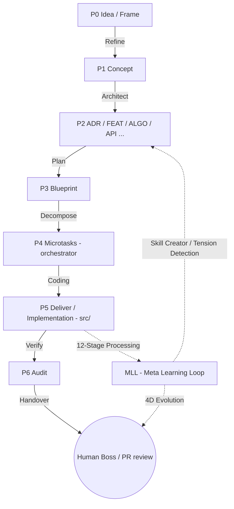

# FRAMEWORK_MASTER_SPEC.md

> **Universal Multi-Agent Framework Boilerplate**
> สถาปัตยกรรมตั้งต้น (Meta-Architecture) สำหรับโปรเจกต์ที่ขับเคลื่อนด้วย Multi-Agent + Doc-Before-Code
> สกัดจาก GKS — ลบ business logic ออกทั้งหมด คงไว้เฉพาะ "กฎของระบบ" ที่ใช้ซ้ำได้กับทุกโปรเจกต์
>
> **Version:** 1.3.0
> **Last updated:** 2026-05-17 — sync กับ **Registry v2.4** (`ADR--REGISTRY-DRIVEN-SCAFFOLDING`, 2026-05-17)
> **License intent:** Boilerplate — fork แล้วแทนที่ `YourProject` / `ExampleFeature` ได้ทันที
> **สถานะ:** ACTIVE — Master Reference สำหรับแตกออกเป็น Atomic (ADR / Protocol) ต่อไป
>
> **Changelog 1.3.0 (2026-05-17):** **Registry v2.4 + Token-Optimal Authoring.**
> 1. **Canonical SSOT shift:** `atom_registry.yaml` (machine-readable YAML) แทนที่ `docs/gks/KNOWLEDGE-TYPES.md` (markdown narrative) เป็น authoritative type taxonomy — เก็บ 5 clusters × 30+ types พร้อม `phase`/`tier`/`folder`/`sections`/`role`. Validator + scaffolder + codegen อ่านจากที่เดียวกัน (ดู `ADR--REGISTRY-DRIVEN-SCAFFOLDING`, `SPEC--ATOM-REGISTRY-SCHEMA`).
> 2. **New required frontmatter fields:** `cluster`, `role`, `aliases` (registry-derived) — บังคับทุก atom; corpus migration ผ่าน `scripts/msp/migrate-aliases.ts` + `scripts/msp/migrate-cluster-role.mjs`.
> 3. **Token-optimal CLI:** `msp-atom` (3 modes: prompt/create/scaffold) replaces `scaffold-atom`. Mode "create" รับ body content เท่านั้น — frontmatter generated by registry; ~700 tokens/atom vs ~4700 (ดู `ALGO--ATOM-SCAFFOLDING-TOKEN-OPTIMAL`).
> 4. **Non-MCP agent path:** `msp-candidate` CLI for T1/T2 agents (Gemini/Qwen) — same write boundary as `msp_candidate` MCP tool but invocable from any agent (ดู `ADR--MSP-CANDIDATE-CLI`).
> 5. **Master Priority Sectors (P0-P4):** CLAUDE.md restructure — P0 always-loaded, P1 indexed, P2-P3 triggered, P4 archive. New P0 masters: `MASTER--ROOT-CAUSE-ANALYSIS`, `MASTER--MSP-DOC-TO-CODE`, `MASTER--ATOM-CONTRADICTION-POLICY` (ดู `CONCEPT--MASTER-PRIORITY-SECTORS`).
> 6. **Validator hardening:** `registry-drift` rule (phase/tier มา match registry); `masterRequiresPromotion` gated on `type:master` (ไม่ใช่ `tier:master`) เพื่อให้ FRAMEWORK atoms ที่อยู่ tier:master ไม่ต้องมี promotion fields.
> 7. **UCF Phase 4 kickoff:** Identity hydration + Subject middleware ใน `packages/msp/src/policy/` (ดู `BLUEPRINT--PHASE-4-USER-ABAC`).
>
> **Changelog 1.2.0 (2026-05-13):** Taxonomy v2.3 prefix updates. `GENESIS--` แทน **Block Manifest** (runtime entry-point ของ Genesis Block; frontmatter contract อยู่ที่ `SPEC--GENESIS-BLOCK-MANIFEST`) — เริ่มต้น v2.3 ตั้ง placeholder เป็น `FRAME--` แต่ retire เพราะ visual collision กับ `FRAMEWORK--`. ความหมายเดิมของ `FRAME--` ("architectural framework / methodology / code standards") ย้ายไป `FRAMEWORK--`. `GUARDRAIL--` rename เป็น `GUARD--`. Prefixes ใหม่: `STACK--`, `SPEC--`, `COGNITIVE--`, `SAFETY--`, `MOD--`. Reference เก่า `FRAME--` ในเอกสารนี้ (~9 จุดที่เหลือใน §6/§7/§11/§14/§17/§18) ที่หมายถึง "architectural framework" ต้องอ่านเป็น `FRAMEWORK--`. Canonical reference: `docs/gks/KNOWLEDGE-TYPES.md` (superseded by `atom_registry.yaml` ใน v1.3.0). Disambiguation: "Genesis Block" มี 2 ความหมาย — **Genesis Graph Backend** (DB ที่ `packages/gks/src/memory/graph/genesis-graph.ts`) vs **Genesis Block** (composite ที่ `GENESIS--` manifest aggregate).
>
> **Changelog 1.1.0:** Inbound queue (`/submit-memory`, `gks/inbound/`, `npm run msp:propose|list|promote`) ถูกแทนที่ด้วย **Candidates flow** (`msp_candidate` MCP tool → `.brain/msp/projects/<ns>/candidates/` → human PR). ดู §7.2 และ §16.5

---

## 0. วิธีใช้เอกสารนี้ (How to use)

ไฟล์นี้คือ **คู่มือตั้งต้น (Master Reference)** ไม่ใช่เอกสารสำหรับรัน
ใช้ขั้นตอนดังนี้เพื่อเริ่มโปรเจกต์ใหม่:

1. อ่านทั้งไฟล์ตั้งแต่ §0 – §20 (อ่านครั้งเดียว — ที่เหลือเปิดอ้างอิงเป็นเรื่อง ๆ)
2. แตกแต่ละ section ออกเป็น Atomic Notes เพื่อจัดเก็บตาม Type (โฟลเดอร์ใช้ชื่อเอกพจน์ตามแบบของ GKS ปัจจุบัน — v1.3.0 ใช้ `gks/framework/` ไม่ใช่ `gks/frame/`):
   - §3 – §4 → `gks/framework/FRAMEWORK--gks-architecture.md`
   - §4.1 → `atom_registry.yaml` (root) + `gks/spec/SPEC--ATOM-REGISTRY-SCHEMA.md`
   - §5 → `gks/proto/PROTO--agent-protocol.md`
   - §6 → `gks/adr/ADR--doc-to-code-workflow.md` + `gks/master/MASTER--MSP-DOC-TO-CODE.md`
   - §7 → `gks/adr/ADR--msp-gatekeeper.md` (+ `ADR--AGENT-WRITE-BOUNDARIES`, `ADR--MSP-CANDIDATE-CLI`)
   - §8 → `gks/proto/PROTO--microtask-codegen.md`
   - §9 → `gks/adr/ADR--component-size-limit.md`, `gks/adr/ADR--changelog-sliding-window.md` + `gks/master/MASTER--ROOT-CAUSE-ANALYSIS.md`
   - §10 → `gks/adr/ADR--multi-agent-branch-strategy.md`
   - §11 → `gks/proto/PROTO--id-naming.md`
3. แทนที่ placeholder ทั้งหมด:
   - `YourProject` → ชื่อโปรเจกต์จริง
   - `YRP` → Project codename (2–4 ตัวพิมพ์ใหญ่)
   - `ExampleFeature` → ชื่อฟีเจอร์แรกที่จะลอง
   - path `D:\yourproject` / `D--yourproject` → path จริงของคุณ
4. Git init → commit baseline → เริ่ม **P0 (Frame)** ตามลำดับ phase ใน §6.1

**กฎเหล็ก:** ไฟล์นี้ไม่มี business logic. ถ้าคุณเจอคำที่ดูเหมือน domain ใดโดยเฉพาะ (POS/CRM/payment/user) ให้ถือว่าเป็น bug แล้วลบทิ้ง

> **Note สำหรับการ fork:** โฟลเดอร์ atomic ในเอกสารนี้ใช้ **singular** (`gks/adr/`, `gks/concept/`, `gks/framework/`) ซึ่งตรงกับ MSP/GKS implementation ปัจจุบัน (v1.3.0) หาก codebase เก่าของคุณใช้ plural (`adrs/`, `concepts/`) ให้ migrate ทั้งสองที่ — schema กลาง (atomic_index.jsonl + atom_registry.yaml) ไม่ขึ้นกับชื่อโฟลเดอร์

---

## 1. วิสัยทัศน์ (Vision)

สถาปัตยกรรมนี้มองการพัฒนาโปรเจกต์ใดก็ตามว่าเป็น **"สายพานการผลิตข้อมูล" (Information Assembly Line)** ที่แปลง:

```
Human Concept  →  Atomic Knowledge  →  Technical Blueprint  →  Code
 (คลุมเครือ)     (โครงสร้างชัด)       (แห้ง/ไร้น้ำ)         (รันได้)
```

เพื่อให้ AI แต่ละระดับทำงานในจุดที่ตัวเองเก่งที่สุด:

- **Large LLM (Claude Opus 4.7 / Gemini 2.5 Pro / GPT-5)** ออกแบบสถาปัตยกรรม / ตัดสินใจ / review architecture
- **Medium LLM (Claude Sonnet 4.6 / Haiku 4.5 / Gemini Flash)** แปลงเอกสาร / composer / validator / generic tasks
- **Small Local SLM (Qwen 7–14B / Llama 3.x 7–13B / Phi-3)** เขียนโค้ดระดับ micro-task ที่ scope แคบและ deterministic

ผลลัพธ์: **ประหยัด token, ลด hallucination, ทำงานแบบ parallel ได้**

**หลักการแกนกลาง:** *Context Isolation → High Precision + Low Cost*

---

## 2. ศัพท์กลาง (Vocabulary)

| คำ | ความหมาย | ตัวอย่าง |
|---|---|---|
| **YourProject** | ชื่อโปรเจกต์ตัวจริง | placeholder เท่านั้น |
| **YRP** | codename 2–4 ตัว uppercase — prefix ของทุก ID | `YRP` |
| **ExampleFeature** | ฟีเจอร์ตัวอย่าง — ห้ามใช้ใน production | placeholder |
| **GKS** | Genesis/Global Knowledge System — "สมอง" ของโปรเจกต์ | `gks/` |
| **MSP** | Memory & Soul Passport — gatekeeper ที่ validate ทุกสิ่งก่อนเข้า GKS | `msp/`, `.brain/msp/` |
| **SSOT** | Single Source of Truth — ข้อมูลมีจริง 1 ที่เท่านั้น | โฟลเดอร์ Type ย่อยใน `gks/` |
| **Atomic Note** | ความรู้หน่วยเล็กสุด 1 เรื่อง 1 ไฟล์ — มี frontmatter | `ADR--xxx.md`, `FLOW--yyy.md` |
| **Blueprint** | แผนงานเทคนิค — รูปแบบขึ้นกับโปรเจกต์: **YAML** (SLM-readable, original GKS / EvaAI) หรือ **Markdown + frontmatter** (human-navigable, MSP) — ใช้อย่างใดอย่างหนึ่งต่อโปรเจกต์ ห้ามผสม | EvaAI: `gks/blueprints/BLUEPRINT--*.yaml` / MSP: `gks/blueprint/BLUEPRINT--*.md` |
| **Micro-task** | 1 concern 1 ไฟล์ YAML — หน่วยย่อยสุดของ codegen (orchestrator territory ตาม `ADR--TASK-TRACKING-AT-ORCHESTRATOR`) | `.brain/<ns>/tasks/<slug>/T*.task.yaml` |
| **Candidate** | atom ที่ agent เสนอ — รอ human PR review ก่อนเข้า `gks/` | `.brain/msp/projects/<ns>/candidates/<id>.md` |
| **MCP** | Model Context Protocol — ช่องทางที่ agent คุยกับเครื่องมือนอก (เช่น GKS, MSP) | `msp_candidate`, `gks_recall`, `gks_lookup` |
| **PR Workflow** | ทางเดียวที่ promote candidate → `gks/` คือ human Pull Request → squash-merge | ดู `ADR--AGENT-WRITE-BOUNDARIES` |
| **Tier (T1/T2/T3)** | ระดับของ agent ตาม responsibility | T3=Architect, T2=Implementer, T1=Executor |

---

## 3. The Five Pillars (5 เสาหลักของระบบ)

ระบบแยก concern เป็น 5 layer เพื่อความปลอดภัย + scalable กับหลาย agent:

### 🤖 3.1 Agent Layer — คนทำงาน
Agent แต่ละตัวมี identity และ scratchpad ของตัวเอง
- **Worker isolation:** อยู่คนละ directory ใน home folder
- **Short-term memory:** scratchpad สำหรับ session ปัจจุบัน
- **ตัวอย่างโครง:** `~/.claude/`, `~/.gemini/`, `~/.eva/` (ไม่บังคับชื่อ — ขึ้นกับ tool)

### 🛡️ 3.2 Manager — MSP (`.brain/msp/`)
**Gatekeeper** ของความรู้ระยะยาว ทุกอย่างที่จะเข้า GKS ต้องผ่าน MSP ก่อน
- **Validation:** เช็ค schema + forbidden fields + link integrity
- **Candidates flow:** agent เขียนเข้า `gks/` ตรงไม่ได้ — ต้องเสนอผ่าน `msp_candidate` MCP tool ซึ่งเขียนลง `.brain/msp/projects/<ns>/candidates/` แล้วรอ **human PR** review ก่อน promote เข้า `gks/<type>/`
- **Contract file:** `.brain/msp/LLM_Contract/atomic_contract.yaml`

#### 3.2.1 Internal layering — Smart Proxy (Hexagonal) Pattern
MSP เป็น *orchestrator* ที่อาจรับ request จากหลาย transport (MCP, Slack, Discord, REST, CLI) — ภายในต้องแยก concern ตาม Hexagonal pattern เพื่อไม่ให้ transport-specific logic หลุดเข้า core (ดู `ADR--MSP-INTERFACE-LAYER`)

```
packages/msp/src/
├── interfaces/    ← inbound adapters (ports): mcp/, slack/, discord/, rest/, cli/
│                    หน้าที่: auth, idempotency, namespace resolution, trace ID, dedup
├── orchestrator/  ← application core (domain): router, correlation, loop (recall→think→act→retain→reflect)
│                    หน้าที่: business logic — ไม่รู้จัก transport (ห้าม import จาก interfaces/)
├── clients/       ← outbound adapters (anti-corruption): gks-client, llm-client, gitnexus-client
│                    หน้าที่: DTO mapping — แปลง type ของ external system → domain type
└── domain/        ← types + invariants: Namespace, Session, Candidate, RecallEvidence
```

**Dependency rule:** `interfaces` → `orchestrator` → `clients` → `domain` (อย่าย้อนทาง)
**Anti-corruption:** GKS types ห้ามหลุดเข้า `orchestrator/` — ต้องผ่าน `clients/gks-client.ts` mapping ก่อน
**Enforcement:** ESLint `no-restricted-imports` + CI guard

> **Why this matters:** ออกแบบแบบนี้ ทำให้เปลี่ยน Slack → Discord หรือ split Gateway ออกเป็น service ตอน traffic สูง = operations change ไม่ใช่ rewrite

### 📚 3.3 Storage — GKS (`gks/`)
คลังความรู้ระยะยาว (SSOT) — atomic markdown + JSONL index
- **Workflow phases P0–P7** (conceptual narrative); **atom phases P0–P6** เท่านั้น (validator-enforced — P4 TASK อยู่ที่ orchestrator, P7 Ops เก็บเป็น config ไม่ใช่ atom). จำแนกด้วย **ID Prefix + Frontmatter** ไม่ใช่โครงโฟลเดอร์ตาม phase (ดู §4.1)
- **Type taxonomy SSOT:** `atom_registry.yaml` ที่ root ของโปรเจกต์ (v1.3.0+) — machine-readable YAML, 5 clusters × 30+ types พร้อม `phase`/`tier`/`folder`/`sections`/`role`. Validator + scaffolder + codegen อ่านจากที่เดียวกัน
- โฟลเดอร์ใช้ชื่อตาม **type** (`gks/adr/`, `gks/concept/`, `gks/framework/`, …)
- Index หลัก: `gks/00_index/atomic_index.jsonl` — agent ควร scan ไฟล์นี้ก่อนเสมอ
- เขียนตรงโดย agent ไม่ได้ — ต้องผ่าน `msp_candidate` MCP tool หรือ `msp-candidate` CLI → PR (ดู §7)

#### 3.3.1 Genesis Block Engine (High-Performance Backend)
นอกจาก JSONL index มาตรฐาน GKS ยังรองรับ **Genesis Block Engine** (Specified by `CONCEPT--GENESIS-BLOCK-ENGINE`):
- **บทบาท:** เป็น `GraphBackend` ประสิทธิภาพสูง (Rust-based) สำหรับงานที่ต้อง Query ซับซ้อน
- **ความสามารถ:** รองรับ OpenCypher query, Bi-temporal time-travel (ย้อนดูสถานะ graph ในอดีต), และ columnar indexing
- **การใช้งาน:** ทำงานแบบ process-local addon (.node) ไม่ต้องมี database server แยกต่างหาก (zero-dependency design)

#### 3.3.2 Vector Layer & Embedding Strategy
เพื่อให้ Agent สามารถค้นหาข้อมูลตามความหมาย (Semantic Search) ได้:
- **Canonical Model:** ใช้ `nomic-embed-text-v1.5` (Specified by `ADR--EMBEDDING-MODEL-PARITY`)
- **Embedding Pipeline:** GKS ทำหน้าที่เป็น *Canonical Writer* ผ่าน `createNomicEmbedder()` โดยรันโมเดลแบบ Local (ผ่าน `@huggingface/transformers` หรือ Ollama)
- **Vector Storage:** เก็บที่ `.brain/msp/projects/<ns>/vector/atomic.jsonl` (JSONL format เพื่อให้ทำ git diff ได้ง่าย) หรือขยายไปใช้ `PgVector` ได้
- **Obsidian Parity:** มนุษย์ที่ใช้ Obsidian + Smart Connections plugin ต้องตั้งค่าให้ใช้โมเดลเดียวกัน เพื่อให้ AI และ Human เห็น "ความเหมือน" ของข้อมูลตรงกัน

### 👁️ 3.4 Viewer — Obsidian (`.obsidian/`, optional)
**สำหรับ human review** — ไม่บังคับสำหรับ agent
- **Primary read path สำหรับ agent:** MCP tools — `gks_recall` (semantic), `gks_lookup` (id), `gks_backlinks` (graph)
- **Obsidian บทบาท:** GUI สำหรับมนุษย์อ่าน/แก้ atom + เห็น crosslink graph
- ถ้าใช้ Obsidian: แนะนำ plugin `obsidian-local-rest-api` (port 27124) แต่ **ไม่บังคับ** — headless/CI ก็รันได้

### 🚀 3.5 Workflow — Two Layers
สองมุมมองที่ map กันได้:
- **Conceptual (5 stages)**: Discover → Define → Design → Deliver → Verify
- **Atomic (P0–P6 phases)**: P0 FRAME → P1 CONCEPT → P2 ADR/FEAT → P3 BLUEPRINT → P5 CODE → P6 AUDIT (P4 TASK เป็น orchestrator territory ตาม `ADR--TASK-TRACKING-AT-ORCHESTRATOR`)

รายละเอียดดู §4 (atom phases) + §6 (gate workflow)

---

## 4. GKS: Information Assembly Line

### 4.1 ภาพรวมประเภทองค์ความรู้ (Knowledge Types)

ระบบ GKS ไม่ยึดติดกับโครงสร้างโฟลเดอร์แบบ Phase แต่จะใช้ **ID Prefix** และ **Frontmatter** ในการกำกับดูแล เพื่อจำแนกประเภทความรู้

> ⚠️ **Canonical type registry = `atom_registry.yaml`** (v1.3.0+ — machine-readable YAML SSOT)
> ตารางในเอกสารนี้เป็น **meta-architecture summary** เพื่อให้เข้าใจภาพรวม — ถ้าขัดแย้งกับ `atom_registry.yaml` ให้ยึด registry เป็นหลัก
>
> **Schema:** `taxonomy.clusters.<cluster_name>.types.<TYPE_ID>` ประกอบด้วย:
> - `phase` (0-6) — atom phase
> - `role` — short descriptive role (เช่น "Architecture decision record")
> - `tier` — governance tier (`process` / `master` / `safety`)
> - `folder` — lowercase folder name ใต้ `gks/`
> - `sections` — required body section headers
> - `description` (optional), `lifecycle` (optional)
>
> Validator, scaffolder, และ codegen tools ทั้งหมดอ่านจาก registry นี้เพื่อ:
> - บังคับ `cluster` + `role` + `aliases` ใน frontmatter ตรงกับ registry definition
> - detect drift ผ่าน `registry-drift` validator rule
> - generate prompt templates โดยไม่ต้องให้ LLM อ่าน KNOWLEDGE-TYPES.md ทั้งไฟล์
>
> รายละเอียด `SPEC--ATOM-REGISTRY-SCHEMA`, `ADR--REGISTRY-DRIVEN-SCAFFOLDING`, `PROTO--REGISTRY-DRIFT-CHECK`

**Type Clusters (ตาม KNOWLEDGE-TYPES.md):**

> - **Cluster 1 — Implementation Flow** (phase-aligned P0-P6): IDEA, CONCEPT, ADR, MOD, FEAT, ALGO, FLOW, ENTITY, API, ENDPOINT, ENTRYPOINT, PARAMS, FRAME, BLUEPRINT, AUDIT, HOTFIX **+ PROTO, MASTER** (MSP-only extras — ดู §4.1.x ด้านล่าง)
> - **Cluster 2 — Agent Governance:** SKILL, PROTOCOL, GUARDRAIL, POLICY, PERSONA
> - **Cluster 3 — Requirements Engineering:** REQ, FR, NFR, CONSTRAINT
> - **Cluster 4 — Ops Governance:** INC, ISSUE, RISK, RUNBOOK, SLO
> - **Cluster 5 — Memory (auto-derived):** INSIGHT, FACT, RULE
>
> **เลือกเฉพาะที่ใช้จริง — อย่ามีโฟลเดอร์ว่าง** Cluster 1 + 4 เกือบทุกโปรเจกต์ต้องมี; Cluster 2 จำเป็นเมื่อมี agent / multi-agent system; Cluster 3 จำเป็นเมื่อ project มี compliance/regulatory; Cluster 5 ทำงานอัตโนมัติ — ไม่ต้องเขียนเอง

| Phase | ID Prefix (Type) | Category | Content / คำอธิบาย | Main Actor |
|---|---|---|---|---|
| **P0** | `IDEA--` | core | ไอเดียดิบ, พรอมต์เริ่มต้น | Human / PM |
| **P0** | `MASTER--` | core | กฎ/นโยบายระดับ root (เช่น contradiction policy, write boundaries) | Architect |
| **P1** | `CONCEPT--` | core | PRD, User Story, Roadmap, motivation | Human / PM |
| **P2** | `ADR--` | core | Architecture Decision Record | Architect |
| **P2** | `FRAME--` | core | มาตรฐานโค้ด + สถาปัตยกรรมระดับสูง | Architect |
| **P2** | `FEAT--` | core | รายละเอียดฟีเจอร์และพฤติกรรม | Architect |
| **P2** | `PROTO--` | core | **Machine-enforced invariant** — กฎสั้นที่ validator เช็คตอน write-time (severity: error) เช่น `PROTO--ADR-MONOTONIC` (ADR-NNN = max+1) | Architect |
| **P2** | `API--` | API | API hub — รวม endpoints ของ subsystem หนึ่ง (Technical SSOT) เช่น `api--core`, `api--billing` | Architect |
| **P2** | `ENDPOINT--` | API | รายละเอียด 1 path × 1 method (atomic) — request/response schema, auth | Architect |
| **P2** | `ENTRYPOINT--` | API | Logic การเข้าถึง — Auth/Middleware/Rate-limit/Routing | Architect |
| **P2** | `ENTITY--` | Data | นิยามข้อมูลและ Schema (DB tables / domain objects) | Architect |
| **P2** | `FLOW--` | Data | เส้นทางการไหลของข้อมูล/UI (sequence/data flow) | Architect |
| **P2** | `ALGO--` | Logic | ขั้นตอนการคำนวณและลอจิก | Architect |
| **P2** | `PARAMS--` | Logic | ตัวเลข, ค่าคงที่, Config (tunable) | Architect |
| **P2** | `MOD--` | Module | Module manifest — boundary + ownership + dependencies | Architect |
| **P2** | `PROTOCOL--` | Agent Governance | **Interaction contract** — handshake / message-format ระหว่าง agent หรือระหว่าง agent กับระบบ (เช่น MCP, agent-to-agent). **ไม่ใช่** "SOP เมื่อ X เกิด" (ดู disambiguation ด้านล่าง) | Architect |
| **P2** | `RUNBOOK--` | Ops | **Operational response guide** — "ถ้าเห็น X ให้ทำ Y" สำหรับ on-call humans / agents (incident response, deploy, rollback) | Ops / SRE |
| **P3** | `BLUEPRINT--` | core | แผนงานเทคนิค — Pure YAML / MD + frontmatter / Hybrid (ดู §4.5) | Tech Lead |
| **P4** | `T*` (tasks) | external | Decomposed microtasks — **orchestrator territory** (ไม่ใช่ atom; ดู `ADR--TASK-TRACKING-AT-ORCHESTRATOR`) | Implementer |
| **P5** | `src/` | — | Implementation & Integration (ไม่ใช่ atom) | Coder Agent |
| **P6** | `AUDIT--` | core | รายงานคุณภาพ + verification outcome | Watchdog |
| **P7** | `ops/` | Ops | Deployment, CI/CD, IaC (ไม่ใช่ atom ทั่วไป) | DevOps |

**Scaling Tier (เลือกตามขนาดของงาน):**
- **L1 (Trivial):** งานเล็กน้อย/จุกจิก (Quick Task เท่านั้น)
- **L2 (Standard):** ฟีเจอร์ใหม่/โมดูลทั่วไป (ต้องมี contract: API / FEAT / BLUEPRINT)
- **L3 (Critical):** ระบบหลัก/สถาปัตยกรรมซับซ้อน (ต้องมีเอกสารครบ FRAME + ADR + CONCEPT)


### 4.2 โครงโฟลเดอร์มาตรฐาน (Canonical Layout)

> **Folder-naming convention:**
> ภาพด้านล่างใช้ **plural** (เช่น `adrs/`, `concepts/`, `blueprints/`) — เป็นรูปแบบดั้งเดิมจาก GKS / EvaAI
> โปรเจกต์ MSP/monorepo รุ่นใหม่ (v1.3.0) ใช้ **singular** (`adr/`, `concept/`, `blueprint/`, `framework/`) + ชื่อสั้น (`algo/` แทน `algorithms/`, `feat/` แทน `features/`). หมายเหตุ: `gks/frame/` (singular ย่อ) ถูก retire — ใช้ `gks/framework/` เต็ม
> **เลือกอย่างใดอย่างหนึ่งต่อโปรเจกต์** — และระบุไว้ใน `CLAUDE.md` ของโปรเจกต์
>
> **Monorepo variant:** ถ้าใช้ npm workspaces จะมี `packages/<pkg>/gks/...` โดย root มี `package.json` ที่ระบุ workspaces (ดู `ADR--MONOREPO-STRUCTURE` ของ MSP เป็นตัวอย่าง)

```text
[GLOBAL — ~/ home folder]
├── .<agent>/                        # scratchpad ของ agent แต่ละตัว
└── .brain/
    ├── gks/global/                  # ความรู้ข้ามโปรเจกต์
    └── msp/                         # Memory processing engine
        └── projects/<path-encoded>/ # project-specific session data & memory
            └── candidates/          # candidate atoms รอ human PR review

[PROJECT — D:\yourproject\]
├── CLAUDE.md                        # instruction สำหรับ T3 agent
├── GEMINI.md                        # instruction สำหรับ T2 agent
├── registry.yaml                    # Master Registry & ID Standards
├── system_config.yaml               # master config (ROLES ONLY — no business config)
├── .agents/                         # project-specific skills & hooks
├── gks/                             # 🧠 The Shared Brain
│   ├── 00_index/                    # L0 search index (atomic_index.jsonl)
│   │   ├── MOC.md
│   │   ├── agent-protocol.md
│   │   ├── atomic_index.jsonl       # ← agents scan THIS first (~22 KB)
│   │   └── atomic_validation_report.json
│   ├── 00_MASTER_DASHBOARD.md       # command center
│   ├── ideas/                       # ⚪ (IDEA--)
│   ├── concepts/                    # 🟢 (CONCEPT--)
│   ├── adrs/                        # 🟡 (ADR--)
│   ├── algorithms/                  # 🟡 (ALGO--)
│   ├── entities/                    # 🟡 (ENTITY--)
│   ├── features/                    # 🟡 (FEAT--)
│   ├── flows/                       # 🟡 (FLOW--)
│   ├── frameworks/                  # 🟡 (FRAME--)
│   ├── modules/                     # 🟡 (MOD--)
│   ├── parameters/                  # 🟡 (PARAMS--)
│   ├── blueprints/                  # 🔴 (BLUEPRINT--)
│   ├── microtasks/                  # 🟣 (T* tasks)
│   │   ├── _SCHEMA.yaml
│   │   ├── _templates/
│   │   └── FEAT-NNN/
│   │       ├── manifest.yaml
│   │       ├── Tn_*.task.yaml
│   │       └── _outputs/            # SLM outputs
│   ├── audits/                      # 🟠 (AUDIT--)
│   ├── ops/                         # 🔵 deployment configs, IaC & live ops
│   └── devlog/
│       ├── task/                    # daily task logs (TSK)
│       ├── implement/               # MSP-IMP-*.md
│       ├── walkthrough/             # MSP-WKT-*.md (wktId)
│       ├── incidents/
│       ├── reviews/
│       └── experiment/              # benchmark / pilot reports
├── msp/                             # 🛡️ Project Governance & Contracts (Local SSOT)
│   ├── ARCHITECTURE_OVERVIEW.md     # วิสัยทัศน์และแผนผังเชิงเทคนิคของโปรเจกต์
│   ├── LLM_Contract/                # Schema contracts (phase2, codegen) - บังคับติดไปกับ Git
│   └── rules/                       # กฎและข้อจำกัดเฉพาะของ Agent ในโปรเจกต์นี้
├── scripts/msp/                     # index + validate + codegen + compose
├── src/                             # 🟥 generated + hand-written code
└── CHANGELOG.md                     # sliding window v2.X.Y
```

### 4.2.1 ประเภทความรู้: Ideas (`ideas/`)
- **ID Prefix:** `IDEA--` (Phase 0)
- **เป้าหมาย:** เก็บ Raw Prompts และไอเดียตั้งต้น (The Spark)
- **ผู้ใช้หลัก:** Human / PM

### 4.3 ประเภทความรู้: Concepts (`concepts/`)
- **ID Prefix:** `CONCEPT--` (Phase 1)
- **เป้าหมาย:** เก็บความต้องการในรูปแบบที่มนุษย์อ่านง่าย
- **ผู้ใช้หลัก:** Boss / PM + AI วิเคราะห์ (Opus / Gemini Pro)
- **Artifacts (ตัวอย่าง):**
  - `CONCEPT--PRD.md` — Product Requirements
  - `CONCEPT--REQ.md` — Functional + Non-functional requirements (FR/NFR)
  - `CONCEPT--ROADMAP.md` — milestones
  - `CONCEPT--SECURITY.md` — ข้อกำหนด data privacy / compliance
  - `CONCEPT--POC.md` — proof of concept สำหรับเทคโนโลยีใหม่
  - `CONCEPT--JOURNEY.md` — journey map
  - `CONCEPT--UI.md` — component list (ถ้ามี UI)

### 4.4 ประเภทความรู้ระดับอะตอม (Atomic Knowledge)
- **เป้าหมาย:** สกัดความรู้จาก Concept เป็น "อะตอม" — 1 ไฟล์ 1 เรื่อง เพื่อให้ AI ค้นแม่นยำ
- **ผู้ใช้หลัก:** Agents ผ่าน GKS MCP Tools (Headless) และ Humans ผ่าน Obsidian (Viewer)
- **หน้าที่:** **SSOT** ของระบบ
- **โครงสร้างโฟลเดอร์ตาม Types:** แยกเก็บในโฟลเดอร์ของตัวเองเพื่อความชัดเจน

**Universal core types:**

| Type | โฟลเดอร์ (plural / singular) | ชนิด | ความหมาย |
|---|---|---|---|
| `ADR--` | `adrs/` หรือ `adr/` | Architecture Decision Record | การตัดสินใจทางสถาปัตยกรรม |
| `MASTER--`| `master/` | Root-level Policy | กฎระดับ root — promoted from Genesis Block (เช่น `MASTER--ROOT-CAUSE-ANALYSIS`, `MASTER--MSP-DOC-TO-CODE`, `MASTER--ATOM-CONTRADICTION-POLICY`); ต้องมี `promoted_from`/`promoted_at`/`promotion_adr` |
| `FRAMEWORK--` | `framework/` | Framework Rules (v2.3+) | มาตรฐานโค้ด + สถาปัตยกรรม / governance (เดิมคือ `FRAME--`) — `tier:master` แต่ไม่ต้องผ่าน promotion (authored directly) |
| `GENESIS--` | `genesis/` | Block Manifest (v2.3+) | runtime entry-point ของ Genesis Block (contract: `SPEC--GENESIS-BLOCK-MANIFEST`). **v1.3.0:** ใช้ `GENESIS--` เท่านั้น — `FRAME--` ถูก retire ทั้งหมด |
| `GUARD--` | `guard/` | Enforced Policy (v2.3+) | นโยบายบังคับพฤติกรรม (เดิมคือ `GUARDRAIL--`) |
| `STACK--` | `stack/` | Technology stack (v2.3+) | inventory ของ language / runtime / library |
| `SPEC--` | `spec/` | Specification (v2.3+) | data contract / wire format / API shape |
| `COGNITIVE--` | `cognitive/` | Mental model (v2.3+) | interpretive lens (Erikson, Qualia, ฯลฯ) |
| `SAFETY--` | `safety/` | Ethical safety (v2.3+) | AI alignment / behaviour shaping |
| `MOD--` | `mod/` | Module manifest (v2.3+) | scope + public API ของ module |
| `FEAT--` | `features/` หรือ `feat/` | Feature Spec | รายละเอียดฟีเจอร์และพฤติกรรมระบบ |
| `PROTO--` | `proto/` | Machine-enforced Invariant | กฎสั้นที่ validator เช็คตอน write-time (severity: error); `linked_symbols` ชี้ไป validator code |

**API domain types** (สำหรับ project ที่มี API):

| Type | โฟลเดอร์ | ชนิด | ความหมาย |
|---|---|---|---|
| `API--` | `apis/` หรือ `api/` | API Hub | รวม endpoints ของ subsystem หนึ่ง — Technical SSOT |
| `ENDPOINT--` | `endpoints/` | Endpoint Spec | 1 path × 1 method (request/response schema, auth) |
| `ENTRYPOINT--` | `entrypoints/` | Access Logic | Auth, Middleware, Rate-limit, Routing |

**Data / Logic / Module types** (เลือกตาม domain):

| Type | โฟลเดอร์ (plural / singular) | ชนิด | ความหมาย |
|---|---|---|---|
| `ENTITY--`| `entities/` หรือ `entity/` | Entity Definition | นิยามข้อมูลและ Schema (DB tables / domain objects) |
| `FLOW--` | `flows/` หรือ `flow/` | Data Flow | เส้นทางการไหลของข้อมูล/UI |
| `ALGO--` | `algorithms/` หรือ `algo/` | Algorithm | ขั้นตอนการคำนวณและลอจิก |
| `PARAMS--`| `parameters/` หรือ `params/` | Parameters | ตัวเลข, ค่าคงที่, Config (tunable) |
| `MOD--` | `modules/` หรือ `mod/` | Module Manifest | ขอบเขต + ความรับผิดชอบของ module + dependencies |

**Agent Governance / Ops types** (สำหรับ agent system + on-call response):

| Type | โฟลเดอร์ | Cluster | ความหมาย |
|---|---|---|---|
| `PROTOCOL--`| `protocol/` | Agent Governance | **Interaction contract** — handshake / multi-step messaging (MCP, agent-to-agent). ตัวอย่าง: `PROTOCOL--IDENTITY-API` |
| `RUNBOOK--` | `runbooks/` หรือ `runbook/` | Ops Governance | **"ถ้าเห็น X ให้ทำ Y"** — operational response guide สำหรับ on-call (incident, deploy, rollback) |
| `GUARD--` | `guard/` | Agent Governance (v2.3: was `GUARDRAIL--`) | Runtime-enforced constraint บน agent behavior หรือ data invariant ("never call X without Y") |
| `POLICY--` | `policies/` | Agent Governance | Operational policy — access (RBAC), data retention, rate limit |
| `SKILL--` | `skills/` | Agent Governance | Agent capability — action/tool ที่ agent สามารถ trigger ได้เอง |
| `PERSONA--` | `personas/` | Agent Governance | Agent identity — role, voice, base system prompt |

> ⚠️ **Disambiguation: "PROTOCOL" ในที่นี้ใช้ความหมาย CS standard** (interaction/communication contract เหมือน HTTP protocol / MCP protocol) — **ไม่ใช่ "SOP เมื่อ X เกิด" ตามภาษาทั่วไป**
>
> สำหรับ "เมื่อ X เกิด ให้ทำ Y" map ตามนี้:
> - **RUNBOOK--** = "ถ้าเห็น alert/incident → รัน steps เหล่านี้" (Ops, executable)
> - **GUARD--** = "agent ห้ามทำ X โดยไม่มี Y" (runtime hard rule) — v2.3 rename จาก `GUARDRAIL--`
> - **POLICY--** = "data retention 90 วัน / rate limit 100rps" (system-level access/config)
> - **PROTOCOL--** = "agent กับ MCP server คุยกันยังไง" (interaction contract)

### 4.5 ประเภทความรู้: Blueprints (`blueprints/` หรือ `blueprint/`)
- **ID Prefix:** `BLUEPRINT--` (Phase 3)
- **เป้าหมาย:** แปลงความรู้ → แผนงานเทคนิคที่รัดกุม (low-water, executable)
- **ผู้ใช้หลัก:** SLM codegen workers (Pure YAML) หรือ human + LLM (Markdown variants)

#### 4.5.1 File format — 3 variants

ทั้ง 3 แบบบรรจุข้อมูลเดียวกัน (metadata + sections) ต่างกันที่ syntax wrapper:

| Variant | File ext | Frontmatter | Body | ใช้เมื่อ |
|---|---|---|---|---|
| **Pure YAML** | `.yaml` | ไม่มี (ทั้งไฟล์เป็น YAML) | YAML structured fields | SLM-driven codegen, deterministic parsing (เช่น EvaAI) |
| **Markdown + YAML frontmatter** | `.md` | YAML (ล้อม `---`) | Prose / sections (Markdown) | Human + LLM mixed workflow, navigable ใน Obsidian (เช่น MSP) |
| **Hybrid (md + frontmatter + YAML blocks)** | `.md` | YAML | Markdown prose **+ YAML code blocks** สำหรับ structured sections (เช่น `geography:`, `api_contracts:`) | ต้องการ machine-extractable sections บางส่วน แต่คง human prose สำหรับ rationale |

**Note:** Atom ทุกชนิดใน GKS ใช้ Markdown + YAML frontmatter เป็น default (ทุก `*.md` ใน `gks/<type>/`); blueprint เป็นข้อยกเว้นเดียวที่อนุญาตเลือก Pure YAML ได้ — ดู `PROTO--MASTER-BODY-SCHEMA` สำหรับ body schema rule ของ atom

**เลือก variant แบบไหน?** เลือกอย่างใดอย่างหนึ่งต่อโปรเจกต์ + ระบุไว้ใน `CLAUDE.md` — ห้ามผสม variant ใน folder เดียว

#### 4.5.2 Required fields (เหมือนกันทุก variant)

```yaml
# Pure YAML — ทั้งไฟล์เป็นแบบนี้
# Markdown — อยู่ใน frontmatter (สำหรับ metadata) + body sections (สำหรับที่เหลือ)
# Hybrid — metadata ใน frontmatter, structured sections เป็น ```yaml blocks ใน body

metadata: { id, name, module, status, version, author }
architectural_pattern: { ... }
data_logic: { ... }
geography:           # path ของ code output — 1:1 กับ code จริง
  components: []
  repositories: []
  routes: []
api_contracts: []    # endpoint + request + response schema (ถ้ามี API)
verification_plan:
  automated: []
  manual: []
```

### 4.6 ประเภทความรู้: Micro-tasks (`T*.task.yaml`)
- **ID Prefix:** `T*` (เช่น `T1_load-task-yaml.task.yaml`)
- **Phase 4** — **ไม่ใช่ atom** ตาม `ADR--TASK-TRACKING-AT-ORCHESTRATOR`
- **Location:** **ไม่อยู่ใน `gks/`** — อยู่ที่ orchestrator layer:
  - **Self-hosted:** `.brain/<ns>/tasks/<slug>/T<n>_<name>.task.yaml`
  - **MSP-layered:** `msp/projects/<id>/tasks/`
  - **External tracker:** Linear / Jira / Asana (ผูกผ่าน `BLUEPRINT.geography`)
- **เป้าหมาย:** decomposition ของ blueprint เป็น micro-task เพื่อให้ SLM/coder agent รันได้ทีละชิ้น
- **เหตุที่ไม่ใช่ atom:** task state churns hourly (open / in-progress / blocked / done) → ไม่มี settling time แบบ atom; durable outcome ไปอยู่ที่ `AUDIT--` แทน
- รายละเอียดเต็มใน §8 (Phase 3.5 Micro-task Codegen)

### 4.7 โค้ดที่รันได้: Code (`src/`)
- **Phase 5** (ไม่ใช่ atom)
- Path ต้องตรงกับ `geography` ที่ประกาศใน Blueprint (1:1 mapping, บังคับ)
- ไฟล์ที่ AUTO-GENERATED ห้ามแก้มือ — แก้ task YAML แล้วรัน codegen ใหม่
- ทุก commit ต้อง link กลับไปที่ task ID / blueprint ID / `AUDIT--`

### 4.8 ประเภทความรู้: Audits (`audits/` หรือ `audit/`)
- **ID Prefix:** `AUDIT--` (Phase 6)
- **เป้าหมาย:** บันทึก verification outcome — ตรวจสอบความถูกต้องระหว่าง Blueprint และ Code, สรุปผล Unit/Integration/E2E Test
- **ผู้ใช้หลัก:** Watchdog Agent / CI/CD Pipeline / human reviewer
- **เนื้อหา:** test results, numbers (coverage, latency, etc.), pass/fail, scope ที่ verify, deviations จาก blueprint
- **Lifecycle:** เขียนทีเดียวตอน task ปิด — durable, citable

### 4.9 ประเภทความรู้: Ops & Deployment (`ops/`)
- **Phase 7** (ไม่ใช่ atom ทั่วไป — เก็บ config/IaC)
- **เป้าหมาย:** ผลักดันโค้ดขึ้น Server จริง (Staging/Production), การทำ CI/CD, Monitor ประสิทธิภาพ และรับ Feedback
- **Key Output:** Live Application, Infrastructure as Code (IaC), Monitoring Dashboard
- **เนื้อหา:** Dockerfile, terraform/pulumi, GitHub Actions workflows, k8s manifests, observability config

### 4.10 กลไกเชื่อมโยง — Master Dashboard
`gks/00_MASTER_DASHBOARD.md` ทำหน้าที่เป็น:
- **Global visibility:** สถานะของแต่ละ FEAT ข้ามทั้ง 8 Phases (P0–P7)
- **Cross-vault linkage:** relative path หรือ absolute URI เชื่อม vault
- **Multi-vault integration:** เปิด vault ย่อย (`phase3/`) ได้เฉพาะเมื่อต้องการ
- **Pair กับ `gks/00_index/atomic_index.jsonl`** — JSONL เป็น L0 machine-readable index (~22 KB); MASTER_DASHBOARD เป็น human-readable command center

### 4.11 Environment Isolation (การแบ่งแยกสภาวะแวดล้อม)
ระบบ GKS บังคับให้มีการแยกสภาวะแวดล้อมเพื่อความมั่นใจในความปลอดภัยและคุณภาพ:
1. **Development (GKS Local):** พื้นที่ทำงานของ Agent ใน **P0–P5** (Frame → Code) — local workspace, candidates queue, ยังไม่ deploy
2. **Staging (Audit Area):** พื้นที่สำหรับ **P6** (AUDIT) เพื่อทดสอบ + verify ก่อนปล่อยขึ้นระบบจริง — CI runs ที่นี่
3. **Production (Live System):** **P7** (Ops) ที่ผู้ใช้จริงเข้าถึง — **ห้าม Agent เข้าไปแก้ไขโค้ดตรง ๆ** ต้องผ่าน CI/CD pipeline เสมอ; rollback ใช้ `RUNBOOK--` ที่ถูก approve แล้ว

---

## 5. Agent Protocol (กฎของ Agent ทุกตัว)

### 5.1 Session Startup (บังคับทุก agent)

```
1. อ่าน CLAUDE.md (หรือ AGENTS.md / agent-instruction ของโปรเจกต์)
   - P0 Master Block sector โหลด always — รวม MASTER--ROOT-CAUSE-ANALYSIS,
     MASTER--MSP-DOC-TO-CODE, MASTER--ATOM-CONTRADICTION-POLICY
2. สแกน L0 index            → gks/00_index/atomic_index.jsonl  (~22 KB)
3. (ถ้ามี) อ่าน MOC          → gks/00_index/MOC.md  (human-readable map)
4. อ่าน FRAMEWORK atoms ที่เกี่ยวข้อง → gks/framework/FRAMEWORK--<area>.md
5. โหลด full atomic ≤ 3 ไฟล์ ต่อ query (เว้นแต่งานต้องการมากกว่า)
```

**Read paths ที่ agent ใช้ได้:**
- **MCP tools** (preferred): `gks_recall` (semantic search), `gks_lookup` (by id), `gks_backlinks` (graph)
- **File system direct read** (fallback): grep / glob ผ่าน file tools
- **REST API** (optional): Obsidian local-rest-api (port 27124) — สำหรับ human-side browse

**ห้าม bulk-read โฟลเดอร์ระดับอะตอมพร้อมกันทั้งหมดเด็ดขาด** — scan index ก่อนเสมอ

### 5.2 Reading Rules (Epistemic-aware)

Atomic note ทุกใบมี `epistemic.confidence` + `epistemic.source_type` — treat them like citations:

| Signal | การปฏิบัติ |
|---|---|
| `confidence ≥ 0.8` + `direct_experience` | **ASSERT** ได้เลย |
| `confidence 0.6–0.8` + `inferred` | **CAVEAT** ก่อน assert |
| `confidence < 0.6` หรือ `external` | **VERIFY** ด้วย code จริงก่อน assert |
| `duration: temporary` + `valid_until` หมด | ถือเป็น **deprecated** |
| `status: draft` / `stub` / `raw` / `partial` | unstable — flag ให้ user ก่อนใช้ |
| `status: superseded` | ตามไปอ่าน `crosslinks.superseded_by` แทน |

**Status values (canonical — บังคับโดย `src/validator/rules/phase-status.ts`):** `stub` / `raw` / `draft` / `active` / `stable` / `deprecated` / `superseded` / `partial`
**Most-used in practice (MSP):** `stable` (~87%), `draft` (~10%), `superseded` (~3%)

**Citation format:** `(ref: MOD--<name>)` หรือ `(ref: ADR--<SLUG>)` เมื่อตอบโดยอ้าง vault — note: MSP ใช้รูป `ADR--SLUG` (เช่น `ADR--MONOREPO-STRUCTURE`); สำหรับโปรเจกต์ที่ใช้ ADR-NNN (numbered) เช่น EvaAI ก็ใช้ `ADR-007` ได้

**Knowledge web:** ต้องอ้างอิงความสัมพันธ์ใน metadata (`crosslinks`) เพื่อตรวจสอบผลกระทบและหาบริบทที่กว้างขึ้น เช่น `implements`, `used_by`, `references`, `contradicts` ในการทำ impact analysis

**Knowledge gap:** ตอบ "Knowledge not found in GKS" — **ห้ามแต่งเอง** แต่เสนอ atomic ใหม่ผ่าน `msp_candidate` MCP tool (→ candidates queue → human PR) ได้

### 5.3 Writing Rules (ดู §7 เต็ม)

| ประเภทไฟล์ (plural / singular) | เขียนตรงได้ไหม | วิธีที่ถูก |
|---|---|---|
| Atoms ใน `gks/<type>/*.md` (ADR, CONCEPT, ALGO, ENTITY ฯลฯ) | ❌ ไม่ได้ | `msp_candidate` MCP tool → candidates → **human PR** |
| `blueprints/*` / `blueprint/*` | ❌ ไม่ได้ (treat as atom) | candidates → PR เช่นกัน |
| Microtasks `T*.task.yaml` | ✅ ได้ (T2/T3) — **ไม่ใช่ atom** อยู่ที่ orchestrator path ตาม ADR--TASK-TRACKING-AT-ORCHESTRATOR | runner validates at execution |
| `src/` (AUTO-GENERATED) | ❌ ห้ามแก้มือ | แก้ task YAML → rerun codegen |
| `src/` (hand-written) | ✅ ได้ | ตาม blueprint |
| `gks/devlog/*` (ถ้าโปรเจกต์ใช้) | ✅ free-write | — |
| `.brain/<ns>/candidates/*` | ✅ ได้ (เขียนผ่าน `msp_candidate` MCP) | — |

### 5.4 Token Efficiency

1. L0 index ก่อนเสมอ → filter by tag/type/module → load เฉพาะที่ match
2. อย่า repeat ADR content ใน response — cite แล้วสรุป
3. Micro-task prompt ≤ 400 tokens, 1 concern ต่อ task
4. วาง stable prefix (CLAUDE.md, MOC.md, LAWS) ไว้ต้น system prompt เพื่อ cache hit สูง
5. **Audit-Only History:** ห้ามโหลด Episodic Memory/Session History ทั้งหมดเข้ามาในทุกรอบ (Ref: §7.5) ให้ใช้การดึงแบบเป้าหมาย (Targeted Retrieval) เท่านั้นเพื่อรักษาประสิทธิภาพ Token

### 5.5 Maintenance (ตรวจทุก session)

1. `status: draft/stub` → caveat
2. `updated_at > 90 วัน` + `duration ≠ universal` → surface ให้ user
3. เจอ 2 note ขัดกัน → flag ทันที + เสนอ PR ที่ตั้ง `crosslinks.superseded_by` (ตาม `MASTER--ATOM-CONTRADICTION-POLICY`)
4. Duplicate filename / broken crosslink → รัน `npm run msp:validate` + `npm run msp:check-links` (ใน monorepo: `npm run msp:validate --workspace=packages/msp`)

---

## 6. Doc-Before-Code Workflow (Three-Phase Gate)

**กฎเหล็ก:** **ห้าม implement ก่อน spec + ADR ได้รับการ approve**

### 6.1 Phase flow (The Assembly Line)

การไหลของข้อมูลใน GKS จะเป็นแบบ "Assemble & Log" โดยมี atom store (durable knowledge) และ devlog (live trace) แยกชั้นกัน:



> **Optional devlog chain (EVA-specific):** บางโปรเจกต์เพิ่ม process-tracking IDs `MSP-IMP-` (P3 plan) → `MSP-TSK-` (P4 task) → `MSP-ACT-` (P5 per-turn action) → `MSP-WKT-` (P6 walkthrough). MSP TypeScript ของ MSP monorepo **ไม่บังคับ** flow นี้ — เป็น convention ของ EVA's MSP-v9.1 (Python) ดู `docs/MSP_RELATIONSHIP.md` ของ GKS

### 6.2 รายละเอียดการผลิดและจดบันทึก (Step-by-Step Logging)

ตาราง phase → atom mapping เต็ม ๆ พร้อมรายการ atom types ครบทุก phase + devlog mapping (EVA-style MSP-IMP/TSK/ACT/WKT) ย้ายไปที่ **`docs/gks/AUTHORING-MANUAL.md` §3.3** เป็น authoritative reference แล้ว

**Quick summary (สำหรับ workflow gate check):**

| Phase | Output (durable atom) |
|---|---|
| P0 → P3 | `FRAMEWORK/MASTER` → `CONCEPT/REQ/FR/NFR` → `ADR/FEAT/ALGO/SPEC/...` → `BLUEPRINT--` |
| P4 → P7 | `T*.task.yaml` (orchestrator, **ไม่ใช่ atom**) → `src/` → `AUDIT--` → `ops/ + RUNBOOK--` |

> **Cross-reference:**
> - **Derivation logic** (atom A → atom B แตกเพราะอะไร) → `docs/gks/AUTHORING-MANUAL.md` §1 (Knowledge Derivation Tree + mermaid diagram)
> - **Phase-by-phase atom checklist** ครบทุก type → `docs/gks/AUTHORING-MANUAL.md` §3.3
> - **Devlog mapping** (EVA-only `MSP-IMP/TSK/ACT/WKT`) → `docs/gks/AUTHORING-MANUAL.md` §3.3 หมายเหตุ Devlog

### 6.3 Agent Rule (บังคับทุก agent ก่อนเขียนโค้ด)

```
1. Check FEAT--<name>.md (หรือ FEAT-NNN.yaml) มีอยู่จริงใน gks/feat/
2. Check status ∈ {stable, active}  (ไม่ใช่ draft/stub/raw/partial/superseded/deprecated)
3. Check ADR ที่ถูก reference (crosslinks.references) มี status ∈ {stable, active}
4. Check BLUEPRINT--<name>.md (ถ้ามี) มี status ∈ {stable, active}
5. เท่านั้นจึงเริ่ม implement
```

ถ้าไม่มี หรือ status ยัง `draft` → **STOP + เสนอผ่าน `msp_candidate` MCP tool / `msp-candidate` CLI → รอ PR merge ที่ flip status เป็น `stable`**

### 6.3.1 Progress Audit Decision Tree (สำหรับ Watchdog / progress check)

> **กฎเหล็ก:** การ "นับ FEAT ที่ไม่มี BLUEPRINT" เพียงอย่างเดียว **ไม่ใช่** signal ที่ reliable ของ "FEAT ที่ยังไม่ได้ทำ" — เพราะ atom drift (code-first commit แต่ลืม backfill BP) จะ false-positive 100%
>
> ตรวจ progress ด้วย **5-step decision tree ที่ผสาน status + linked_symbols + actual file existence:**

| ผลตรวจ | สถานะจริง | Action |
|---|---|---|
| `status: draft/stub/raw` | ยังไม่อนุมัติ spec | รอ PR merge — **ปล่อยไว้** |
| `status: stable` + `linked_symbols` ว่าง/ขาด | ยังไม่ได้ implement | **TODO: schedule implementation** |
| `status: stable` + `linked_symbols` ชี้ไฟล์ที่ไม่มีบน disk | path drift หรือ implementation ถูกลบ | **Fix linked_symbols** หรือ flip status → `deprecated` |
| `status: stable` + ไฟล์มีอยู่จริง + ไม่มี BLUEPRINT | **Atom drift** (code-first commit) | **Backfill BLUEPRINT** ผ่าน `msp-candidate` (HOTFIX-style 48h window) |
| `status: superseded` | ตายแล้ว ไม่ต้องสน | ข้าม — ดู `crosslinks.superseded_by` |

**Algorithm สำหรับ tooling:**

```typescript
for (const feat of atoms.filter(a => a.type === 'feat')) {
  if (['draft','stub','raw','superseded','deprecated'].includes(feat.status)) continue
  const hasBP = blueprints.some(bp => bp.crosslinks?.implements?.includes(feat.id))
  const linkedFiles = (feat.linked_symbols ?? []).map(s => typeof s==='string'?s:s.file)
  const filesExist = linkedFiles.length > 0 && linkedFiles.every(f => fs.existsSync(f))

  if (!filesExist && linkedFiles.length === 0) report('NOT_IMPLEMENTED', feat)
  else if (!filesExist) report('PATH_DRIFT', feat)
  else if (!hasBP) report('ATOM_DRIFT_BACKFILL_BP', feat)
}
```

> Implementation reference: `npx gks verify-flow` (aspirational; pattern documented but tool not yet shipped — ดู §15.1)

### 6.4 Hotfix Escape Hatch

กรณีเร่งด่วน (prod down):
- tag commit `HOTFIX`
- ต้อง **backfill phase 1–3 artifacts ภายใน 48 ชม.**
- เกิน 48 ชม. → blocked by pre-commit

### 6.5 CLI Enforcement (แนะนำ)

**Generic placeholders (สำหรับ fork ใหม่):**
```bash
<yourproject-cli> new-feature          # scaffold FEAT-*.md จาก template
<yourproject-cli> verify-flow          # lint spec completeness
<yourproject-cli> pre-commit           # block commit ถ้า src/ ไม่มี approved spec
```

**ตัวจริงที่ใช้ใน MSP monorepo:**
```bash
gks new-feature --task-tracker=local   # scaffold FEAT + BLUEPRINT + microtask skeletons
npm run msp:validate                   # full atom validation (frontmatter, ID format, anti-hallucination)
npm run msp:check-links                # verify all crosslinks resolve
npm run msp:index                      # regen gks/00_index/atomic_index.jsonl
npx gks verify-flow                    # check FEAT → BLUEPRINT → AUDIT chain
```

Pre-commit hook (`packages/msp/src/hooks/pre-commit.ts`) บังคับ validate ก่อน commit ทุกครั้ง — bypass ด้วย `git commit --no-verify` + tag `HOTFIX` (48h backfill window — ดู §6.4)

---

## 7. MSP Gatekeeper — Write Contract

### 7.1 ทำไมต้องมี MSP
ป้องกัน:
- Agent เขียนทับ SSOT ด้วยข้อมูลผิด
- ID ซ้ำ (เช่น ADR number ซ้ำ)
- Frontmatter hallucination (agent แต่งฟิลด์ที่ไม่มีจริง)
- Link เสีย (wikilink ชี้ไปที่ไม่มี)

### 7.2 Graph Integrity: DAG & Acyclic Invariants
เพื่อป้องกันการเกิด infinite loop ในการประมวลผลความรู้ และเพื่อให้การวิเคราะห์ผลกระทบ (Impact Analysis) แม่นยำ MSP บังคับใช้กฎ **DAG (Directed Acyclic Graph)** กับโครงสร้างความสัมพันธ์:

- **Acyclic Enforcement:** ทุกความสัมพันธ์เชิงทิศทาง (Directional Crosslinks) เช่น `supersedes`, `implements`, `parent_blueprint`, และ `resolves` **ห้ามมีการวนลูป (No Cycles)**
- **Supersession Traceability:** สายธารการสืบทอดความรู้ (`supersedes`) ต้องเป็นเส้นตรงหรือกิ่งก้านที่ชัดเจน เพื่อให้ระบบ `asOf` query สามารถโครงการภาพความรู้ ณ จุดใดจุดหนึ่งในอดีตได้อย่างถูกต้อง
- **Impact Analysis Guarantee:** การตรวจสอบ "แรงระเบิด" (Blast Radius) จากการแก้ไขอะตอมหนึ่งไปยังอะตอมอื่น จะต้องจบลงในเวลาที่กำหนด (Termination guarantee) ซึ่งทำได้เฉพาะในโครงสร้างแบบ DAG เท่านั้น
- **Enforcement Mechanism:** ตรวจสอบผ่าน **PROTO Invariants** (เช่น `PROTO--TRACE-INVARIANTS`) ในทุกๆ การเสนอ `msp_candidate` หากพบการวนลูป ระบบจะปฏิเสธการเขียนทันที (Reject at write-time)

### 7.3 Candidates Flow (replaces legacy Inbound Queue)

> **Migration note:** ก่อน Phase 3 (2026-05-09) เคยใช้ inbound queue + `/submit-memory` slash command + `npm run msp:propose|list|promote`. ทั้งหมดถูกถอดออกแล้ว ใช้ flow ด้านล่างแทน

```
Agent Draft (in-memory)
   │
   ▼
msp_candidate (MCP tool) ──►  .brain/msp/projects/<path-encoded>/candidates/
                                            │
                                            ▼
                                   MSP Validator
                                ┌──────────────┐
                                │ • frontmatter schema
                                │ • forbidden fields
                                │ • ID uniqueness
                                │ • wikilink resolution
                                │ • ADR number = max+1
                                └──────────────┘
                                            │
                          pass               │               fail
                            │                │                │
                            ▼                │                ▼
              git branch + commit             │       MCP returns reject + reason
              human opens Pull Request        │
                            │                │
                            ▼                │
                   reviewer approves          │
                            │                │
                            ▼                │
              merge to main →  gks/<type>/   │
              (canonical SSOT)
```

**Promotion rule:** ไม่มี CLI promote — `git merge` ของ PR คือการ promote เท่านั้น (ดู `ADR--AGENT-WRITE-BOUNDARIES`)

### 7.3 Frontmatter Contract (ย่อ)

```yaml
# msp/LLM_Contract/atomic_contract.yaml (project root) +
# atom_registry.yaml (project root — type taxonomy SSOT)
required_fields:
  - id          # เช่น CONCEPT--EXAMPLE-FEATURE (TYPE--SLUG format)
  - phase       # 0 - 6  (validator-enforced; spec discusses P7 ops as "out of atom scope")
  - type        # ตรงกับ folder + ต้องมีใน atom_registry.yaml clusters
                # implementation_flow: idea | concept | adr | mod | feat | algo | flow |
                #     entity | api | endpoint | entrypoint | params | genesis | framework |
                #     stack | spec | cognitive | safety | master | proto | blueprint | audit
                # agent_governance: llm | slm | mcp | cmd | skill | protocol | guard |
                #     policy | persona
                # requirements: req | fr | nfr | constraint
                # ops: inc | hotfix | issue | risk | runbook | slo
                # memory: insight | fact | rule
  - status      # stub | raw | draft | active | stable | deprecated | superseded | partial
                # (canonical set — enforced by src/validator/rules/phase-status.ts)
  - tier        # process | master | safety | genesis (must match registry definition)
  - cluster     # v1.3.0+ — implementation_flow / agent_governance / requirements / ops / memory
                # (registry-derived — validated against atom_registry.yaml)
  - role        # v1.3.0+ — short descriptive role (e.g. "Architecture decision record")
                # (registry-derived — validated against atom_registry.yaml)
  - aliases     # v1.3.0+ — non-empty string array: [TYPE_PREFIX, cluster_name, role]
                # plus optional user-defined aliases
  - vault_id    # ID ของโมดูล/scope (โปรเจกต์กำหนดเอง — generic identifier)
  - created_at  # ISO 8601 timestamp
  # recommended (ไม่บังคับ แต่ควรมี):
  # - updated_at, source_type, tags, linked_symbols

validation_rules:  # กฎการตรวจสอบความสัมพันธ์
  - phase_must_exist: true
  - missing_derived_from_in_p1_is_orphan: true
  - missing_implements_in_p2_is_orphan: true

forbidden_fields:   # agent แต่งไม่ได้ — system เป็นคนเซ็ต (หรือไม่เซ็ตเลย)
  - commit_hash
  - reviewer_approved_at
  # หมายเหตุ: promotion_level ถูกถอดออกตาม ADR--AGENT-WRITE-BOUNDARIES
  # (ไม่มี promotion CLI — promotion = git merge ของ PR เท่านั้น)

anti_hallucination:
  - wikilinks_must_resolve: true       # บังคับโดย PROTO--WIKILINK-RESOLVE
  - adr_id_must_be_max_plus_one: true  # บังคับโดย PROTO--ADR-MONOTONIC
  - no_future_dates: true
  - registry_drift_check: true         # v1.3.0 — บังคับโดย PROTO--REGISTRY-DRIFT-CHECK
                                        # phase/tier ของ atom ต้องตรงกับ atom_registry.yaml

epistemic:          # บังคับระบุระดับความมั่นใจและที่มา
  confidence: 0.0 – 1.0
  source_type: direct_experience | documented_source | inferred | external | axiomatic
  duration: permanent | temporary | deprecated   # ถ้า temporary ต้องระบุ valid_until

crosslinks:         # ความเชื่อมโยงแบบ Knowledge Web
  implements: []      # ADR/spec ที่ atom นี้ไปรองรับ
  used_by: []         # ใครพึ่งพา atom นี้
  references: []      # บริบทอื่นที่เกี่ยวข้อง
  contradicts: []     # ขัดแย้งกับ atom ใด (ต้อง pair กับ supersedes/superseded_by)
  supersedes: []      # atom นี้แทนที่ atom ใด (atom เก่าต้องตั้ง status: superseded)
  superseded_by: []   # ถ้า atom นี้ถูกแทน ระบุ atom ใหม่ที่นี่
  enforces: []        # (PROTO เท่านั้น) FRAME/MASTER ที่กฎนี้บังคับใช้
  resolves: []        # (backfill atoms) HOTFIX-- ที่ atom นี้มาปิด
```

### 7.4 Codegen Contract (Phase 3.5)

`.brain/msp/LLM_Contract/codegen_microtask_contract.yaml`

**Forbidden in generated code:**
- `export default` ใน framework ที่ใช้ named export (เช่น Next.js App Router)
- Fabricated imports (`lodash`, `moment`, `uuid`, `zod`, `joi`, `yup`, `axios`) **ยกเว้น** อยู่ใน `package.json`
- `console.log`, `TODO`, `FIXME`, `XXX` markers

**Required per slot:** ขึ้นกับ framework — ประกาศใน template

### 7.5 MSP Conversation & Session Memory

MSP มีบทบาทในการดูแลจัดการความจำข้าม session, project และ workspace ด้วยระบบที่เรียบง่ายแต่ผูกพันธ์กับ Atomic Knowledge ที่เกิดขึ้นระหว่างทาง

## 8. Symbol Graph & Processing Pipeline (12-Stage DAG)

> Alias: **Block Decomposition** (top-down half of the Genesis Block Cycle) — see `docs/gks/PRD--GENESIS-BLOCK-CYCLE.md` for the unified vocabulary and its `Block Assembly` counterpart.

เพื่อให้ Codebase ถูกเปลี่ยนสภาพเป็น **Architectural Knowledge Graph** ที่ AI Agents สามารถเข้าใจความหมายเชิงสถาปัตยกรรมได้ MSP บังคับใช้กระบวนการประมวลผลแบบ **Directed Acyclic Graph (DAG)** ทั้งหมด 12 ระยะหลัก:

### 8.1 The 12 Stages
1. **Scan (การสแกน):** สำรวจเส้นทางไฟล์ (File paths) และขนาดข้อมูลทั้งหมดเพื่อสร้างแผนผังพื้นฐานของ Repository
2. **Structure (โครงสร้าง):** จับคู่ความสัมพันธ์โฟลเดอร์/ไฟล์ เพื่อสร้างลำดับชั้น (Hierarchy Tree) ของซอฟต์แวร์
3. **Specialized Parse - Markdown:** วิเคราะห์ไฟล์ `.md` เพื่อสกัดความรู้ (Atoms) และเชื่อมโยงเนื้อหาอธิบายเข้ากับระบบ
4. **Specialized Parse - COBOL:** วิเคราะห์โค้ด Legacy (COBOL) เพื่อให้ระบบรองรับการวิเคราะห์ข้ามยุคสมัย
5. **Symbolic Parse:** สกัดสัญลักษณ์ (Functions, Classes, Methods, Interfaces) โดยใช้ **Tree-sitter AST**
6. **Framework - Routes:** วิเคราะห์เส้นทาง API (เช่น Next.js App Router) เพื่อระบุ Entry Points ของระบบ
7. **Framework - Tools:** สกัดคำนิยามของ MCP tools หรือ RPC handlers ที่ระบุไว้ในโค้ด
8. **Framework - ORM:** วิเคราะห์ระบบจัดการข้อมูล (เช่น Prisma, Supabase) เพื่อดูความสัมพันธ์กับ Database Schema
9. **Cross-File Resolution:** เชื่อมโยงการ Import/Export สัญลักษณ์ระหว่างไฟล์ที่แยกจากกัน
10. **MRO (Method Resolution Order):** จัดลำดับชั้นการสืบทอด (Heritage Map) เพื่อระบุการเรียกใช้งานจริงในระบบที่ซับซ้อน
11. **Communities (การจัดกลุ่มชุมชน):** ใช้ **Leiden Algorithm** จัดกลุ่มสัญลักษณ์ที่มีความเกี่ยวข้องกันในเชิงหน้าที่ (Functional Cohesion)
12. **Processes (กระบวนการประมวลผล):** ติดตามเส้นทางการไหลของข้อมูล (Execution Flows) จาก Entry Points ไปยังฟังก์ชันปลายทาง

### 8.2 Persistence: GenesisGraphBackend
ข้อมูลกราฟความรู้ที่ได้จากทั้ง 12 ระยะจะถูกบันทึกลงใน **GenesisGraphBackend (DB)**:
- **Graph Storage:** จัดเก็บในรูปแบบที่รองรับการ Query ความสัมพันธ์ที่ซับซ้อนและลึก (Deep Traversal)
- **Agent Accessibility:** ข้อมูลใน DB นี้จะถูก SURFACED ผ่าน MCP tools (เช่น `gks_backlinks`, `symbol_trace`) เพื่อให้ AI Agents สามารถเรียกใช้งานได้ทันที

---


- **Project Path Encoding:** กำหนด `<path-encoded>` ตาม location เช่น `D:/company/ProA` จะถูกตั้งค่าเป็น `D--ProA`
- **Candidates Path:** `.brain/msp/projects/<path-encoded>/candidates/` (gitignored — per-user staging area ก่อน PR)

> [!IMPORTANT]
> **หลักการ Memory for Audit (ไม่ใช่ Full Context Reload):**
> ความจำในระดับ Session History และ Episodic Memory มีไว้เพื่อการ **ตรวจสอบ (Audit)**, การสืบสวนหาที่มา (Traceability), และการทำสรุปผล (Summarization) เท่านั้น **ห้ามโหดลย้อนอ่านกลับไปถึงจุดเริ่มต้นในทุกเซสชัน** เพื่อประหยัด Token และป้องกัน Context Overflow ให้ใช้การเข้าถึงแบบ Selective (ผ่าน ID อ้างอิง) เมื่อจำเป็นเท่านั้น
#### 7.5.1 Linear Session History (JSONL)
จัดเก็บประวัติการสนทนาในรูปแบบ `.jsonl` แยกตาม session เพื่อใช้ไล่เรียงเหตุการณ์ราย Turn
- **Path:** `.brain/msp/projects/<path-encoded>/sessions/<episodicId>.jsonl`
- **Schema:**
  ```json
  {
    "sessionId": "<string>",       // รหัสกลุ่มการสนทนา
    "episodicId": "<string>",      // รหัสของรอบการสนทนาย่อย/Episode
    "turnId": "<number>",          // ลำดับ turn ในการสนทนา
    "msgId": "<string>",           // รหัสข้อความ
    "speakerId": "<string>",       // ผู้พูด เช่น 'user' หรือ 'MSP-AGT-XXX'
    "content": "<string>",         // ข้อความที่ใช้สนทนา
    "learnId": "<string>"          // ID ของความรู้ที่เพิ่มขึ้นมาระหว่างบทสนทนา
  }
  ```

#### 7.5.2 Rich Episodic Memory (JSON)
จัดเก็บสรุปเหตุการณ์สำคัญ (Episodes) ในรูปแบบ Rich Metadata เพื่อการสืบค้นและทำความเข้าใจบริบทในระดับสูง
- **Path:** `.brain/msp/projects/<path-encoded>/memory/episodic_memory.json`
- **Schema:**
  ```json
  {
    "episodicId": "ep_001",
    "sessionId": "sess_001",
    "projectId": "D--ProA",
    "timestamp": "2026-04-18T10:30:00Z",
    "location": "Virtual Office / Project Alpha Channel",
    "importance_score": 0.85,
    "range": ["turnIdx-x"],        // ช่วงของ turn ที่ครอบคลุม
    "anchor": {
      "content": "เราจะรวยไปด้วยกัน",
      "msgId": "xxxx"
    },
    "context": {
      "topic": "การวางแผนเปิดตัวโปรเจกต์ใหม่",
      "participants": ["User", "Gemini"],
      "mood": "Productive"
    },
    "content": {
      "summary": "ผู้ใช้ปรึกษาเรื่องการจัดวาง Roadmap ของโปรเจกต์ Alpha ในช่วงไตรมาสที่ 3",
      "key_decisions": [
        "เลือกใช้วิธีการทำตลาดแบบ Hybrid",
        "กำหนดวันเปิดตัว Soft Launch คือ 15 กันยายน 2026"
      ],
      "unresolved_questions": [
        "งบประมาณในส่วนของ Influencer ยังไม่สรุปชัดเจน"
      ]
    },
    "tags": ["Project Alpha", "Marketing", "Roadmap"],
    "associations": {
      "related_event_ids": ["ep_000_past_discussion"],
      "entity_links": ["entity_marketing_dept", "entity_alpha_product"],
      "knowledgeId": "FEAT--market-strategy",
      "learnId": "ALGO--campaign-logic"
    }
  }
  ```

### 7.6 Human Review Gates

| Artifact | Reviewer | Action |
|---|---|---|
| New ADR | Boss | approve / reject |
| FEAT spec | Boss | approve for Phase 2 |
| Blueprint (Phase 3) | Boss | approve for Phase 3.5 |
| Task YAML | Implementer (self) + runner tests | gate by acceptance test |
| Generated code | CI + PR review | merge to branch |

### 7.7 MSP Phase Governance (The Ruler of Flow)

MSP ทำหน้าที่กำกับดูแลการทำงานในแต่ละเฟส เพื่อให้มั่นใจว่า "คุณภาพของเอกสาร" สอดคล้องกับ "ความสำคัญของงาน" ก่อนจะอนุญาตให้ Agent เริ่มลงมือเขียนโค้ด

#### 7.7.1 Governance Rules
- **Phase Gating:** MSP จะตรวจสอบ Checklist ขั้นต่ำของแต่ละเฟสตาม Scaling Level (L1-L3)
- **Phase 1 Technical Feasibility:** บังคับให้มีการระบุ "High-level Surface Draft" (เช่น รายการ Endpoint สำคัญ, public functions, หรือ UI flow หลัก) ลงในเอกสาร `CONCEPT--` ตั้งแต่เฟส 1 เพื่อยืนยันความเป็นไปได้ทางธุรกิจและเทคนิค
- **Mandatory contracts at Design (P2):** ขึ้นกับ domain ของโปรเจกต์:
  - **API-having project:** ต้องมี `API--` (hub) + `ENDPOINT--` (per path/method) + `ENTRYPOINT--` (auth/middleware)
  - **Library / SDK project:** ต้องมี `PROTOCOL--` (public interface contract)
  - **Agent system:** ต้องมี `SKILL--` (capabilities), `GUARDRAIL--` (runtime rules), `PERSONA--` (identity)
- **Optional integrations:** MCP server / agent-to-agent protocol → spec ผ่าน `PROTOCOL--` (interaction contract); machine-enforceable invariant → `PROTO--`

#### 7.7.2 Checklist ตามขอบเขตงาน

> **Note:** `MSP-ACT-` / `MSP-WKT-` / `MSP-IMP-` / `MSP-TSK-` คือ devlog IDs แบบ EVA-specific — โปรเจกต์ทั่วไปอาจใช้ git commits + AUDIT-- แทนได้ทั้งหมด

| Scale | Universal core ต้องมี | เพิ่ม (ตาม domain) | Devlog (optional, EVA-style) |
|---|---|---|---|
| **L1 (Quick Tasks)** | `AUDIT--` (สรุปผล) | — | `MSP-ACT-` + `MSP-WKT-` |
| **L2 (Feature/Module)** | `CONCEPT--` + `ADR--` + `FEAT--` + `BLUEPRINT--` + `AUDIT--` | API project: `API--` + `ENDPOINT--`<br>Lib: `PROTOCOL--`<br>Agent: `SKILL--` | `MSP-WKT-` |
| **L3 (Major/Core)** | `CONCEPT--PRD` + `FRAME--` + `ADR--` (≥1 รายการ) + `FEAT--` + `FLOW--` + `BLUEPRINT--` + `AUDIT--` | + `MASTER--` (ถ้าเกี่ยวกฎ root)<br>+ `PROTO--` (ถ้ามี invariant ที่ validator ต้องเช็ค)<br>+ `REQ--`/`FR--`/`NFR--` (ถ้ามี compliance) | `MSP-WKT-` |

---

## 8. Phase 3.5 Micro-task Codegen

**Rationale:** SLM เล็ก (4B–14B) juggle > 3 concerns พร้อมกันไม่ไหว — success rate ~40%
**Solution:** แตกเป็น 1 concern ต่อ task → success rate → ~100%

### 8.1 3-Tier Agent Workflow

| Tier | Agent | Rate | Role |
|---|---|---|---|
| **T3** | Large LLM (Claude Opus 4.7 / Gemini 2.5 Pro / GPT-5) | rare | ออกแบบ ADR, blueprint, decompose, PR review |
| **T2** | Mid LLM (Claude Sonnet 4.6 / Haiku 4.5 / Gemini Flash) | per-feature | instantiate template, acceptance tests, composer, validators |
| **T1** | SLM (Qwen 2.5-Coder / Llama 3.x / Phi-3 — local 4–14B) | per-task | execute 1 concern — pure codegen |

### 8.2 Layer Structure

**Durable (in `gks/` — atom store):**
```
gks/
├── blueprint/BLUEPRINT--FEAT-NNN.md     WHAT (contract — .md หรือ .yaml ตาม §4.5)
└── (no microtasks here — ตาม ADR--TASK-TRACKING-AT-ORCHESTRATOR)
```

**Live execution state (in `.brain/<ns>/tasks/` — orchestrator territory, ไม่ใช่ atom):**
```
.brain/<ns>/tasks/FEAT-NNN/
├── _SCHEMA.yaml                         schema สำหรับ task YAML
├── _templates/                          framework-specific slot templates
│   ├── input-validator.template.yaml
│   ├── error-mapper.template.yaml
│   ├── route-handler.template.yaml
│   └── route-export.template.yaml
├── manifest.yaml                        what to compose (order + layout)
├── Tn_*.task.yaml                       1 concern per task
└── _outputs/                            SLM outputs (git-optional)
```

**Generated code (in `src/` — output):**
```
src/.../*.<ext>                          CODE (auto-generated, ห้ามแก้มือ)
```

> **Note:** Path `.brain/<ns>/tasks/` เป็น **per-namespace** — gitignored. ใช้ตัวจริง path encoding ตาม §17.1 (เช่น `D--yourproject` แทน `D:/yourproject`)

### 8.3 Task Schema (required fields)

```yaml
task:
  task_id: "T1_validate-input"        # pattern: ^T\d+_[a-z0-9-]+$
  feature: "FEAT--EXAMPLE"            # MSP style: ^FEAT--[A-Z0-9-]+$
                                      # or EvaAI style: ^FEAT-\d{3}$
  concern: "Single concern, no 'and'"  # max 120 chars
  output:
    file: "_outputs/T1.out.<ext>"
    exports:
      - name: validateInput
        kind: function                # function | const | class | default
  prompt:
    template: "..."                   # Jinja-lite, ≤ 400 tokens
    inputs: {}
  acceptance_tests:                   # ≥ 2 cases
    - input: "<expression>"
      expect: "<expected value>"
  runner:
    model: "qwen2.5-coder:14b-instruct-q4_K_M"  # หรือ qwen3-coder, llama3.x, phi-3 ฯลฯ
    max_retries: 3
    temperature: 0.0
    num_ctx: 4096
```

### 8.4 Manifest Schema

```yaml
manifest:
  manifest_id: "FEAT--EXAMPLE_example_endpoint"
  feature: "FEAT--EXAMPLE"                                       # หรือ "FEAT-001" (EvaAI)
  target_file: "src/<framework-path>/<file>.<ext>"
  blueprint_ref: "gks/blueprint/BLUEPRINT--EXAMPLE.md#api_contracts[0]"
                                                                 # .md (MSP) หรือ .yaml (EvaAI)
  tasks: [T1_validate-input, T2_error-mapper, T3_handler, T4_exports]
  compose:
    order: [T1, T2, T3, T4]
    layout: <framework-layout-name>
    slots: [header, imports, helpers, handler, exports]
```

### 8.5 Deterministic Composer

- ไม่มี SLM เกี่ยวข้อง — แค่ joiner
- merge imports + dedupe
- วางตาม slot ที่ประกาศใน layout
- output: 1 ไฟล์โค้ดสุดท้าย ที่ตรงกับ `geography` ของ blueprint

### 8.6 Commands

**MSP monorepo (actual):**
```bash
npm run msp:run-task   <args>        # T1 รัน task ผ่าน tsx src/codegen/cli.ts
npm run msp:master     <args>        # ตัว tooling สำหรับ MASTER-- atoms (ตัว body schema ฯลฯ)
npm run msp:hotfix:open              # เปิด hotfix window (48h backfill)
npm run msp:hotfix:check             # ตรวจ window ที่หมดอายุ
```

**Generic placeholders (สำหรับ fork ใหม่):**
```bash
<cli> codegen  <feature-id>          # T1 รัน task → _outputs/
<cli> compose  <feature-id>          # deterministic join → src/
<cli> run-task <feature-id> <task>   # รัน task เดียว (debug / retry)
```

> **Implementation note:** ใน MSP monorepo, codegen pipeline implement ที่ `packages/msp/src/codegen/cli.ts` (เข้าผ่าน `msp:run-task`) ดู `BLUEPRINT--CODEGEN-MICROTASK-RUNNER` สำหรับ contract

### 8.7 Retry Loop

```
run task  →  acceptance_tests pass?  →  yes → next task
    ▲                 │
    │ no
    │                 ▼
 inject (previous output + failure reason) into next prompt
    │                 │
    └─────────────────┘
   (max_retries ครั้ง — ถ้ายังไม่ผ่าน escalate ให้ T2)
```

---

## 9. Engineering Laws (กฎวิศวกรรมกลาง)

### 9.1 Component / File Size Limit

| File Type | Hard Limit | Soft Limit |
|---|---|---|
| UI component | 500 LOC | 300 LOC |
| Custom hook | 200 LOC | 150 LOC |
| Utility file | 150 LOC | 100 LOC |
| Route handler | 100 LOC | 60 LOC (delegate to repo/service) |

- นับเฉพาะบรรทัดที่ไม่ใช่ blank / comment
- Enforcement: pre-commit hook **warn** (ไม่ block) — Boss เป็นคนตัดสิน exception
- **เหตุผล:** AI agent hold context เต็มไฟล์ได้ → edit quality สูง + hallucination ต่ำ

### 9.2 Repository Pattern (บังคับ)

- ทุก data access ต้องผ่าน `src/lib/repositories/` (หรือ layer เทียบเท่า)
- UI / route ห้ามเรียก ORM ตรง
- เหตุผล: test ง่าย + replace DB ได้ + consistency

### 9.3 Lean Navigator (Prompt Engineering Law)

- `CLAUDE.md` / `GEMINI.md` / `AGENTS.md` ห้ามบรรจุ detail specs
- บรรจุเฉพาะ: high-level map + link ไปที่ `gks/` detail (relative path)
- Agent ต้อง query vault (ผ่าน `gks_recall` / `gks_lookup` MCP tool หรือ file read) เมื่อต้องการ detail
- เหตุผล: ลด initial context ~70%, **prompt caching hit สูงขึ้น** (stable prefix), edit atom โดยไม่แตะ system prompt

### 9.4 Changelog — Sliding Window

- `CHANGELOG.md` ที่ root — เก็บ 10 version ล่าสุด
- Version ใหม่กว่า 11 → archive ไปที่ `docs/changelog/v{X.Y.Z}.md`
- Versioning: semver-like `v{MAJOR}.{MINOR}.{PATCH}`
  - `MAJOR` = breaking architecture change (ต้องมี ADR ใหม่)
  - `MINOR` = new feature / module
  - `PATCH` = fix / refactor / config
- Entry format:

  ```markdown
  ## [X.Y.Z] YYYY-MM-DD
  ### Added / Changed / Fixed / Notes
  - description
  ```
- Session discipline: ทุก session จบด้วย CHANGELOG entry ผ่าน `/checkpoint` command

### 9.5 Auditor System

> **Status: aspirational / EVA-specific.** ใน MSP monorepo ปัจจุบันยังไม่มี `auditor` persona และไม่มี `npm run check-sync` ใช้ pattern ดังต่อไปนี้แทน:
> - **Drift detection (manual):** เปรียบเทียบ `BLUEPRINT.geography` กับไฟล์จริงใน `src/` ผ่าน `npx gks verify-flow`
> - **Validator:** `npm run msp:validate` + `npm run msp:check-links` ตรวจ atom integrity (schema, links, ID format)
> - **PR review:** human reviewer ตรวจ FEAT/BLUEPRINT/AUDIT chain ใน Pull Request
>
> โปรเจกต์ที่ต้องการ auditor agent แบบ autonomous สามารถ implement persona ตาม pattern นี้:
> - Persona file: `.agents/auditor.md`
> - Check script: `<cli> check-sync` — detect module ที่ src/ เปลี่ยน แต่ BLUEPRINT/AUDIT ยังไม่อัปเดต
> - บังคับรันก่อน feature completion (pre-push hook หรือ CI step)

### 9.6 AUTO-GENERATED file marker

- ไฟล์ที่ผลิตจาก Phase 3.5 (micro-task codegen) ต้องขึ้นต้นด้วย comment:
  ```
  // AUTO-GENERATED — DO NOT EDIT
  // Source: .brain/<ns>/tasks/FEAT--EXAMPLE/manifest.yaml
  // Regenerate: npm run msp:run-task FEAT--EXAMPLE
  ```
- Path สำหรับ task manifest อยู่ที่ orchestrator territory (ไม่ใช่ `gks/microtasks/` ตามรุ่นเก่า — ดู §4.6 และ ADR--TASK-TRACKING-AT-ORCHESTRATOR)

---

## 10. Git Strategy (Multi-Agent-safe)

### 10.1 Rule หลัก
**1 Issue / 1 Milestone = 1 Branch**

```
main  (protected — ห้าม push ตรง; PR only)
 ├── yrp-16/<short-kebab-description>    ← Agent A  (generic style)
 ├── claude/msp-m7c-retrieval            ← Agent B  (MSP style)
 └── feat/multi-tenant-support           ← Dev      (conventional-commits style)
```

### 10.2 Branch Naming

โปรเจกต์เลือก convention เองและระบุไว้ใน `CLAUDE.md` — common patterns:

| Pattern | ตัวอย่าง | ใช้เมื่อ |
|---|---|---|
| `<prefix>-<issue-id>/<slug>` | `yrp-16/multi-agent-branch-strategy` | ผูกกับ issue tracker (Linear / Jira / GitHub Issues) |
| `<agent>/<project>-<milestone>-<slug>` | `claude/msp-m7c-retrieval` | Multi-agent setup — แยกตาม agent + milestone (MSP convention) |
| `<conv-type>/<slug>` | `feat/multi-tenant-support`, `fix/race-condition` | Conventional Commits style |

Issue trackers (Linear / Jira / GitHub Issues) ส่วนใหญ่ generate branch name ให้อัตโนมัติ — ใช้ของมัน

### 10.3 Workflow ต่อ Task

**PR-based (recommended, canonical for MSP):**
```bash
git checkout main && git pull origin main
git checkout -b <branch>
# ... work ...
git commit -m "<conv-type>(<scope>): <summary>"
git push -u origin <branch>

gh pr create --title "<summary>" --body "..."  # หรือเปิดผ่าน GitHub UI
# CI ต้องเขียว + reviewer approve
gh pr merge --squash --delete-branch
```

**Local squash-merge (สำหรับ solo / fast-iter project ที่ main ไม่ protected):**
```bash
git checkout main && git pull origin main
git merge --squash <branch>
git commit -m "<conv-type>(<scope>): <summary>"
git push origin main
git branch -d <branch> && git push origin --delete <branch>
```

> **MSP rule:** main = protected, ห้าม push ตรง — ทุก change ผ่าน PR + squash-merge + CI green บน Node 20 + 22 (ดู `packages/msp/CLAUDE.md`)

### 10.4 Conflict Handling

```bash
git fetch origin
git rebase origin/main
# resolve ...
git push origin yrp-NN/<desc> --force-with-lease
```

ใช้ `--force-with-lease` — ไม่ใช่ `--force` (fail ถ้ามีคน push ทับ = ปลอดภัยกว่า)

### 10.5 File Ownership (Soft Rules)

| Area | Agent ที่ควรแก้ |
|---|---|
| UI components | ตกลงก่อนทุกครั้ง |
| Repository layer (`src/lib/repositories/*`) | หนึ่งคนต่อ repo file |
| DB schema | **ห้ามแก้พร้อมกัน — ADR required** |
| `CLAUDE.md` / `GEMINI.md` / `AGENTS.md` | Boss / Lead Architect |
| `gks/devlog/*` (ถ้ามี) | ทุกคน (แยกไฟล์ตาม task) |
| `gks/<type>/*.md` (atoms — ADR, CONCEPT, FEAT, BLUEPRINT ฯลฯ) | `msp_candidate` MCP → PR only — ห้ามเขียนตรง |
| `.brain/<ns>/candidates/*` | per-user staging — เขียนผ่าน MCP tool เท่านั้น |

### 10.6 Commit Message Convention

```
<prefix>-<id>: <present tense description>

Examples:
  yrp-16: add multi-agent branch strategy ADR
  yrp-17: fix race condition in queue worker
  yrp-18: refactor filter layer to use repository pattern
```

### 10.7 Traceability Chain

```
External tracker  ↔  Git branch  ↔  Commit message  ↔  Atom IDs (gks/)
(Linear/Jira/GH)                                       (FEAT--, BLUEPRINT--, AUDIT--)
                                                       (+ MSP-IMP-/-TSK-/-WKT- ถ้าใช้ EVA-style devlog)
```

**ตัวอย่าง:**
- Linear `MSP-123` → branch `claude/msp-m7c-retrieval` → commit `feat(retrieval): add hybrid scoring` → `FEAT--HYBRID-RETRIEVAL` + `BLUEPRINT--HYBRID-RETRIEVAL` + `AUDIT--HYBRID-RETRIEVAL` (durable atoms)

---

## 11. ID Naming Conventions (Meta-level only)

> **หมายเหตุ:** section นี้คงไว้เฉพาะ ID เชิง process (workflow / audit / agent)
> ID ของ business entity (customer, order, product, etc.) ขึ้นกับ domain — ไม่อยู่ใน boilerplate
>
> ⚠️ **`MSP-*` prefixes ทั้งหมดเป็น EVA-specific convention** (จาก EVA's MSP-v9.1 Python implementation)
> MSP TypeScript รุ่นใน monorepo นี้ **ไม่บังคับใช้** — โปรเจกต์ทั่วไปอาจใช้ git commit IDs + atom IDs (FEAT/BLUEPRINT/AUDIT) ทดแทนได้
> ดู `docs/MSP_RELATIONSHIP.md` ของ GKS

### 11.1 Process Identifiers (EVA-style, optional)

| Name | Format | ตัวอย่าง | หมายเหตุ |
|---|---|---|---|
| **Session ID** | `MSP-SESS-[YYMMDD][SERIAL]` | `MSP-SESS-260120001` | รหัสรอบการสนทนา (Traceability Anchor) |
| **Implementation Plan** | `MSP-IMP-[YYMMDD][SERIAL]` | `MSP-IMP-260415001` | รหัสแผน technical ระดับโมดูล (≈ atom `BLUEPRINT--`) |
| **Task** | `MSP-TSK-[YYMMDD][IMPSERIAL]-[SERIAL]` | `MSP-TSK-260415001-001` | งานย่อยรายวัน/รายเซสชัน (orchestrator territory — ไม่ใช่ atom) |
| **Action (Sub-task)** | `MSP-ACT-[YYMMDD][TSKSERIAL]-[SERIAL]` | `MSP-ACT-260415001-001` | การกระทำ C/R/U/D ภายใต้ Task |
| **Action (Quick Task)** | `MSP-ACT-[YYMMDD][SERIAL]` | `MSP-ACT-260415001` | งานจุกจิกที่ไม่ต้องมี Imp Plan |
| **Walkthrough (wktId)** | `MSP-WKT-[YYMMDD][TSKSERIAL]-[SERIAL]` | `MSP-WKT-260415001-001` | สรุป task เพื่อตรวจ (≈ atom `AUDIT--`) |

### 11.2 Review & Quality (EVA-style, optional)

| Name | Format | หมายเหตุ |
|---|---|---|
| Incident event | `MSP-INC-[YYMMDD][TSKSERIAL]-[SERIAL]` | **raw event log** — แยกจาก atom `INC--` (post-mortem ที่ distil แล้ว) |
| Review | `MSP-REV-[YYMMDD][TSKSERIAL]-[SERIAL]` | ตรวจคุณภาพ |
| Feedback | `MSP-FBK-[YYMMDD][TSKSERIAL]-[SERIAL]` | ข้อเสนอแนะ |
| Attachment | `MSP-ATT-[YYMMDD][TSKSERIAL]-[SERIAL]` | ไฟล์แนบประกอบ |

> **Disambiguation:** `MSP-INC-` = raw incident **event** (process log), `INC--` = post-mortem **atom** (durable knowledge ใน `gks/`). ดู KNOWLEDGE-TYPES.md

### 11.3 Identity

| Name | Format | ตัวอย่าง |
|---|---|---|
| **User** (human) | `MSP-USR-[NAME]` | `MSP-USR-BOSS` |
| **Agent** (AI) | `MSP-AGT-[CODENAME]-[PLATFORM]` | `MSP-AGT-ATLAS-CLI` |

**Agent naming rule:**
- ห้ามใช้ platform อย่างเดียว (`MSP-AGT-CLAUDE` ❌ — ระบุไม่ได้ว่า agent ตัวไหน)
- ต้องมี CODENAME เสมอ (`MSP-AGT-ATLAS-CLI` ✅ — Atlas บน CLI platform)
- CODENAME ต้องลงทะเบียนที่ `registry.yaml` ก่อนใช้

### 11.4 Audit Log ID

| Name | Format | ตัวอย่าง |
|---|---|---|
| AuditLog entry | `AUD-YYYYMMDD-SERIAL` | `AUD-20260323-0001` |

Serial = 4-digit zero-padded, reset ทุกวัน

> **Disambiguation:** `AUD-` = audit **log entry** (event-stream JSONL, write-time records ใน `.brain/.../audit/`), `AUDIT--` = audit **atom** (durable verification report ใน `gks/audit/`). ทั้งสองมีบทบาทต่างกัน

### 11.5 Casing Conventions (Generic)

| Layer | Case | ตัวอย่าง |
|---|---|---|
| DB columns | `snake_case` | `created_at`, `user_id` |
| Application code (JS/TS/Py) | `camelCase` | `createdAt`, `userId` |
| Class / Component | `PascalCase` | `UserList`, `Dashboard` |
| Environment variables | `SCREAMING_SNAKE_CASE` | `DB_URL`, `API_KEY` |
| Constants | `SCREAMING_SNAKE_CASE` | `MAX_RETRIES` |

### 11.6 Traceability & Backlink Rules

เพื่อป้องกันปัญหา **"ข้อมูลกำพร้า" (Orphaned Data)** และเพื่อให้สามารถไล่อ้างอิง (Audit) หาที่มาของทุกการตัดสินใจได้อย่างสมบูรณ์ ระบบกำหนดกฎการทำ Backlink ดังนี้:

**สำหรับ atoms ใน `gks/<type>/` (universal — บังคับ):**
- ทุก atom ต้องมี `crosslinks` ครบตาม direction ที่เกี่ยวข้อง: `implements` / `used_by` / `references` / `supersedes` / `superseded_by` ฯลฯ (ดู §7.3)
- `MASTER--ATOM-CONTRADICTION-POLICY` บังคับ — ถ้า atom ใหม่ขัดกับ atom เก่า ต้องตั้ง `superseded_by` reciprocal
- `PROTO--WIKILINK-RESOLVE` (validator) บังคับ — wikilinks ต้อง resolve

**สำหรับ EVA-style process artifacts (optional):**
- **Mandatory sessionId Backlink:** `MSP-IMP-` / `MSP-TSK-` / `MSP-ACT-` / `MSP-WKT-` **ต้อง** ระบุ `sessionId` ใน metadata
- **Anchor Point:** `sessionId` เชื่อมไปยัง `.brain/msp/projects/<path-encoded>/sessions/<sessionId>.jsonl`
- **Audit Traceability:** Auditor ใช้ `sessionId` ค้น Episodic Memory (`.brain/.../memory/episodic_memory.json`) เพื่อเข้าใจ rationale ของงาน
- **Automation Rule:** AI Agent ต้องใส่ `sessionId` ของเซสชันปัจจุบันลงในไฟล์ที่สร้าง/แก้ไขทุกครั้ง

**สำหรับ generic projects (ไม่ใช้ EVA-style):** ใช้ git commit hash + atom IDs (FEAT/BLUEPRINT/AUDIT chain) เป็น traceability anchor — ดู §10.7

### 11.7 Registry Schema (The SSOT Handbook)

`registry.yaml` คือไฟล์ที่เป็น "Single Source of Truth" สำหรับมาตรฐานทั้งหมดใน Framework สคริปต์สร้างโปรเจกต์ (Scaffolding) และ Agent จะยึดถือข้อมูลจากไฟล์นี้เป็นหลัก

#### 11.7.1 โครงสร้างระดับ Top-level
| Key | คำอธิบาย |
|---|---|
| `id_naming_conventions` | รายการรหัสและพรีฟิกซ์แยกตาม Domain (หัวใจหลักของ Scaffolding) |
| `casing_conventions` | กฎการตั้งชื่อตัวแปรในระดับ DB, App และ Component |
| `id_origins` | ตารางอ้างอิงที่มาของ ID สำคัญ (เช่น auditId, sessionId) |

#### 11.7.2 โครงสร้างภายใต้ id_naming_conventions
ในแต่ละรายการ (Entry) จะประกอบด้วยฟิลด์มาตรฐานดังนี้:

```yaml
- name: "ชื่อประเภท"         # สำหรับระบุตัวตนใน UI/Logs
  prefix: "PREFIX--"        # รหัสเริ่มต้นสำหรับไฟล์ (เช่น FEAT--)
  format: "Naming-Format"   # รูปแบบการตั้งชื่อ (ถ้ามี)
  scope: "global/project"   # ระดับเครื่อง (Global) หรือระดับโปรเจกต์ (Project)
  path: "relative/path/"    # เส้นทางโฟลเดอร์สำหรับสร้าง (Scaffolding Path)
  description: "คำอธิบาย"     # หน้าที่ของโฟลเดอร์หรือรหัสนั้นๆ
```

#### 11.7.3 การทำงานร่วมกับ Scaffolding Script
สคริปต์สร้างโปรเจกต์จะทำการวนลูปอ่าน `id_naming_conventions` ทั้งหมด:
1.  ตรวจสอบ **scope**: หากเป็น `project` จะสร้างใน Root ปัจจุบัน หากเป็น `global` จะสร้างใน Home Directory (`~/`)
2.  ดำเนินการ **mkdir -p**: ตามค่าที่ระบุใน `path`
3.  ลงทะเบียน **Identity**: หากมีการระบุ `registry` (เช่น รายชื่อ Agent) ระบบจะใช้ข้อมูลนั้นในการพิสูจน์ตัวตนข้ามระบบ

---

## 12. Knowledge UI — The Obsidian Ecosystem (optional)

Obsidian เป็น **GUI ที่แนะนำ** (ไม่บังคับ) สำหรับมนุษย์ในการดูและแก้ atom; **agent ไม่ต้องใช้ Obsidian** — agent เข้าถึง vault ผ่าน MCP tools (`gks_recall` / `gks_lookup` / `gks_backlinks`) หรือ file system โดยตรง

> **Headless / CI / server setups ทำงานได้โดยไม่ต้องติดตั้ง Obsidian** — Smart Connections และ Obsidian local-rest-api เป็น optional convenience

### 12.1 The Obsidian Vault Strategy (เมื่อใช้)
- **Folder as Vault:** กำหนดให้โฟลเดอร์ `gks/` ทำหน้าที่เป็น Obsidian Vault
- **SSOT Interface:** ทุกไฟล์ Markdown ใน Vault คือ "ความจริงหนึ่งเดียว" ที่ผ่าน MSP validation + human PR review แล้ว
- **Embedder parity:** ถ้าเปิด Smart Connections plugin ต้องเลือก model เดียวกับ GKS (default `nomic-embed-text-v1.5`) — ดู `docs/gks/embedder-compatibility.md`

### 12.2 Semantic Linking (Wikilinks)
ระบบ GKS บังคับใช้การเชื่อมโยงความรู้แบบ **Semantic Web** ผ่าน Wikilinks (ไม่ขึ้นกับว่าเปิด Obsidian ไหม):
- **Format:** ใช้ `[[TYPE--SLUG]]` ในการอ้างอิงถึง atom อื่น เช่น `[[ADR--MONOREPO-STRUCTURE]]` (MSP) หรือ `[[ADR--001]]` (EvaAI numbered style)
- **ID-First:** ห้ามลิงก์ผ่าน File Path ให้ลิงก์ผ่านรหัส ID เท่านั้น เพื่อให้ระบบสามารถย้ายโฟลเดอร์ atom ได้โดยลิงก์ไม่เสีย (Relocation Resilience)
- **Validation:** `PROTO--WIKILINK-RESOLVE` บังคับใช้ที่ write-time — wikilinks ต้อง resolve เป็น atom ที่มีอยู่จริงใน `atomic_index.jsonl`

### 12.3 Visualization with Canvas (Obsidian only)
ในการออกแบบลำดับงาน (Flows) และสถาปัตยกรรม (Architecture) ในเฟส P2 และ P3 ให้ใช้ **Obsidian Canvas (`.canvas`)**:
- **Naming Rule:** ไฟล์ Canvas ต้องขึ้นต้นด้วย ID Prefix (เช่น `FLOW--user-onboarding.canvas`)
- **Integration:** สามารถลากไฟล์ Atomic Notes เข้ามาวางใน Canvas เพื่อสร้างแผนผังที่มีชีวิต (Live Architecture Diagram)
- **Alternative:** สำหรับ headless setup ใช้ Mermaid diagram ใน markdown body แทน Canvas

### 12.4 Recommended Plugin Ecosystem (เมื่อใช้ Obsidian)
- **Dataview:** สร้าง Dashboard ติดตามสถานะ atom (เช่น ตรวจสอบ ADR ที่ status = `proposed` รอ review)
- **Smart Connections** (หรือ similar): semantic search ใน vault — **ต้อง configure model ให้ตรงกับ GKS** (default `nomic-embed-text-v1.5`) ไม่งั้น embed ซ้ำสองครั้ง
- **Obsidian Local REST API** (port 27124): API gateway สำหรับ external tools ที่ต้องอ่าน vault — optional
- **Graph View** (built-in): ตรวจ "กำพร้าความรู้" (Orphaned Atoms) — โหนดที่ไม่มีเส้นเชื่อมต่อ = ไม่ได้พิสูจน์ที่มา → flag PR
- **Canvas** (built-in): ดู §12.3

> **Note:** "Model Context Protocol (MCP)" **ไม่ใช่ Obsidian plugin** — เป็น **protocol** ที่ Claude / agent CLI ใช้คุยกับ tools (เช่น `gks_*` MCP server). MCP server ของ GKS ติดตั้งแยกต่างหาก ไม่ผ่าน Obsidian

---

## 13. Hybrid Retrieval System (The Agent's Eyes)

เพื่อให้ Agent สามารถค้นหาความรู้จาก GKS ได้อย่างแม่นยำและรวดเร็ว ระบบจึงใช้การสืบค้นแบบ **Hybrid Retrieval (4-Layer Pipeline)**

### 13.1 ชั้นการสืบค้น (Retrieval Layers)

| ชั้น | เทคนิค | MCP tool | ความเหมาะสม | Cost |
|---|---|---|---|---|
| **1. Atomic** | O(1) Exact ID Match | `gks_lookup` | เมื่อระบุ ID ชัดเจน (เช่น `ADR--MONOREPO-STRUCTURE`) | ต่ำมาก |
| **2. FTS** | Full-Text Search (Ripgrep) | (file tools — Grep) | ค้นหาด้วย Keyword ทั่วทั้งไฟล์ | ต่ำ |
| **3. Vector** | Semantic Search (Embeddings) | `gks_recall` | ค้นหาด้วยความหมายหรือบริบทที่ใกล้เคียง | ปานกลาง |
| **4. Graph** | Relationship Traversal | `gks_backlinks` | ค้นหาผ่าน Backlinks / `crosslinks.references` / `superseded_by` ฯลฯ | ปานกลาง |

> **Embedder default (vector layer):** `nomic-embed-text-v1.5` (768-dim, Thai+English, local) — แก้ผ่าน `createNomicEmbedder()` options หรือ implement `Embedder` interface เอง

### 13.2 การประมวลผล (Orchestration)
1.  **Cheap Cascade:** เริ่มค้นจาก Atomic (`gks_lookup`) และ FTS ก่อน — หากเจอ Exact Match ระบบหยุดค้น (Short-circuit) เพื่อประหยัด Token
2.  **Parallel Dispatch:** หากไม่เจอในชั้นแรก ส่ง Query ไปยัง Vector (`gks_recall`) และ Graph (`gks_backlinks`) พร้อมกันภายใต้เวลาที่กำหนด (Latency Budget)
3.  **RRF Reranking:** นำผลลัพธ์จากทุก Provider มาจัดลำดับความสำคัญใหม่ด้วยอัลกอริทึม **Reciprocal Rank Fusion (RRF)**
4.  **Metadata Boost / Filter:** ปรับคะแนนตาม `status`:
    - `stable` / `active` → boost
    - `superseded` → follow `crosslinks.superseded_by` แล้วใช้ atom ใหม่แทน
    - `deprecated` → filter ออก (หรือลด weight มาก)
    - `draft` / `stub` / `raw` / `partial` → lower confidence; flag เป็น "work-in-progress"
    - `valid_until` ที่หมดอายุ → ถือเป็น deprecated

### 13.3 ดัชนีความรู้ (Indexing)
- **Index file:** `gks/00_index/atomic_index.jsonl` (~22 KB) — JSONL ที่ทุก atom 1 record
- **Automatic Indexing:** ทุกครั้งที่มีการแก้ไข GKS ต้องรัน `npm run msp:index` (ใน monorepo: `npm run msp:index --workspace=packages/msp`) เพื่อ regen index
- **Validation:** `npm run msp:validate` (atom integrity) + `npm run msp:check-links` (crosslink resolution) ก่อนทำการ Index
- **Backlinks index:** `npm run msp:backlinks` regen graph เพื่อให้ `gks_backlinks` ทำงานได้แม่นยำ
- **Trigger:** pre-commit hook + CI step (ระบบไม่ให้ commit ที่ index หลุดจาก content จริง)

---

## 14. Glossaries & SSOT

### 14.1 SSOT Authority Hierarchy

เมื่อเอกสารหลายอันพูดถึงเรื่องเดียวกัน ใช้ลำดับนี้:

| ลำดับความน่าเชื่อ | เอกสาร / ไฟล์ | ขอบเขต |
|---|---|---|
| 1 (สูงสุด) | **โค้ดจริง** ใน `packages/<pkg>/src/` | runtime behavior — ของจริงที่ทำงาน |
| 2 | **`atom_registry.yaml`** (project root, v1.3.0+) | type taxonomy SSOT — machine-readable; validator + scaffolder + codegen อ่านจากที่นี่ |
| 3 | **PROTO atoms** (`gks/proto/`) | machine-enforced invariants ที่ validator เช็ค (รวม `PROTO--REGISTRY-DRIFT-CHECK`) |
| 4 | **MASTER atoms** (`gks/master/`) | root policies — `MASTER--ROOT-CAUSE-ANALYSIS`, `MASTER--MSP-DOC-TO-CODE`, `MASTER--ATOM-CONTRADICTION-POLICY` ฯลฯ |
| 5 | **ADR atoms** (`gks/adr/`) | architectural decisions (status: accepted / stable) |
| 6 | **FRAMEWORK atoms** (`gks/framework/`) | architectural patterns + code standards |
| 7 | **`docs/gks/KNOWLEDGE-TYPES.md`** (deprecated v1.3.0) | narrative reference — superseded by `atom_registry.yaml` |
| 8 | **CONCEPT / FEAT / BLUEPRINT atoms** | requirements + impl plans (per-feature scope) |
| 9 | **FRAMEWORK_MASTER_SPEC.md** (เอกสารนี้) | **meta-architecture summary** — ถ้าขัดกับ ลำดับ 1-8 ให้ยึดข้างบน |
| 10 | `CLAUDE.md` / `AGENTS.md` ของ project | per-project agent instructions (P0-P4 Master sectors) |
| 11 | `README.md` | onboarding intro — ไม่ใช่ authoritative spec |

**Conflict resolution rule:** ถ้าเอกสารชั้นสูงกับชั้นต่ำขัดกัน → ชั้นสูงชนะเสมอ + เปิด PR ปรับชั้นต่ำให้ตรง

### 14.2 Key Terms (ที่ใช้ทั่ว framework)

| Term | ความหมาย | อ้างอิง |
|---|---|---|
| **Atom / Atomic Note** | 1 ไฟล์ markdown 1 เรื่อง พร้อม YAML frontmatter (id, phase, type, status, cluster, role, aliases ฯลฯ) | §2, `atom_registry.yaml` |
| **SSOT** | Single Source of Truth — ข้อมูลมีจริง 1 ที่เท่านั้น | §14.1 |
| **Registry SSOT** | v1.3.0+ — `atom_registry.yaml` เป็น machine-readable taxonomy ที่ validator/scaffolder/codegen อ่านจากที่เดียว | `ADR--REGISTRY-DRIVEN-SCAFFOLDING`, `SPEC--ATOM-REGISTRY-SCHEMA` |
| **Crosslink** | ลิงก์ระหว่าง atom (implements / used_by / references / supersedes / superseded_by ฯลฯ) | §7.3 |
| **Wikilink** | `[[TYPE--SLUG]]` ที่ฝังใน atom body — ต้อง resolve (PROTO--WIKILINK-RESOLVE) | §12.2 |
| **Phase (P0–P7)** | ขั้นของ assembly line — Frame → Concept → ADR → Blueprint → (Task) → Code → Audit → Ops | §4.1, §6.1 |
| **Cluster** | v1.3.0+ — กลุ่ม atom types ตาม domain (`implementation_flow` / `agent_governance` / `requirements` / `ops` / `memory`); registry-derived frontmatter field | `atom_registry.yaml` |
| **Role** | v1.3.0+ — short descriptive role of an atom type ("Architecture decision record", "Implementation plan" ฯลฯ); registry-derived frontmatter field | `atom_registry.yaml` |
| **Aliases** | v1.3.0+ — non-empty string array `[TYPE_PREFIX, cluster_name, role]` + optional user aliases; lookup labels for graph/search | `atom_registry.yaml`, `packages/msp/src/validator/utils/registry.ts` |
| **Master Priority Sector** | v1.3.0+ — P0/P1/P2/P3/P4 hierarchy ใน CLAUDE.md สำหรับ MASTER-- atoms (P0 always-loaded, P4 archive) | `CONCEPT--MASTER-PRIORITY-SECTORS` |
| **Tier (T1/T2/T3)** | ขนาด agent ตาม responsibility — Architect / Implementer / Executor | §2, §8.1 |
| **Scaling Level (L1/L2/L3)** | ขนาด/ความสำคัญของงาน — Trivial / Standard / Critical | §4.1, §7.7.2 |
| **Candidates** | atom ที่ agent เสนอ รออยู่ใน `.brain/<ns>/candidates/` รอ PR | §2, §7.2 |
| **PR Workflow** | promote candidate → `gks/` ผ่าน human Pull Request เท่านั้น | ADR--AGENT-WRITE-BOUNDARIES |
| **MCP** | Model Context Protocol — channel agent ↔ external tools (เช่น `msp_candidate`, `gks_*`) | §2 |
| **msp-candidate CLI** | v1.3.0 — non-MCP agent path (T1/T2 Gemini/Qwen CLI agents) ที่ wrap `CandidateWriter` | `ADR--MSP-CANDIDATE-CLI` |
| **msp-atom CLI** | v1.3.0 — 3-mode authoring tool (prompt/create/scaffold) ที่อ่าน `atom_registry.yaml` | `BLUEPRINT--REGISTRY-DRIVEN-ATOM-CLI` |
| **Devlog** | log การทำงาน (optional, EVA-style: MSP-IMP/TSK/ACT/WKT) | §11 |
| **Geography** | path mapping ใน BLUEPRINT บอกว่า code จะอยู่ไฟล์ไหน (1:1 กับ src/) | §4.5, §4.7 |

### 14.3 Obsidian Config Sharing (ถ้าโปรเจกต์ใช้ Obsidian)
เพื่อให้มาตรฐาน UI เหมือนกันทุกคน โฟลเดอร์ `.obsidian/` (Plugins, Appearance, Settings) จะถูกเก็บใน Git
ยกเว้น: `.obsidian/workspace.json`, `.obsidian/workspace-mobile.json`, `.obsidian/cache/` (per-user — gitignored)

---

## 15. Operational Commands (Template)

### 15.1 MSP / GKS commands (commands ที่มีจริงใน monorepo)

**Atom integrity:**
```bash
npm run msp:index           # regen gks/00_index/atomic_index.jsonl (L0 index)
npm run msp:validate        # validator (frontmatter schema, ID format, anti-hallucination, PROTOs, registry-drift)
npm run msp:check-links     # ตรวจ crosslinks ทั้งหมด resolve เป็น atom จริง
npm run msp:backlinks       # regen backlinks graph
npm run msp:verify          # gks verify-flow — FEAT → BLUEPRINT → AUDIT chain check
npm run msp:codegen         # v1.3.0 — regenerate JSON schemas + LLM prompt templates from atom_registry.yaml
```

**Atom authoring (v1.3.0 — token-optimal CLI):**
```bash
# msp-atom — 3 modes (script at scripts/msp/msp-atom.ts)
tsx scripts/msp/msp-atom.ts prompt --type=concept                         # emit minimal prompt template
tsx scripts/msp/msp-atom.ts create --type=concept --slug=NEW-IDEA \
    --body-from=body.md                                                   # create with LLM-generated body only
tsx scripts/msp/msp-atom.ts scaffold --type=concept --slug=NEW-IDEA       # legacy scaffold mode

# msp-candidate — non-MCP agent path (for Gemini/Qwen CLI agents)
# script wraps packages/msp/src/memory/candidates/cli.ts (bin: msp-candidate)
msp-candidate propose --id=CONCEPT--FOO --type=concept --title="Foo" --body=...
msp-candidate list --namespace=<ns>
msp-candidate read <candidate-id>
msp-candidate delete <candidate-id>
```

**Codegen (Phase 4 — micro-task):**
```bash
npm run msp:run-task        # tsx src/codegen/cli.ts — รัน T* task
npm run msp:master          # tooling สำหรับ MASTER-- atoms (body schema, contradiction policy ฯลฯ)
npm run msp:graph           # symbols/dependency graph utility
```

**Hotfix (escape hatch — 48h backfill window):**
```bash
npm run msp:hotfix:open     # เปิด hotfix window พร้อม HOTFIX-- atom
npm run msp:hotfix:list     # list windows ที่ยัง active
npm run msp:hotfix:check    # ตรวจ window ที่เกิน 48h (จะ block commit)
npm run msp:hotfix:close    # ปิด window หลัง backfill atoms เสร็จ
```

**Workspace-scoped (ใน monorepo):**
```bash
npm run msp:validate --workspace=packages/msp
npm test --workspace=packages/gks
```

> **Note:** ใน fork โปรเจกต์ใหม่ — ตัว `msp:` prefix อาจเปลี่ยนตามชื่อโปรเจกต์ แต่ semantic commands ทั้ง 4 กลุ่ม (atom-integrity / codegen / hotfix / scoped) ควรมีครบ

## 16. Migration & Indexing Utilities

เพื่อรองรับการย้ายโปรเจกต์เก่าเข้าสู่มาตรฐาน GKS และการรักษาความถูกต้องของดัชนีความรู้ (Knowledge Index) Framework จึงมีสคริปต์ช่วยเหลือดังนี้:

### 16.1 Re-indexer (Deterministic)
สคริปต์สำหรับรวบรวม ID จากทุกไฟล์ใน `gks/` มาสร้าง L0 atomic index เพื่อให้ agent scan ได้เร็ว

- **Location:** `scripts/msp/re-indexer.ts` (TypeScript — รันผ่าน tsx)
- **Command (preferred):** `npm run msp:index`
- **Command (direct):** `tsx scripts/msp/re-indexer.ts --root=.`
- **Output:** `gks/00_index/atomic_index.jsonl`
- **Usage:** รันทุกครั้งเมื่อมีการเพิ่ม/ลบ atom; pre-commit hook trigger อัตโนมัติ

### 16.2 Legacy Standardizer (AI-Based) — aspirational

> **Status: aspirational / template.** MSP monorepo ปัจจุบัน **ยังไม่มี** standardizer พร้อมใช้ — เป็น pattern สำหรับโปรเจกต์ที่ต้องการ migrate เอกสารเก่าเข้าระบบ atom

สคริปต์ที่ใช้ LLM แปลงเอกสารเก่า (ไม่มี frontmatter, ชื่อไฟล์ไม่ถูก) ให้กลายเป็น Atomic Knowledge:

- **Suggested Location:** `scripts/migration/standardizer.ts`
- **Suggested Command:** `npm run msp:migrate -- <target-folder>`
- **Workflow:**
    1. สแกนไฟล์ `.md` ในโฟลเดอร์เป้าหมาย
    2. ส่งเนื้อหาให้ LLM (T2 ปกติพอ) วิเคราะห์ type + สร้าง metadata (id, phase, status, vault_id)
    3. ส่งผ่าน `msp_candidate` MCP tool → ไฟล์ใหม่ลง `.brain/msp/projects/<ns>/candidates/` เพื่อรอ **human PR review** ก่อนเข้า `gks/`
- **Safety:** **ห้ามรันแบบ Force Move** เข้า `gks/` โดยตรง — ต้องผ่าน candidates + PR เสมอ เพื่อป้องกัน metadata hallucination

### 16.3 App-level (ขึ้นกับ stack — ตัวอย่าง generic)

```bash
npm run lint
npm test
npm run test:e2e
npm run build
```

### 16.4 Pre-commit (via husky หรือ equivalent)

```bash
#!/usr/bin/env bash
# Atom integrity gate — block commit ถ้า atom ผิด schema / crosslink เสีย
npm run msp:validate || {
  echo "MSP validation failed — รันด้วย verbose mode เพื่อดู error"
  exit 1
}
npm run msp:check-links || {
  echo "Crosslink resolution failed — มี wikilink ที่ชี้ไป atom ที่ไม่มี"
  exit 1
}

# Optional gates
npm run lint:size 2>/dev/null     # warn if file > 500 LOC (ดู §9.1)
npm run msp:hotfix:check          # block ถ้ามี HOTFIX-- window ที่เกิน 48h backfill
```

**Bypass (emergency only):** `git commit --no-verify` + tag commit ด้วย `HOTFIX` → ระบบเปิด 48h backfill window อัตโนมัติ (ดู §6.4)

### 16.5 Slash Commands (แนะนำสำหรับ Claude Code / Gemini)

| Command / Tool | Action |
|---|---|
| `msp_candidate` (MCP tool) | draft atomic → `.brain/.../candidates/` → human PR (replaces legacy `/submit-memory`) |
| `/checkpoint` | end-of-session CHANGELOG entry |
| `/catchup` | read latest CHANGELOG to restore context |
| `/new-feature` | scaffold FEAT from template |
| `/verify-flow` | lint spec completeness |

> **Deprecated:** `/submit-memory` slash command และ `npm run msp:propose|list|promote` ถูกลบใน Phase 3 (2026-05-09) — อย่าใช้

---

## 17. Path Encoding & Multi-Agent Coordination

### 17.1 Path Encoding

เพื่อให้ multi-agent อ้าง project ข้ามเครื่องได้โดยไม่ขึ้นกับ OS path separator:

**Canonical rule:** แทน path separator (`\` หรือ `/`) ทุกตัวด้วย `--` แล้วเอา drive colon (`:`) ออก

```
D:\yourproject       →  D--yourproject
D:/company/ProjectA  →  D--company--ProjectA
/home/u/proj         →  home--u--proj
C:\Users\name\msp    →  C--Users--name--msp
```

**Short-form alternative (drop intermediate dirs — เลือกได้ถ้าโปรเจกต์ unique):**
```
D:/company/ProjectA  →  D--ProjectA
```
ใช้ short-form ได้เมื่อชื่อโฟลเดอร์ leaf ไม่ซ้ำกับโปรเจกต์อื่นใน global registry

**MSP paths ที่ใช้ encoding:**
```
.brain/msp/projects/<path-encoded>/candidates/    # candidate atoms
.brain/msp/projects/<path-encoded>/sessions/      # session JSONL
.brain/msp/projects/<path-encoded>/memory/        # episodic memory + vectors
.brain/msp/projects/<path-encoded>/audit/         # audit log JSONL
.brain/<path-encoded>/tasks/                      # microtask YAMLs (orchestrator)
```

### 17.2 Agent Registry (`registry.yaml`)

```yaml
# registry.yaml — Agent + ID registry
id_naming_conventions:
  - category: Process Identifiers
    formats:
      - name: "Implementation Plan ID"
        format: "MSP-IMP-[YYMMDD][SERIAL]"
        registry: {}           # mapping ID → title

  - category: Identity Identifiers
    formats:
      - name: "Agent ID"
        format: "MSP-AGT-[CODENAME]-[PLATFORM]"
        registry:
          MSP-AGT-<CODENAME>-<PLATFORM>:
            codename: <name>
            platform: <platform + model>
            default_model: <model-id>
            owner: MSP-USR-<NAME>
            role: <T3/T2/T1 responsibility>
            accepts_commands_from: [MSP-USR-BOSS, MSP-AGT-...]
            instructions: "<path to CLAUDE.md or GEMINI.md>"
            description: <multi-line>
```

### 17.3 Recommended Tier Mapping

| Tier | Suggested Model | Role |
|---|---|---|
| T3 Architect | Claude Opus 4.7 / Gemini 2.5 Pro / GPT-5 | ADRs, blueprints, decomposition, PR review, architecture |
| T2 Implementer | Claude Sonnet 4.6 / Haiku 4.5 / Gemini 2.5 Flash | template instantiation, tests, composer, validators, generic tasks |
| T1 Executor | Qwen 2.5-Coder 7–14B / Llama 3.x 7–13B / Phi-3 (local GPU/CPU) | 1-concern micro-task codegen — deterministic + narrow scope |

> **เกณฑ์เลือก model:** scope แคบ + ไม่ต้องการสร้างสรรค์ → ใช้ tier ต่ำ (ประหยัด cost + latency); งานที่ต้อง trade-off สำคัญหรือ architecture decision → ขยับขึ้น tier สูง

### 17.4 Traceability Summary

| Source | Role |
|---|---|
| **GKS atoms** (`gks/<type>/`) | Source of Knowledge — ADR, FEAT, BLUEPRINT, AUDIT, PROTO, MASTER ฯลฯ (durable, citable) |
| **MSP candidates** (`.brain/msp/projects/<ns>/candidates/`) | Staging — agent-proposed atoms ก่อน PR |
| **GitHub / Git** | Source of Code — PR, branch, commit, squash-merge history |
| **External tracker** (Linear / Jira / GH Issues) | Source of Task — status, assignment, comments (orchestrator territory) |
| `.brain/msp/projects/<ns>/sessions/` | Session history (JSONL) — turn-by-turn |
| `.brain/msp/projects/<ns>/memory/episodic_memory.json` | Episodic summaries (rich metadata) |
| `gks/devlog/` (optional, EVA-style) | Local devlog — task log + implementation record (ถ้าโปรเจกต์เลือกใช้) |

---

---

## 18. Minimum Viable Bootstrap (การเริ่มจากศูนย์)

ขั้นตอนตั้งต้นโปรเจกต์ใหม่จาก boilerplate นี้:

### Step 1 — Skeleton
เลือก convention (plural หรือ singular) แล้วระบุใน `CLAUDE.md` ของโปรเจกต์

**Single-package layout (เริ่มเล็ก):**
```bash
# Universal core types (เก็บแค่ที่ใช้จริง — ลบ folder ที่ว่างได้)
mkdir -p gks/{00_index,idea,concept,adr,framework,feat,proto,master,blueprint,audit,genesis,spec,algo}
# Optional types ตาม domain
# mkdir -p gks/{api,endpoint,entrypoint}                     # API project
# mkdir -p gks/{entity,flow}                                  # Data-heavy project
# mkdir -p gks/{algo,params}                                  # Logic-heavy project
# mkdir -p gks/{mod,protocol,skill,guardrail,policy,persona}  # Multi-module / agent system
# mkdir -p gks/{runbook,inc,issue,risk,slo,hotfix}            # Ops governance

mkdir -p .agents src scripts/msp
mkdir -p .brain/msp/projects        # candidates, sessions, memory (gitignored, per-user)
mkdir -p .brain/tasks               # microtasks (orchestrator territory — ไม่ใช่ atom)

touch CLAUDE.md README.md CHANGELOG.md
touch gks/00_index/{MOC.md,atomic_index.jsonl}
```

**Monorepo layout (npm workspaces):**
```bash
# Root
mkdir -p packages/<pkg>/{gks,src,test,scripts}
echo '{"workspaces":["packages/*"]}' >> package.json
```

> เพิ่ม `.brain/` และ `dist/` ลง `.gitignore` (candidates/sessions/memory เป็น per-user staging)

### Step 2 — แตก FRAMEWORK_MASTER_SPEC.md เป็น atomic
ตามที่ระบุใน §0 — แต่ละ section กลายเป็น 1 atomic file (FRAME / ADR / PROTO / MASTER ตามความเหมาะสม)

### Step 3 — เขียน Concept artifact ตัวแรก
- `gks/concept/CONCEPT--PRD.md` — อธิบายโปรเจกต์
- `gks/concept/CONCEPT--ROADMAP.md` — milestones คร่าวๆ
- `gks/stack/STACK--TECH-STACK.md` — เลือก stack (Node version, framework, db ฯลฯ) — v1.3.0 ใช้ `STACK--` type

### Step 4 — Setup scripts
- **`atom_registry.yaml`** (v1.3.0+) — type taxonomy SSOT ที่ root โปรเจกต์ (5 clusters × N types)
- `scripts/msp/re-indexer.ts` — สแกนหา atomic files → `gks/00_index/atomic_index.jsonl`
- `scripts/msp/msp-atom.ts` (v1.3.0) — 3-mode atom authoring CLI (prompt/create/scaffold)
- `scripts/msp/codegen-schemas.ts` (v1.3.0) — generate JSON schemas + prompt templates from registry
- `src/validator/cli.ts` — atom validator (frontmatter, ID, anti-hallucination, registry-drift)
- `src/codegen/cli.ts` — micro-task runner (อ่าน task YAML จาก `.brain/<ns>/tasks/`)
- *(Optional)* `scripts/migration/standardizer.ts` — สำหรับย้าย legacy markdown เข้าระบบ candidates
- *(Optional, v1.3.0)* `scripts/msp/migrate-aliases.ts` + `scripts/msp/migrate-cluster-role.mjs` — one-shot corpus migrations เมื่อ registry schema เปลี่ยน

`package.json` scripts:
```json
{
  "msp:index": "tsx scripts/msp/re-indexer.ts --root=.",
  "msp:validate": "tsx src/validator/cli.ts",
  "msp:check-links": "gks validate --links --root=.",
  "msp:run-task": "tsx src/codegen/cli.ts",
  "msp:codegen": "tsx scripts/msp/codegen-schemas.ts"
}
```

### Step 5 — Pre-commit hook
ติดตั้ง husky → `.husky/pre-commit`:
```bash
npm run msp:validate || exit 1
npm run msp:check-links || exit 1
npm run msp:hotfix:check 2>/dev/null  # ถ้ามี hotfix utility
```

### Step 6 — Agent bootstrap
- ลงทะเบียน agent ใน `registry.yaml` (ดู §17.2)
- ติดตั้ง **GKS/MSP MCP server** เพื่อให้ agent ใช้ `gks_recall` / `gks_lookup` / `gks_backlinks` / `msp_candidate`
- *(Optional)* setup Obsidian vault ชี้ไปที่ `gks/` สำหรับ human-side browsing

### Step 7 — First feature
- `gks/concept/CONCEPT--EXAMPLE-FEATURE.md` (status: `stable` หลัง PR review merge)
- `gks/feat/FEAT--EXAMPLE-FEATURE.md` (เสนอผ่าน `msp_candidate` → candidates → PR)
- `gks/blueprint/BLUEPRINT--EXAMPLE-FEATURE.md` (หรือ `.yaml` ถ้าโปรเจกต์ใช้ pure YAML)
- (ถ้าใช้ codegen) `.brain/tasks/EXAMPLE-FEATURE/T*.task.yaml`
- code → `src/...`
- `gks/audit/AUDIT--EXAMPLE-FEATURE.md` (verification outcome)
- entry ใน `CHANGELOG.md`

---

## 19. Checklist สำหรับ Fork ไปใช้งาน

```
[ ] แทนที่ YourProject / YRP / ExampleFeature ทั้งหมดด้วยชื่อจริง
[ ] เลือก folder convention (plural EvaAI / singular MSP) + ระบุใน CLAUDE.md
[ ] เลือก blueprint format (pure YAML / md+frontmatter / hybrid) + ระบุใน CLAUDE.md
[ ] อัปเดต path encoding (D--yourproject → path จริงตาม §17.1)
[ ] ลบ type folder ที่ไม่ใช้ + เพิ่ม domain-specific (API/Data/Logic/Module/Procedure ตามต้องการ)
[ ] (v1.3.0) เขียน atom_registry.yaml ที่ root — declare ทุก type ที่ใช้พร้อม phase/tier/folder/sections/role
[ ] เขียน msp/LLM_Contract/atomic_contract.yaml (frontmatter schema — รวม cluster/role/aliases required)
[ ] เลือก agent + LLM model ประจำ tier (T3/T2/T1) + ลงทะเบียนใน registry.yaml
[ ] ติดตั้ง GKS/MSP MCP server (เพื่อให้ agent ใช้ gks_recall / msp_candidate ได้)
[ ] (v1.3.0) ติดตั้ง msp-candidate CLI สำหรับ non-MCP agents (Gemini/Qwen CLI)
[ ] (v1.3.0) ตั้ง CLAUDE.md Master Priority Sectors (P0/P1/P2/P3/P4)
[ ] (optional) setup Obsidian vault + plugins (Dataview, Smart Connections — เลือก embedder ให้ตรงกับ GKS)
[ ] install husky + pre-commit hook (msp:validate + msp:check-links + hotfix:check)
[ ] เขียน CONCEPT--PRD แรก + FRAMEWORK--TECH-STACK
[ ] เปิด first PR ด้วย FEAT-- + BLUEPRINT-- + AUDIT-- เพื่อ test workflow end-to-end
```

---

## 11. Meta Learning Loop (MLL) — The Self-Improving Brain

**Meta Learning Loop (MLL)** คือระบบที่ทำหน้าที่เป็น "โรงงานกลั่นความรู้" (Refinery) เพื่อเชื่อมโยงประสบการณ์การทำงาน (Experience) กลับไปเป็นความรู้ถาวร (Durable Knowledge)

### 11.1 MLL Skill Creator (Hermes-style)
เมื่อเอเจนต์ทำงานสำเร็จ (P5/P6) MLL จะสกัดเอา "ทักษะที่เพิ่งใช้งาน" ออกมาเป็น **`SKILL--`** หรือ **`TOOL--`** อัตโนมัติ:
1.  **Immediate Learning:** วิเคราะห์ร่องรอยการทำงาน (Execution Trace) ทันทีที่จบ Task
2.  **Candidate Stage:** สร้าง Atom ในโฟลเดอร์ `candidates/` (Staging Area)
3.  **Human Verification:** ร้องขอให้ผู้ใช้ตรวจสอบความถูกต้องผ่านระบบ PR/Review ก่อนจะบันทึกลง GKS อย่างเป็นทางการ

### 11.2 Bottom-up 4D Evolution
MLL บังคับใช้เกณฑ์ **4D Completeness** สำหรับความรู้ที่สำคัญ (Master Tier):
- ต้องมีครบ 4 มิติ: **Algo, Concept, Frame, Proto**
- หากขาดมิติใด MLL จะสร้าง Task ให้เอเจนต์หรือมนุษย์เข้ามาเติมเต็มความรู้ส่วนที่หายไป

### 11.3 Tension Detection (Drift Control)
ตรวจสอบความขัดแย้งระหว่าง "สิ่งที่ระบบเชื่อ" (Atoms) กับ "ความเป็นจริงในโค้ด" (12-Stage Graph):
- หากพบความขัดแย้ง MLL จะสร้าง **Tension Event** เพื่อแจ้งเตือนความเสี่ยง (Risk) หรือความคลาดเคลื่อนของข้อมูล

---

## 20. Principles — หลักคิด 8 ข้อที่คงไว้เสมอ

1. **Context Isolation → Precision + Cost efficiency**
   ยิ่งจำกัดขอบเขตที่ agent เห็น ยิ่ง hallucinate น้อย ยิ่งถูก

2. **1 Concern → 1 Task**
   ถ้าใช้คำเชื่อม "and / also" ใน concern ให้แตกเป็น 2 task

3. **SSOT หรือไม่มีเลย**
   ข้อมูลซ้ำคือข้อมูลผิด — ห้ามมี 2 ที่ (v1.3.0: registry SSOT = `atom_registry.yaml`)

4. **Doc Before Code — ไม่มีข้อยกเว้น ยกเว้น HOTFIX**
   HOTFIX ต้อง backfill ≤ 48 ชม.

5. **Right Agent for the Right Tier**
   Opus 4.7 คิดสถาปัตยกรรม, Sonnet 4.6 ทำงาน implementation, Qwen 2.5-Coder พิมพ์ 1-concern task — อย่าใช้ผิดทาง

6. **Write → Queue → Validate → Merge**
   ห้าม write ตรงไปที่ SSOT เด็ดขาด

7. **Generated code is disposable, task YAML is source**
   แก้ YAML แล้ว regenerate เสมอ — ห้ามแก้ output

8. **Root Cause Before Fix** (v1.3.0 — `MASTER--ROOT-CAUSE-ANALYSIS`)
   ก่อนเสนอแก้ใด ๆ ต้องระบุและยืนยันสาเหตุที่แท้จริง — reactive patches ที่จัดการเฉพาะ symptom จะสร้างบั๊กใหม่และซ่อนปัญหาเดิม

---

*End of FRAMEWORK_MASTER_SPEC.md — ไฟล์นี้คือ baseline บริสุทธิ์ ห้ามเพิ่ม business logic ลงไป ถ้าต้องการเพิ่ม domain-specific ให้สร้าง atomic notes ในโฟลเดอร์ของ knowledge types (เช่น `gks/entities/`) แทน*
