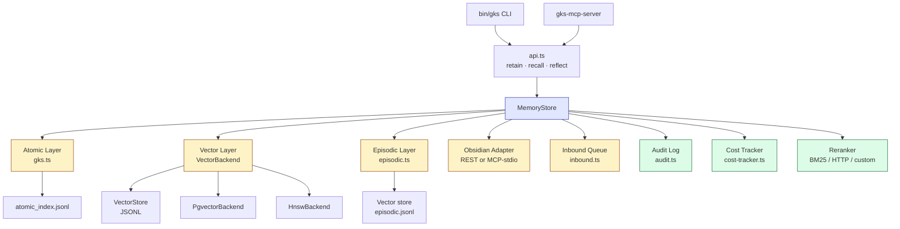
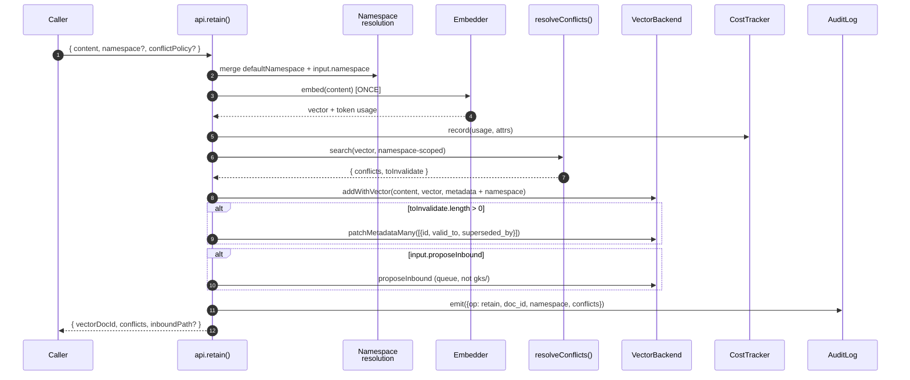
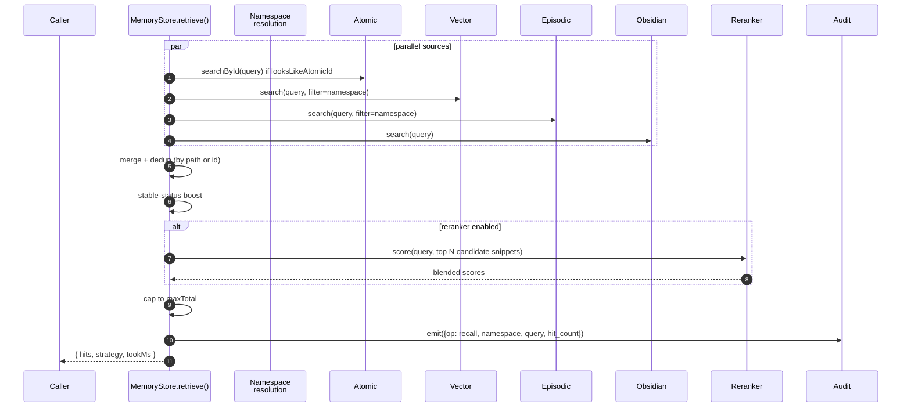
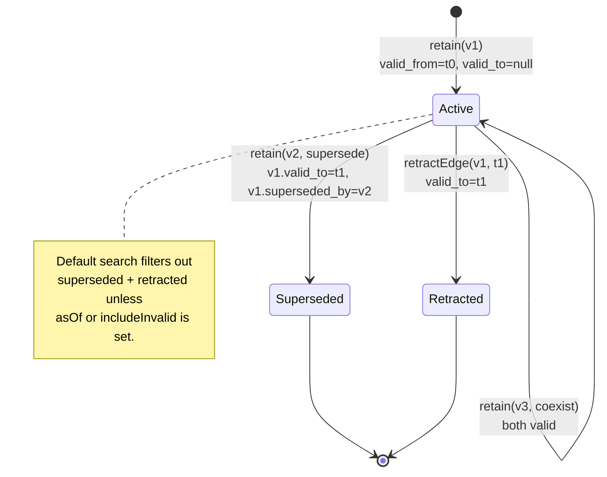
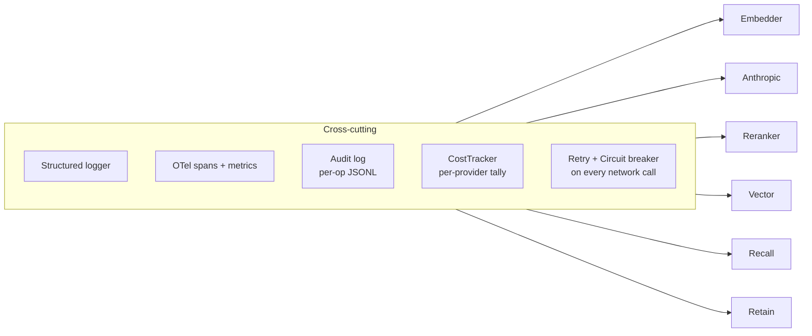

# GKS — Architecture

Companion to `BLUEPRINT--memory`.
Where the BLUEPRINT is the canonical spec, this page is the
"how-it's-actually-wired" overview for engineers picking up the codebase.

For incremental design decisions, see the ADR series in
[`docs/adr/`](./adr/).

> **Atom-prefix taxonomy (v2.3, 2026-05-13)**: directory layout below
> uses v2.3 vocabulary. `FRAME--` is now **Block Manifest** (runtime
> entry-point of a Genesis Block, contract: `SPEC--GENESIS-BLOCK-MANIFEST`);
> the prior governance / architecture meaning moved to `FRAMEWORK--`.
> `GUARDRAIL--` renamed to `GUARD--`. Engine code in this doc is
> unchanged by v2.3 — it's an organisational refit on the knowledge
> layer above the storage engine. Full prefix table:
> [`KNOWLEDGE-TYPES.md`](./KNOWLEDGE-TYPES.md).
>
> **Naming reminder**: the `genesis-block.ts` backend wired into
> `GraphBackend` is the **Genesis Graph Backend** (storage / DB). It is
> NOT the same as a **Genesis Block** (composite knowledge unit
> declared via a `FRAME--` manifest). The two layers are orthogonal —
> a Genesis Block's edges can be persisted in a Genesis Graph Backend
> instance, but neither owns the other.

---

## Layer dependency



**Rule:** upper layers depend on lower; lower must NOT import from
upper. The orchestrator (apps using GKS) sits above CLI/MCP; the API
module knows nothing about CLI/MCP existence.

---

## Retain flow



Single embed call per retain (the wrapping cost tracker reads it once).
Conflict detection runs against the same namespace; cross-tenant supersede
is impossible by construction.

---

## Recall flow



`crossNamespace: true` skips the namespace filter entirely — only meant
for admin / migration paths and emits a `meta.cross_namespace=true`
flag on the audit event so anomalies are easy to find.

---

## Bi-temporal lifecycle



The `asOf` query travels back in time:
`graph.query({ from:'u', rel:'LIVES_IN', asOf:'2023-06-01' })` returns
the edge that was current then, not now.

---

## Storage layout

```
<root>/
├── gks/                                  ← CANONICAL, READ-MOSTLY
│   ├── 00_index/
│   │   └── atomic_index.jsonl           ← AtomicLayer reads this
│   ├── concept/                         ← CONCEPT-- atoms (+ COGNITIVE-- per v2.3)
│   ├── frame/                           ← FRAME--      (v2.3: Block Manifest)
│   ├── framework/                       ← FRAMEWORK--  (v2.3: governance / architecture, was FRAME--)
│   ├── adr/                             ← ADR--
│   ├── feat/                            ← FEAT--
│   ├── algo/                            ← ALGO-- · …
│   ├── spec/                            ← SPEC--       (v2.3)
│   ├── stack/                           ← STACK--      (v2.3)
│   ├── safety/                          ← SAFETY--     (v2.3)
│   ├── guard/                           ← GUARD--      (v2.3: was GUARDRAIL--)
│   ├── blueprint/                       ← BLUEPRINT-- (yaml)
│   ├── issues/                          ← ISSUE-- (light-tier per ADR-012)
│   └── ...                              ← one folder per type (ADR-013)
└── .brain/msp/projects/evaAI/
    ├── memory/                          ← episodic markdown summaries
    │   └── MSP-SESS-...md
    ├── session/
    │   ├── MSP-SESS-...session.json     ← lifecycle + cost summary
    │   └── MSP-SESS-...trace.jsonl      ← append-only trace
    ├── inbound/                         ← queue of proposed atoms (GKS default — MSP overrides to `candidates/` per Phase 3)
    │   └── INSIGHT--FOO.rev-...md
    ├── vector/
    │   ├── atomic.jsonl                 ← (or *.hnsw, or pgvector schema)
    │   ├── episodic.jsonl
    │   └── _manifest.json               ← embedder + schema_version
    └── audit/
        └── audit-YYYY-MM-DD.jsonl       ← append-only audit log
```

**Write rules** (BLUEPRINT--memory § write_rules):

| Path | Write policy |
|---|---|
| `gks/` | NEVER write directly — go via `proposeInbound()` (GKS API) or `msp_candidate` (MSP MCP tool wrapper) |
| `.brain/.../memory/*.md` | append-only; refuse-on-overwrite |
| `.brain/.../inbound/*` (or `candidates/*` when MSP overrides `inboundDir`) | each artifact is a new file with a unique reviewId — see Phase 3 migration |
| `.brain/.../vector/*.jsonl` | rebuildable; safe to overwrite via `re-embed` |
| `.brain/.../session/*.trace.jsonl` | append-only during the session |
| `.brain/.../audit/*.jsonl` | append-only forever |

---

## Pluggable boundaries

Every external dependency sits behind a small interface that has both an
in-process default and a production adapter:

| Capability | Interface | Default | Production |
|---|---|---|---|
| Vector store | `VectorBackend` | JSONL `VectorStore` | `PgvectorBackend`, `HnswBackend` |
| Graph store | `GraphBackend` | in-memory `GraphStore` | `PgGraphBackend` |
| Reranker | `Reranker` | BM25 lexical | `httpReranker` (TEI / BGE rerank-v2) |
| LLM client | `LlmClient` | (heuristic in Consolidator) | `createAnthropicClient` |
| Obsidian | `ObsidianAdapter` | `MockObsidianAdapter` | `RestObsidianAdapter`, `MCPObsidianAdapter` |
| Embedder | `Embedder` | mock SHA-256 | Ollama `bge-m3`, OpenAI fallback |

Adding a new backend = implement the interface + register a factory.
No callers change.

---

## Cross-cutting concerns

These wrap the core data path:



Each is opt-out via `MemoryStoreOptions`:
- `audit: false`           — disable audit log
- `cost: false`            — disable cost tracker
- `reranker: { enabled: false }` — disable reranker pass
- `obsidian: undefined`    — disable obsidian source
- Telemetry is no-op until `setupTelemetry()` registers an SDK
- Resilience is always on (the retry budget caps it; the breaker has
  reasonable defaults but is configurable per provider)

---

## Phase mapping

| Phase | Status | Lives in |
|---|---|---|
| 1 — Atomic + Vector + retain/recall + LoCoMo | ✅ | first commit + Slice A |
| 2A — Bi-temporal + reranker + LongMemEval + LLM consolidator | ✅ | Slice A |
| 2C — Re-embed + Obsidian REST + sessions | ✅ | Slice C |
| 2D — Graph + BEAM + VectorBackend abstraction + quickstart | ✅ | Slice D |
| 2B — pgvector + HNSW + PgGraphBackend + MCP-stdio + rerank fixtures | ✅ | Phase 2B |
| 3 — Backend-pluggable benchmarks + sweep runner | ✅ | Phase 3 |
| 4 — Observability + Resilience + Multi-tenancy + Cost + Schema migrations | ✅ | Phase 4 |
| 5 — MCP server + CLI + ADRs | ✅ (this slice) | Phase 5 |
| 6 — Release | pending | Phase 6 |

---

## Where to look

- Spec: `BLUEPRINT--memory` (root of repo, currently inline in commit history)
- Roadmap: [`docs/ULTRAPLAN.md`](./ULTRAPLAN.md)
- Benchmarks: [`docs/BENCHMARKS.md`](./BENCHMARKS.md)
- Observability: [`docs/OBSERVABILITY.md`](./OBSERVABILITY.md)
- Schema migrations: [`docs/MIGRATIONS.md`](./MIGRATIONS.md)
- ADRs: [`docs/adr/`](./adr/)
- Quickstart: [`examples/quickstart.ts`](../examples/quickstart.ts)
