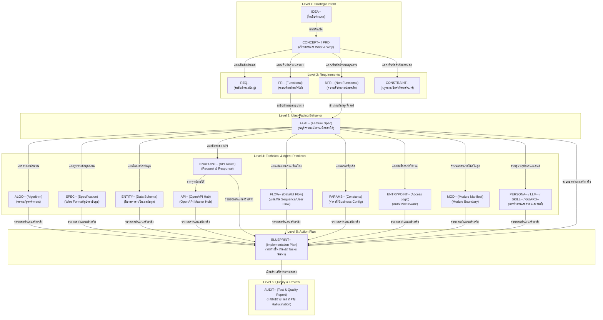

# คู่มือการเขียนและจัดการอะตอมความรู้ (GKS Atom Authoring & Metadata Manual)

คู่มือนี้สรุปมาตรฐาน รูปแบบเมทาดาตา (Metadata Specification) โครงสร้างระดับความสัมพันธ์ (Taxonomy Hierarchy) และเครื่องมือ (CLI & Validation) ในระบบ **Genesis Knowledge System (GKS)** เพื่อให้มั่นใจว่าความรู้ในคลังมีความกะทัดรัด (Atomic) แยกส่วนกันอย่างชัดเจน (Decoupled) และสืบย้อนกลับได้แบบ 100% (Traceable)

---

## 🏛️ 1. โครงสร้างระดับความสัมพันธ์และการแตกแขนง (GKS Taxonomy Hierarchy & Derivation)

ความรู้ในคลัง GKS ไม่ได้อยู่แยกกันอย่างโดดเดี่ยว แต่มีสายสัมพันธ์การไหลของข้อมูลจากบนลงล่างที่เป็นขั้นเป็นตอน โดยแบ่งเป็น **6 ระดับชั้นหลัก (Levels)** เพื่อให้ผู้เขียนและเอเจนต์เห็นภาพชัดเจนว่า **"อะตอมตัวใดแตกแขนงมาเพื่อตอบโจทย์อะตอมระดับบนตัวใด"** ดังนี้:

### 🗺️ แผนผังการแตกแขนงระดับความรู้ (Knowledge Derivation Tree)



---

### 📝 รายละเอียดการแตกแขนงในแต่ละระดับ (Step-by-Step Breakdown)

#### **ระดับที่ 1: Strategic Intent (เจตจำนงเชิงกลยุทธ์ / จุดเริ่มต้น)**
*   **จาก `IDEA--` สู่ `CONCEPT--`**:
    *   **`IDEA--` (ร่างแรก)**: ไอเดียประกายไฟสั้นๆ ที่ยังไม่ตกผลึก
    *   **แตกออกมาเป็น ──► `CONCEPT--` (เป้าหมายสูงสุด / PRD)**: เมื่อความต้องการชัดเจนจะสถาปนา CONCEPT-- ขึ้นมากำหนดภาพรวม ขอบเขต (Scope) และประโยชน์สำหรับผู้ใช้ (What & Why)

#### **ระดับที่ 2: Requirements Engineering (การแตกข้อกำหนดเชิงสเปคระบบ)**
*   **จาก `CONCEPT--` สู่กลุ่ม Requirements**:
    *   เมื่อได้ภาพรวมของธุรกิจ/ผู้ใช้จาก CONCEPT-- ระบบจะถูกแตกรายละเอียดเชิงวิศวกรรมความต้องการเป็น:
        *   **`REQ--` (ร่มข้อกำหนดใหญ่)**: สำหรับจัดกลุ่มความต้องการระบบเชิงวิชาการ
        *   **`FR--` (Functional Requirement)**: ข้อมูลรายการการทำงานหลักที่ระบบ "ต้องทำได้" เพื่อตอบโจทย์ Concept
        *   **`NFR--` (Non-functional Requirement)**: เกณฑ์ด้านมาตรฐานประสิทธิภาพ ความปลอดภัย และประสบการณ์ผู้ใช้
        *   **`CONSTRAINT--` (Hard Constraint)**: กฎเกณฑ์ภายนอกหรือระบบเดิมที่ไม่สามารถหลีกเลี่ยงหรือละเมิดได้

#### **ระดับที่ 3: User-Facing Behavior (การออกแบบพฤติกรรมสัมผัสของผู้ใช้)**
*   **จาก `FR--` / `NFR--` สู่ `FEAT--`**:
    *   **`FEAT--` (Feature Spec)**: จะถูกสร้างขึ้นมา **เพื่อเป็นตัวกลางในการตอบโจทย์ (Implements)** หนึ่งหรือหลาย `FR--` / `NFR--` โดยจะเขียนอธิบายพฤติกรรมหน้าจอ (User-facing behaviour) การแสดงผล และเงื่อนไขการทำงานจริงเมื่อผู้ใช้งานตอบโต้กับระบบ

#### **ระดับที่ 4: Technical & Agent Primitives (การแตกองค์ประกอบย่อยเฉพาะด้าน)**
*   **จาก `FEAT--` สู่ส่วนประกอบเชิงเทคนิคและปฏิบัติการ**:
    *   เพื่อป้องกันไม่ให้เอกสาร `FEAT--` กลายเป็นเอกสารสเปคที่ยักษ์เกินไปและแก้ไขยาก เราจะ **Decompose** ข้อมูลทางเทคนิคและเอเจนต์ออกเป็นอะตอมขนาดจิ๋วเฉพาะทางที่นำกลับมาใช้ซ้ำ (Reuse) ได้ง่าย:
        *   **──► `ALGO--` (Algorithm)**: แยกสูตรคำนวณ ตรรกะคัดเกณฑ์ หรือเงื่อนไขตัดสินใจที่ซับซ้อน
        *   **──► `SPEC--` (Technical Specification)**: ข้อกำหนดรูปทรงข้อมูลระดับลึก หรือสายข้อมูลภายนอก (Data Shape / Wire Format)
        *   **──► `ENTITY--` (Data Schema)**: นิยามฟิลด์ข้อมูล ตารางฐานข้อมูล และความเชื่อมโยงเชิงโครงสร้าง
        *   **──► `ENDPOINT--` (One API Path)**: สัญญา interface รับส่งข้อมูล Request/Response สำหรับเชื่อมโยงข้ามเครื่อง
        *   **──► `API--` (OpenAPI Hub)**: จุดรวมเอกสาร OpenAPI หลักสำหรับจัดกลุ่ม Endpoints ต่างๆ ของระบอบอินเตอร์เฟส
        *   **──► `FLOW--` (Data/UI Flow)**: แผนผัง Sequence ลำดับขั้นตอนการไหลของข้อมูลเพื่อให้อ่านพฤติกรรมของฟีเจอร์ได้ง่าย
        *   **──► `PARAMS--` (Constants)**: ค่าคงที่หรือค่าคอนฟิกธุรกิจของแอปพลิเคชัน
        *   **──► `ENTRYPOINT--` (Access Logic)**: รายละเอียดการกรองความปลอดภัยและการควบคุมสิทธิ์ผ่านมิดเดิลแวร์
        *   **──► `MOD--` (Module Manifest)**: กำหนดขอบเขตความเป็นเจ้าของโค้ด โครงสร้างโฟลเดอร์แพ็คเกจ และสิทธิ์เปิดใช้ฟังก์ชันของโมดูลย่อย
        *   **──► 🤖 Agent Governance Primitives (มีหรือไม่มีก็ได้ - Optional)**: สำหรับฟีเจอร์ที่ทำงานขับเคลื่อนด้วยเอเจนต์ AI เราจะ Decompose สเปคการควบคุมพฤติกรรมและความปลอดภัยออกมาดังนี้:
            *   **`PERSONA--` (Agent Identity)**: นิยามตัวตน บทบาท และ Seed System Prompt ของเอเจนต์
            *   **`LLM--` / `SLM--` (Reasoning/Execution Engine)**: ตัวกำหนดค่าสมอง คอนฟิกการคิด และพารามิเตอร์การเรียกใช้โมเดล
            *   **`MCP--` (Context Tool)**: รายละเอียดเครื่องมือเชื่อมต่อผ่านโปรโตคอล Model Context Protocol
            *   **`SKILL--` (Agent Capability)**: ทักษะและความสามารถพิเศษของเอเจนต์ที่ถูกจัดเตรียมไว้
            *   **`GUARD--` / `POLICY--` (Guardrails & Policies)**: กฎความปลอดภัยเชิงโครงสร้าง/พฤติกรรมเอเจนต์ และนโยบายการรันเฉพาะทาง
            *   **`PROTOCOL--` (Interaction Contract)**: สัญญาและรูปแบบข้อความสื่อสารระหว่างเอเจนต์ย่อยด้วยกัน
            *   **`CMD--` (System Command)**: รายการคำสั่งระบบปฏิบัติการระดับล่างที่อนุญาตให้เอเจนต์เรียกใช้เพื่อความปลอดภัย

#### **ระดับที่ 5: Action Plan (การร่างแผนงานพัฒนา)**
*   **จากโครงสร้างทั้งหมด สู่ `BLUEPRINT--`**:
    *   **`BLUEPRINT--` (แผนดำเนินงาน)**: รวบรวมและวิเคราะห์ความเชื่อมโยงของอะตอมในระดับเทคนิคและเอเจนต์ทั้งหมด (FEAT, ALGO, ENTITY, SPEC, FLOW, PARAMS, ENTRYPOINT, API, MOD, PERSONA, LLM, MCP, SKILL, GUARD, PROTOCOL) เพื่อจัดขั้นตอนการลงมือพัฒนาเชิงปฏิบัติ มีการจัดลำดับการทำงาน (Geography) และรายการตัวงานที่นักพัฒนาหรือเอเจนต์ T1/T3 สามารถนำไปเขียนโค้ดได้จริง

#### **ระดับที่ 6: Quality & Verification (รายงานการตรวจสอบหลังพัฒนา)**
*   **จากผลลัพธ์พัฒนา สู่ `AUDIT--`**:
    *   **`AUDIT--` (ผลการทดสอบคุณภาพ)**: หลังจากทำตามแผนพัฒนาสำเร็จ อะตอมนี้จะถูกเขียนขึ้นเพื่อส่งรายงานผลการตรวจสอบความเสถียร ผลทดสอบแบบ Automated Test (เช่น Vitest) และบันทึกการป้องกันการหลงลืม (Anti-hallucination Check) เพื่อยืนยันความถูกต้องเทียบกับเป้าหมายเริ่มต้นที่กำหนดไว้ใน `CONCEPT--`

---

## 🏷️ 2. มาตรฐานหน้าสารบัญ (Frontmatter Metadata Specification)

ทุกอะตอมใน GKS จะต้องมีส่วนหัว Frontmatter ในรูปแบบ YAML ที่ถูกต้องตามโครงสร้างที่อัปเดตล่าสุด ดังตัวอย่างนี้:

```yaml
---
id: CONCEPT--ACCEPTANCE-VITEST-RUNNER
phase: 1
type: concept
status: stable
vault_id: default
tier: genesis
source_type: axiomatic
title: "Vitest acceptance runner — sandbox candidate + spawn vitest"
aliases:
  - CONCEPT
cluster: implementation_flow
role: "Strategic intent / PRD"
---
```

### รายละเอียดฟิลด์สำคัญ:
1.  **`aliases`**: อาเรย์เก็บคำพ้องสำหรับการเปิดใช้งานด้วย Obsidian โดยกำหนดให้ **ดัชนีแรก (Index 0) ต้องเป็นตัวพิมพ์ใหญ่ของประเภทอะตอมนั้นๆ เสมอ** (เช่น `CONCEPT`, `FEAT`, `ADR`) โดยตัดฟิลด์ `cluster` และ `role` ออกไปจากอาเรย์นี้แล้วเพื่อความกระชับ
2.  **`cluster`**: ฟิลด์แยกเดี่ยวแสดงหมวดหมู่ความไหลเวียน (เช่น `implementation_flow`, `agent_governance`, `requirements`, `ops`)
3.  **`role`**: ฟิลด์แยกเดี่ยวระบุหน้าที่ความรับผิดชอบของประเภทอะตอมนั้นๆ (เช่น `"Strategic intent / PRD"`, `"Feature spec"`, `"Architecture decision record"`)

---

## 🗂️ 3. แผนผังประเภทอะตอม (Atom Types Taxonomy Mapping)

ตามเกณฑ์มาตรฐานในคลังสะสมความรู้ GKS เราได้จำแนกอะตอมออกเป็น **Core (บังคับมี / Required)** ซึ่งจำเป็นสำหรับการส่งมอบฟีเจอร์และวงจรพัฒนาหลัก และ **Optional (มีหรือไม่มีก็ได้ / Optional)** ซึ่งเป็นอะตอมสนับสนุนทางเทคนิคหรือสกัดด้วยเครื่องมืออัตโนมัติ:

### 🌟 3.1 กลุ่มอะตอมหลัก (Core - บังคับมี / Required)
เหล่านี้คืออะตอมที่ขับเคลื่อนวงจรการสร้างและการันตีคุณภาพของการพัฒนาฟีเจอร์หลัก (Phase-aligned P0 -> P6) ทุกอะตอมในกลุ่มนี้จำเป็นต้องได้รับการสถาปนาและเชื่อมโยงกันอย่างเป็นระบบ:

| รหัสประเภท | ชื่อฟิลด์ `role` (หน้าที่) | หมวดหมู่ `cluster` | รายละเอียดและการใช้งาน | หัวข้อบังคับ (Required Sections) |
|---|---|---|---|---|
| **`CONCEPT`** | `"Strategic intent / PRD"` | `implementation_flow` | กำหนดความต้องการทางธุรกิจ ภาพรวม What & Why | Problem, Hypothesis, Scope, Out of scope, Verification, Source |
| **`ADR`** | `"Architecture decision record"` | `implementation_flow` | บันทึกการตัดสินใจทางสถาปัตยกรรมที่สำคัญ | Context, Decision, Consequences, Alternatives considered, Source |
| **`FR`** | `"Functional requirement"` | `requirements` | ข้อกำหนดทางเทคนิคและการทำงานเชิงระบบ | Requirement, Verification, Source |
| **`NFR`** | `"Non-functional requirement"` | `requirements` | ข้อกำหนดด้านคุณภาพระบบ (Performance, Sec, etc.) | Quality attribute, Verification, Source |
| **`FEAT`** | `"Feature spec"` | `implementation_flow` | พฤติกรรมการตอบสนองหน้างานของผู้ใช้ | User-facing behaviour, Verification, Out of scope, Source |
| **`ENTITY`** | `"Data schema"` | `implementation_flow` | นิยามของตารางฐานข้อมูลและโมเดลข้อมูลย่อย | Schema definition, Relations, Source |
| **`ENDPOINT`** | `"One API path / method"` | `implementation_flow` | สัญญาและข้อตกลงของ API แต่ละเส้นทาง | Contract, Request, Response, Errors, Source |
| **`BLUEPRINT`** | `"Implementation plan"` | `implementation_flow` | แผนขั้นตอนการลงมือพัฒนาเชิงเทคนิค | Geography, Acceptance, Dependencies, Tasks, Source |
| **`AUDIT`** | `"Test results / quality report"` | `implementation_flow` | ผลลัพธ์การทดสอบและการตรวจสอบความเสี่ยง | Scope verified, Test results, Deviations, Anti-hallucination check, Follow-ups, Source |
| **`MASTER`** | `"Root-level policy / genesis rule"` | `implementation_flow` | นโยบายระดับสูงสุดหรือกฎการตั้งต้นระบบ | Policy, Scope, Enforcement, Source |
| **`PROTO`** | `"Machine-enforced invariant"` | `implementation_flow` | กฎเกณฑ์ที่ระบบ Validator จะต้องบังคับตรวจจับ | Rule, Severity, Enforcement, Counter-example, Source |

---

### 🧩 3.2 กลุ่มอะตอมสนับสนุน (Optional - มีหรือไม่มีก็ได้ / Optional)
อะตอมเหล่านี้จะใช้เพื่อวัตถุประสงค์เฉพาะทาง การควบคุมพฤติกรรมเอเจนต์ (Agent Governance) การบริหารจัดการความปลอดภัย หรือเป็นข้อมูลประมวลผลอัตโนมัติ:

#### A. สถาปัตยกรรมและเทคนิค (Tech & Framework Support)
*   **`IDEA`** (`role`: `"Raw prompt / spark"`, `cluster`: `implementation_flow`) - ไอเดียร่างแรกที่จุดประกาย มีอายุสั้นก่อนพัฒนาเป็น CONCEPT
*   **`MOD`** (`role`: `"Module manifest"`, `cluster`: `implementation_flow`) - ประกาศขอบเขตความเป็นเจ้าของและพอร์ตสาธารณะของโมดูล
*   **`ALGO`** (`role`: `"Algorithm definition"`, `cluster`: `implementation_flow`) - นิยามตรรกะการคำนวณ สูตรคณิตศาสตร์ หรือขั้นตอนการทำงาน
*   **`FLOW`** (`role`: `"Data / UI flow"`, `cluster`: `implementation_flow`) - แผนภาพความเคลื่อนไหวของข้อมูลหรือพฤติกรรมหน้าจอ
*   **`API`** (`role`: `"OpenAPI master hub"`, `cluster`: `implementation_flow`) - จุดศูนย์รวมเอกสาร OpenAPI หลัก
*   **`ENTRYPOINT`** (`role`: `"Auth / middleware / access logic"`, `cluster`: `implementation_flow`) - ตรรกะดักผ่านหรือจัดการสิทธิ์การเข้าถึง
*   **`PARAMS`** (`role`: `"Constants / business config"`, `cluster`: `implementation_flow`) - ค่าคงที่หรือค่าคอนฟิกธุรกิจของแอปพลิเคชัน
*   **`GENESIS`** (`role`: `"Block Manifest (v2.3+)"`, `cluster`: `implementation_flow`) - จุดเริ่มต้นการรันของ Genesis Block
*   **`FRAMEWORK`** (`role`: `"Governance / architectural framework"`, `cluster`: `implementation_flow`) - แม่แบบและกฎเกณฑ์สถาปัตยกรรม
*   **`STACK`** (`role`: `"Technology stack inventory"`, `cluster`: `implementation_flow`) - รายการและเวอร์ชันเทคโนโลยีที่เลือกใช้
*   **`SPEC`** (`role`: `"Technical specification"`, `cluster`: `implementation_flow`) - ข้อกำหนดรูปทรงข้อมูลเชิงลึก
*   **`COGNITIVE`** (`role`: `"Mental model / interpretive lens"`, `cluster`: `implementation_flow`) - กรอบความคิดหรือตัวเลนส์การวิเคราะห์เชิงปัญญา
*   **`SAFETY`** (`role`: `"Ethical safety / AI alignment"`, `cluster`: `implementation_flow`) - กฎความปลอดภัยทางจริยธรรมและการควบคุมปัญญาประดิษฐ์

#### B. การบริหารเอเจนต์และพฤติกรรม (Agent Governance)
*   **`LLM`** (`role`: `"Large reasoning engine"`, `cluster`: `agent_governance`) - ตัวกำหนดค่าและการประเมินสติปัญญาของโมเดลตัวใหญ่
*   **`SLM`** (`role`: `"Small execution engine"`, `cluster`: `agent_governance`) - ตัวประมวลผลตัวเล็กเฉพาะทาง
*   **`MCP`** (`role`: `"Model Context Protocol tool"`, `cluster`: `agent_governance`) - รายละเอียดเครื่องมือเชื่อมต่อผ่านโปรโตคอล MCP
*   **`CMD`** (`role`: `"Executable system command"`, `cluster`: `agent_governance`) - ข้อมูลคำสั่งของระบบปฏิบัติการที่อนุญาตให้ใช้งาน
*   **`SKILL`** (`role`: `"Agent capability"`, `cluster`: `agent_governance`) - ความสามารถพิเศษของตัวแทนเอเจนต์
*   **`PROTOCOL`** (`role`: `"Interaction contract"`, `cluster`: `agent_governance`) - สัญญาสื่อสารข้อความระหว่างเอเจนต์
*   **`GUARD`** (`role`: `"Structural / behavioural guardrail"`, `cluster`: `agent_governance`) - ข้อจำกัดการทำงานที่เข้มงวดของเอเจนต์
*   **`POLICY`** (`role`: `"Operational policy"`, `cluster`: `agent_governance`) - นโยบายการควบคุมเก็บรักษาหรือสิทธิ์การรัน
*   **`PERSONA`** (`role`: `"Agent identity"`, `cluster`: `agent_governance`) - นิยามตัวตน นิสัย และ Seed System Prompt ของเอเจนต์

#### C. ความต้องการและการดำเนินงานระดับย่อย (Specialized Requirements & Ops)
*   **`REQ`** (`role`: `"Umbrella requirement"`, `cluster`: `requirements`) - ภาพความต้องการระบบในร่มใหญ่
*   **`CONSTRAINT`** (`role`: `"Hard external constraint"`, `cluster`: `requirements`) - ข้อจำกัดและกฎหมายจากภายนอกที่ไม่สามารถต่อรองได้
*   **`INC`** (`role`: `"Incident post-mortem"`, `cluster`: `ops`) - บทเรียนและการวิเคราะห์สาเหตุของวิกฤติระบบในอดีต
*   **`HOTFIX`** (`role`: `"Hotfix escape-hatch atom"`, `cluster`: `ops`) - ข้อมูลแพทช์ด่วนพิเศษชั่วคราว
*   **`ISSUE`** (`role`: `"Live issue tracker"`, `cluster`: `ops`) - บันทึกปัญหาการทำงานแบบไลฟ์เรียลไทม์
*   **`RISK`** (`role`: `"Identified risk + mitigation"`, `cluster`: `ops`) - ข้อมูลความเสี่ยงและทางออกบรรเทาความเสียหาย
*   **`RUNBOOK`** (`role`: `"Operational response guide"`, `cluster`: `ops`) - คู่มือปฏิบัติการเมื่อเกิดสถานการณ์วิกฤติต่างๆ
*   **`SLO`** (`role`: `"Service-level objective"`, `cluster`: `ops`) - เป้าหมายความเสถียรและการแจ้งเตือน

#### D. ความรู้สะสมอัตโนมัติ (Derived Memory - สกัดข้อมูลจากระบบ)
*   **`INSIGHT`** (`role`: `"Session-derived observation"`, `cluster`: `memory`) - ข้อสังเกตและพฤติกรรมที่สกัดมาจากเซสชันการพัฒนา
*   **`FACT`** (`role`: `"Retain-derived fact"`, `cluster`: `memory`) - ข้อเท็จจริงที่สกัดและกลั่นกรองขึ้นมา
*   **`RULE`** (`role`: `"Derived behavioural rule"`, `cluster`: `memory`) - กฎเกณฑ์พฤติกรรมที่เรียนรู้จากการทำงานจริง
*   **`USAGE`** (`role`: `"Usage metrics rollup"`, `cluster`: `memory`) - สารสรุปการประเมินปริมาณการรันและทราฟฟิกข้อมูล
*   **`EPISODE`** (`role`: `"Execution episode log"`, `cluster`: `memory`) - บันทึกผลการทำงานของเอเจนต์ในเซสชันนั้นๆ

---

### 3.3 มุมมอง Phase-Temporal และการจดบันทึก (Phase Activity & Devlog Mapping)

ตาราง derivation tree ใน §1 และตาราง atom types ใน §3.1/§3.2 มองในมิติ **"atom ใดต่อยอดจากอะไร"** (causal/hierarchical) ส่วนตารางด้านล่างมองในมิติ **"phase ใดต้องผลิต atom อะไร"** (temporal/workflow) — เป็น quick-reference สำหรับใช้ตอน gate check ก่อนข้าม phase

| Phase | กิจกรรมหลัก | Atom Artifact (durable) | Devlog (optional, EVA-style) |
|---|---|---|---|
| **P0** | Framework architecture & root policies | `FRAMEWORK--`, `MASTER--`; optionally `GENESIS--` Block Manifest, `SAFETY--`, `STACK--` | — |
| **P1** | กำหนดความต้องการธุรกิจ & motivation | `CONCEPT--`, `REQ--`, `FR--`, `NFR--`, `CONSTRAINT--` | — |
| **P2** | ออกแบบโครงสร้าง / API / decision | `ADR--`, `FEAT--`, `ALGO--`, `ENTITY--`, `FLOW--`, `API--`, `ENDPOINT--`, `ENTRYPOINT--`, `PARAMS--`, `MOD--`, `SPEC--`, `PROTO--`, `PROTOCOL--`, `GUARD--`, `POLICY--`, `PERSONA--`, `SKILL--`, `LLM--`, `SLM--`, `MCP--`, `CMD--` | — |
| **P3** | วางแผนการแก้โค้ดเชิงลึก | `BLUEPRINT--` | `MSP-IMP-` (EVA only) |
| **P4** | แตกงานย่อย (Task Decomposition — orchestrator) | `T*.task.yaml` (**ไม่ใช่ atom** — ดู `ADR--TASK-TRACKING-AT-ORCHESTRATOR`) | `MSP-TSK-` (EVA only) |
| **P5** | ลงมือเขียนโค้ดจริง | `src/` | `MSP-ACT-` (EVA only) |
| **P6** | ตรวจสอบคุณภาพและ Acceptance Test | `AUDIT--`, `INC--`, `ISSUE--`, `RUNBOOK--` | `MSP-WKT-` (EVA only) |
| **P7** | Deploy / Ops | `ops/` configs + `RUNBOOK--` + `SLO--` + `RISK--` + `HOTFIX--` | — |

#### หมายเหตุ Devlog (EVA-specific)

โปรเจกต์ EVA-style (Python MSP-v9.1) ใช้ devlog IDs เป็น tracing layer แยกจาก atom store:
- **`MSP-IMP-`** (Implementation plan log) — track per-blueprint execution
- **`MSP-TSK-`** (Task log) — track per-microtask
- **`MSP-ACT-`** (Action log) — per-turn agent action
- **`MSP-WKT-`** (Walkthrough) — sign-off bundle, ≈ AUDIT-- but unstable

โปรเจกต์ TypeScript MSP monorepo **ไม่บังคับ** flow นี้ — ใช้ git commits + AUDIT-- atoms แทนได้ทั้งหมด ดูรายละเอียดที่ `docs/MSP_RELATIONSHIP.md`

---

## 🛠️ 4. เครื่องมือสร้างและจำลองโครงสร้างอะตอม (CLI tool)

เพื่อลดข้อผิดพลาดในการป้อนข้อมูล YAML เรามีโปรแกรมจัดการอะตอมความรู้ (`msp-atom`) ซึ่งจะทำงานตามค่าคอนฟิกใน `atom_registry.yaml` โดยอัตโนมัติ

คุณสามารถรันโปรแกรมนี้ผ่านคำสั่งต่อไปนี้ (รันจาก Workspace Root):

### คำสั่งที่ 1: การร่างโครงสร้างตัวอย่าง (`scaffold`)
สร้างไฟล์เทมเพลตเปล่าที่มีฟิลด์เมทาดาตาครบถ้วนและโครงสร้างหัวข้อ Markdown ที่ถูกต้องตามประเภทนั้นๆ ไปยังไดเรกทอรีที่เหมาะสม
```bash
npx tsx scripts/msp/msp-atom.ts scaffold --type=<ประเภท> --slug=<ชื่อสลัก>
```
*ตัวอย่าง:*
```bash
npx tsx scripts/msp/msp-atom.ts scaffold --type=concept --slug=NEW-DASHBOARD
```
*(จะได้ไฟล์ร่างที่ `gks/concept/CONCEPT--NEW-DASHBOARD.md`)*

### คำสั่งที่ 2: ร่างไฟล์พร้อมเนื้อหาเริ่มต้น (`create`)
สร้างไฟล์ความรู้ใหม่ที่มีข้อมูลเริ่มต้นในเทมเพลตพร้อมใช้งาน
```bash
npx tsx scripts/msp/msp-atom.ts create --type=<ประเภท> --slug=<ชื่อสลัก> --title="หัวข้ออะตอม"
```

### คำสั่งที่ 3: ดูตัวอย่างข้อแนะนำการเขียนตามประเภท (`prompt`)
พิมพ์เทมเพลตและคำแนะนำในการเขียนของอะตอมประเภทนั้นออกมาทาง Console
```bash
npx tsx scripts/msp/msp-atom.ts prompt --type=<ประเภท>
```

---

## 🧪 5. การจัดการสารบัญและตรวจสอบความถูกต้อง (Indexing & Validation)

หลังจากสร้างหรืออัปเดตอะตอมใดๆ ผู้เขียนจำเป็นต้องรันกระบวนการตรวจสอบคุณภาพความเชื่อมโยงก่อนส่งมอบการเปลี่ยนแปลงเสมอ (Pre-push / PR Verification):

### ขั้นตอนที่ 1: อัปเดตไฟล์ดัชนีคลังอะตอม (`msp:index`)
ทำการสแกนไฟล์อะตอมทั้งหมดในคลัง `gks/` เพื่อเรียบเรียงและปรับปรุงดัชนีเชื่อมโยงหลักให้อยู่ในเวอร์ชันล่าสุด
```bash
npm run msp:index
```
*(จะแก้ไขไฟล์ `gks/00_index/atomic_index.jsonl` โดยอัตโนมัติ)*

### ขั้นตอนที่ 2: ตรวจสอบความถูกต้องของโครงสร้างและการเชื่อมโยง (`msp:validate`)
รันระบบตรวจสอบ (Validation Predicates) เพื่อจับข้อผิดพลาด เช่น ลิงก์เสีย ลิงก์วนลูป หรือฟิลด์ Frontmatter ไม่ครบถ้วน
```bash
npm run msp:validate
```

> [!IMPORTANT]
> **ระบบจะไม่อนุญาตให้ผ่านเกณฑ์หากพบข้อผิดพลาดประเภท `[required-fields]`** 
> หากมีการแก้ไขฟิลด์เมทาดาตาอย่างไม่ถูกต้อง ตัวตรวจสอบจะแจ้งเตือนและระบุจุดที่ต้องแก้ไขอย่างแม่นยำ

---

## 💡 6. แนวทางการเขียนที่ดี (GKS Best Practices)

*   **มีเนื้อหากระชับ (One Atom, One Responsibility)**: หากเขียนไปแล้วรู้สึกว่าเริ่มครอบคลุมหลายหัวข้อ ให้พิจารณาตัดแบ่งออกเป็นอะตอมย่อย แล้วโยงความสัมพันธ์ด้วยวงเล็บเหลี่ยมคู่แบบวิกิลิงก์ `[[TYPE--SLUG]]`
*   **รักษาคุณภาพลิงก์ (No Dangling Links)**: ตรวจสอบให้แน่ใจว่าปลายทางการทำวิกิลิงก์ `[[...]]` มีตัวตนจริงอยู่ในคลัง และมีไฟล์อะตอมพร้อมอยู่แล้วในตอนที่อัปเดตดัชนี
*   **ใช้ภาษาที่ตรงไปตรงมา**: เขียนหัวข้อและเนื้อหาในลักษณะอ้างอิงความจริง (Axiomatic) และรวบรัดเพื่อให้โมเดล AI (T1, T2, T3) และผู้อ่านที่เป็นมนุษย์สามารถดึงข้อมูลและทำความเข้าใจได้อย่างรวดเร็ว
