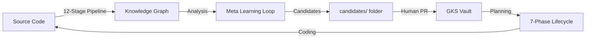

# Technical Specification — Meta Learning Loop (MLL)

**Scope:** MLL Orchestration, Candidate Flow, and 4D Verification.

---

## 1. System Architecture

MLL sits as a management layer between **GKS (Storage)** and **MSP (Orchestrator)**.



## 2. Data Schemas

### 2.1 Skill Candidate (YAML)
Located in `.brain/msp/projects/<ns>/candidates/SKILL--<id>.md`

```yaml
---
id: SKILL--EXAMPLE-TASK
version: 1.0
type: skill
tier: genesis
mll_metadata:
  source_episodes: ["EP_001", "EP_042"]
  definition_stability: 0.92
  suggested_by: "MLL-Skill-Creator"
  timestamp: "2026-05-13T..."
---
# Executive Summary
...
```

### 2.2 Tension Event (Log)
Located in `gks/devlog/tension-events/<date>-<id>.md`

```markdown
# Tension Event: [MASTER--EMPATHY]

- **Symptom:** Conflicting behavior between rule and user outcome.
- **Master ID:** `MASTER--EMPATHY`
- **Evidence:** `EP_2026_05_001`
- **MLL Proposal:** Review the "Non-judgmental" boundary.
- **Severity:** High
```

## 3. The 4D Verification Logic

MLL enforces the **4D Completeness** for all atoms promoted to the "Master" tier:

| Dimension | Atom Type | Purpose |
|---|---|---|
| **Algo** | `ALGO--` | Deterministic steps / pseudo-code. |
| **Concept** | `CONCEPT--` | Semantic meaning and definitions. |
| **Frame** | `FRAMEWORK--` | Context and mental model. |
| **Proto** | `PROTOCOL--` | Interaction/Implementation pattern. |

## 4. Stability Check (Multi-Model Consensus)

MLL implements a `check_stability()` function that:
1.  Sends the Atom definition to 3 different LLM providers (Google, Anthropic, OpenAI/Local).
2.  Asks them to summarize the core principle.
3.  Calculates semantic similarity between the summaries.
4.  If similarity > 0.85, the definition is considered **Stable**.

## 5. Integration with 12-Stage Pipeline

- **Stage 3 (Markdown):** MLL reads all existing Atoms to build the baseline.
- **Stage 12 (Processes):** MLL monitors execution traces. If a trace matches a known `SKILL--` but the code has changed, MLL flags a **Tension Event**.
