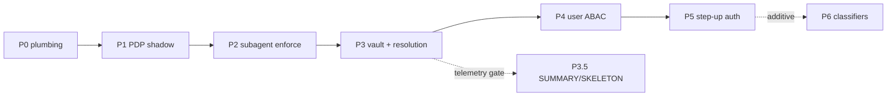

# ULTRAPLAN — UCF Implementation

> **Executor:** 3-Tier agent stack (T3 design / T2 scaffold / T1 micro-task codegen)
> **Reviewer:** Claude / human
> **Branch base:** `main` — per-phase branches `claude/msp-ucf-phase-N-<slug>`
> **Status:** READY for autonomous execution per phase; HALT at gates ⛔
> **Last updated:** 2026-05-14T23:46:17+07:00

---

## 0. Context (read this first — full self-contained brief)

### 0.1 What UCF is

The Universal Context Framework (`FRAMEWORK--UNIVERSAL-CONTEXT-FRAMEWORK`) makes
every retrieval and tool-call decision in MSP a function of **three orthogonal
axes**:

- **WHO** — Subject / Resource identity + clearance (security axis) → enforced by the **ABAC PDP**.
- **WHERE** — active Vault + Resource Namespace (isolation axis) → enforced by the **GKS storage partition**.
- **HOW MUCH** — resolution tier + token budget (economy axis) → enforced by the **MSP composer**.

Every context-shaping operation is parameterised by a **four-tuple**
`decide(subject, resource, action, context) → decision`, consumed by a
**five-layer pipeline**, ordered cheapest-first:

```
L1 Namespace filter → L2 ABAC policy filter → L3 graph+vector scoring
   → L4 resolution tier assignment → L5 budget enforcement
```

### 0.2 Locked decisions (FRAMEWORK §"Decisions tracked in §0")

| id | Topic | Result |
|---|---|---|
| D-1 | Policy language v1 | YAML + minimal operators (~200 LOC) |
| D-2 | Resolution tier count (MVP) | 2-tier: FULL + MENTION + `expand()`; 4-tier deferred to Phase 3.5/4 |
| D-7 | Default policy posture | `default-permit` + shadow log in Phase 1; tighten to `default-deny` per-endpoint from Phase 3 |
| D-8 | AttributeBag storage | Atom metadata / frontmatter; GKS `Namespace` untouched |

### 0.3 Open questions — working assumptions (spec §14)

| OQ | Topic | Working assumption | Required by |
|---|---|---|---|
| OQ-1 | Hop metric | weighted hybrid `0.7·sim + 0.3·(1/(1+hops))` | Phase 3 |
| OQ-2 | MCP step-up channel | per-tool risk class; out-of-band only for `risk: high` | Phase 5 |
| OQ-3 | Auth provider | minimal in-house (PIN + Passkey) + accept reverse-proxy headers | Phase 4 |
| OQ-4 | Vault membership versioning | session-snapshot with explicit `refresh` action | Phase 3 |
| OQ-5 | Audit log destination | inline MSP audit with `audit_class: security`, split later if required | Phase 4 |
| OQ-6 | Embedding-leak threshold | constant-time deny only when vault config sets `sensitive_mode: true` | Phase 4 |

### 0.4 Doc-chain state — where we are in the 7-Phase Creation Lifecycle

The doc-to-code 7-Phase Creation Lifecycle (`FRAMEWORK_MASTER_SPEC.md` §6) is
`P0 FRAMEWORK → P1 CONCEPT → P2 ADR/FEAT → P3 BLUEPRINT → P4 TASK → P5 CODE → P6 AUDIT`.

| Phase | Blueprint (P3) | FEAT(s) (P2) | P3 status |
|---|---|---|---|
| 0 Plumbing | `BLUEPRINT--PHASE-0-PLUMBING` | — | merged (#138) |
| 1 PDP shadow | `BLUEPRINT--PHASE-1-PDP-SHADOW` | `FEAT--POLICY-DECISION-POINT` | merged (#138) |
| 2 Subagent scope | `BLUEPRINT--PHASE-2-SUBAGENT-SCOPING` | `FEAT--SUBAGENT-SCOPE-FILTERING` | merged (#138) |
| 3 Vault + resolution | `BLUEPRINT--PHASE-3-VAULT-AND-RESOLUTION` | `FEAT--VAULT-COMPOSITION`, `FEAT--RESOLUTION-EXPAND-ON-DEMAND` | merged (#138) |
| 4 User-level ABAC | `BLUEPRINT--PHASE-4-USER-ABAC` | (references `FEAT--POLICY-DECISION-POINT`) | this PR |
| 5 Step-up auth | `BLUEPRINT--PHASE-5-STEP-UP-AUTH` | `FEAT--STEP-UP-AUTH-PIN` | this PR |

All six P3 BLUEPRINTs exist after this PR merges. **P4 (TASK decomposition),
P5 (CODE), P6 (AUDIT) remain** — this ULTRAPLAN sequences them, one PR per phase.

### 0.5 The 5 Pillars, mapped onto this track

`FRAMEWORK_MASTER_SPEC.md` §3 — the system splits concern into five layers:

| Pillar | Role | This track |
|---|---|---|
| **Agent** | the workers | the 3-Tier executor stack (§3): T3 designs, T2 scaffolds, T1 codes |
| **MSP (Manager)** | gatekeeper / orchestrator | all new code lands in `packages/msp/src/policy/`, `vault/`, `orchestrator/resolution/`; PEPs sit at the `interfaces/` boundary (Hexagonal — §3.2.1) |
| **GKS (Storage)** | long-term knowledge SSOT | **untouched** — `Namespace` reused as-is per D-8; UCF wraps GKS, never edits it |
| **Obsidian (Viewer)** | human review GUI | N/A for this track |
| **Workflow** | the lifecycle | the 7-Phase forward lifecycle this doc sequences + the 12-Stage reverse pipeline (§5) |

### 0.6 How the standards compose

```
5 PILLARS  →  7-PHASE CREATION LIFECYCLE (forward)  →  P4 WBS  →  3T agents  →  P5 CODE
                                                                                  │
                          12-STAGE PROCESSING PIPELINE (reverse / MLL)  ◄──────────┘
```



---

## 1. Target architecture

All new code is MSP-side. GKS is untouched.

```
packages/msp/src/
├── policy/
│   ├── types.ts                 # Subject, Resource, Action, RequestContext,
│   │                            #   Decision, Obligation, AttributeBag + constructors  (P0)
│   ├── operators.ts             # equals, in, not_in, set ∩∪∖, arithmetic, time          (P1)
│   ├── loader.ts                # YAML → PolicySet, watchPolicies hot-reload, load linter (P1)
│   ├── pdp.ts                   # evaluatePolicy() — pure function, ~300 LOC              (P1)
│   ├── shadow-log.ts            # append-only shadow log writer + shadow-report aggregator (P1)
│   ├── task-scope.ts            # SubagentScope type + descriptor scope-block parser       (P2)
│   ├── escalation.ts            # escalate() round-trip: subagent → parent → widen/fail    (P2)
│   ├── subject.ts               # hydrateSubject(identity) → Subject AttributeBag          (P4)
│   └── step-up/
│       ├── provider.ts          # StepUpProvider interface + Challenge/Verify* types       (P5)
│       ├── challenge-store.ts   # server-side nonce store, TTL, replay defense             (P5)
│       └── pin-provider.ts      # PinProvider — Argon2id, action_hash binding              (P5)
├── vault/
│   ├── types.ts                 # Vault, VaultRegistry, ResolutionPolicy                  (P3)
│   └── registry.ts              # loadVaults / resolveVault / vaultRead*/Write*Namespace  (P3)
└── orchestrator/resolution/
    ├── tier.ts                  # tier-assignment score = w1·sim + w2·1/(1+hops)          (P3)
    └── budget.ts                # Layer 5 budget enforcement, on_overflow strategies      (P3)

policies/                        # repo root — YAML policy set
├── 00-default-permit.yaml       (P1)   ├── 10-subagent-scope.yaml        (P2)
├── 20-restricted-expose.yaml    (P3)   ├── 30-multi-tenant.yaml          (P4)
├── 40-pii-block-from-llm.yaml   (P4)   └── 50-step-up.yaml               (P5)

~/.msp/vaults/*.yaml             # vault configs — loaded, not committed                  (P3)
```

**Hexagonal boundary** (`FRAMEWORK_MASTER_SPEC.md` §3.2.1): PEPs are inbound
adapters — they live at the `interfaces/` edge (Express middleware, MCP tool
handlers, the composer entry). The PDP (`pdp.ts`) is **pure domain logic** — no
I/O, no transport awareness. `interfaces → orchestrator → clients → domain`;
never reverse.

**Touched (non-new) files:** `cognitive/index.ts` (facade — `recall`/`remember`/
`runTask`/`expand`/`escalate`), `memory.ts` (tuple pass-through + vault
read/write wiring), `mcp/tools/*.ts` (per-tool Action + identity), `index.ts`
(Express middleware), `codegen/master/composer.ts` (the PEP that graduates
shadow → enforce across phases).

---

## 2. Execution phases — the WBS (all 6 phases fully decomposed)

### WBS model

Each phase = **one PR**. Within a phase:

- **Task** — a blueprint `## Tasks` item (`Tn.m`). PR-internal milestone.
- **sub-task** — a distinct concern within a Task.
- **micro-task** — 1 concern, the `Tn_*.task.yaml` unit (`FRAMEWORK_MASTER_SPEC`
  §8.3): `task_id` (`^T\d+_[a-z0-9-]+$`), `concern` (≤120 chars, no "and"),
  `output.file` + `exports`, `acceptance_tests` (≥2), `runner` (model, retries,
  temp 0.0, ctx). Micro-task YAMLs live in `.brain/<ns>/tasks/FEAT-NNN/` —
  gitignored orchestrator territory (§8.2); this doc holds the WBS tables, the
  YAML files are scaffolded at per-phase execution time.
- **Tier** — `T1` = local SLM micro-task codegen (narrow, deterministic);
  `T2` = mid LLM (templates, acceptance tests, composer wiring, validators);
  `T3` = large LLM (pure-function design, type systems, cross-cutting wiring,
  PR review). Assignment rule: complex/architectural/pure-function → T3/T2;
  narrow deterministic single-file → T1.

`.brain/<ns>/tasks/FEAT-NNN/` layout per phase (`<ns>` = path-encoded namespace,
§17.1):

```
.brain/<ns>/tasks/<FEAT-OR-PHASE>/
├── _SCHEMA.yaml          # the §8.3 task schema for this phase
├── _templates/           # T2-authored slot templates (*.template.yaml)
├── manifest.yaml         # per target file: order + slots + blueprint_ref
├── Tn_*.task.yaml        # one per micro-task, 1 concern
└── _outputs/             # T1 SLM outputs (git-optional)
```

---

### PHASE 0 — Plumbing  (RISK: very low)

- **Blueprint:** `BLUEPRINT--PHASE-0-PLUMBING` · **FEAT:** — (foundational)
- **Ship gate:** every existing test passes unchanged; `grep evaluatePolicy`
  returns only the type def, no call sites — Phase 0 is behaviourally invisible.
- **PR:** `claude/msp-ucf-phase-0-plumbing` → ⛔ GATE 0 (human review)

| Task | sub-tasks | micro-tasks (`Tn_*.task.yaml`) | Tier |
|---|---|---|---|
| **T0.1** `policy/types.ts` | type defs; constructors; malformed-shape rejection | `T1_subject-resource-action-types`, `T2_decision-obligation-context-types`, `T3_attributebag-type`, `T4_make-subject-resource-constructors` | T3 (design) → T1 (per-type) |
| **T0.2** thread tuple through facade | `recall` sig; `remember` sig; `runTask` sig; default inference | `T5_facade-recall-tuple-param`, `T6_facade-remember-tuple-param`, `T7_facade-runtask-tuple-param`, `T8_action-inference-defaults` | T2 |
| **T0.3** thread through `memory.ts` | opaque pass-through into GKS recall; into GKS retain | `T9_memory-recall-tuple-passthrough`, `T10_memory-retain-tuple-passthrough` | T2 |
| **T0.4** MCP tool handlers | per-tool Action map; default `Subject{kind:'mcp-client'}` | `T11_mcp-action-map`, `T12_mcp-default-subject` | T1 |
| **T0.5** Express middleware | build `Subject{kind:'user',anonymous}`; build `RequestContext`; attach to `req` | `T13_express-subject-middleware`, `T14_express-requestcontext-middleware` | T2 |
| **T0.6** `attributes:` frontmatter | re-indexer carries bag; recall carries bag; round-trip test | `T15_reindexer-attributes-passthrough`, `T16_recall-attributes-passthrough` | T2 |
| **T0.7** 4-tuple debug log | log line at each entry point; shape test | `T17_four-tuple-debug-logger`, `T18_log-shape-test` | T1 |

- **`manifest.yaml`** — `target_file: packages/msp/src/policy/types.ts`,
  `tasks: [T1,T2,T3,T4]`, `compose.slots: [header, types, constructors, exports]`.
  Facade / memory / mcp / express edits are in-place patches, not composed files.
- **devlog hook:** append entry — Phase 0, PR #, T0.1–T0.7 status, "behaviourally
  invisible" confirmation, test count before/after.

---

### PHASE 1 — PDP in shadow mode  (RISK: low)

- **Blueprint:** `BLUEPRINT--PHASE-1-PDP-SHADOW` · **FEAT:** `FEAT--POLICY-DECISION-POINT`
- **Ship gate:** `runTask` output **byte-identical** to Phase 0 for a fixture
  task (shadow mode changes nothing observable); `evaluatePolicy` purity property
  test passes; shadow log accumulates one entry per `runTask`.
- **PR:** `claude/msp-ucf-phase-1-pdp-shadow` → ⛔ GATE 1

| Task | sub-tasks | micro-tasks | Tier |
|---|---|---|---|
| **T1.1** `operators.ts` | equality/`in`/`not_in`; set `∩∪∖`; arithmetic; time | `T1_equality-membership-operators`, `T2_set-operators`, `T3_arithmetic-operators`, `T4_time-operators` | T1 |
| **T1.2** `loader.ts` | YAML → `PolicySet`; load-time linter; `watchPolicies` monotonic version | `T5_yaml-policyset-parser`, `T6_load-time-linter`, `T7_watch-policies-hot-reload` | T2 |
| **T1.3** `pdp.ts` `evaluatePolicy` | rule match; effect resolution + default fallthrough; `reasoning` emit; purity | `T8_rule-matcher`, `T9_effect-resolution-default`, `T10_reasoning-trace-emit` | T3 (pure-function design) |
| **T1.4** `00-default-permit.yaml` | the permit-everything starter policy | `T11_default-permit-starter-policy` | T1 |
| **T1.5** `shadow-log.ts` | append-only writer keyed by `trace_id`; `shadow-report` aggregator | `T12_shadow-log-writer`, `T13_shadow-report-aggregator` | T2 |
| **T1.6** `runTask` shadow PEP | build tuple; call PDP; log Decision (no enforce); fixture-diff assert | `T14_runtask-shadow-pep` | T2 |
| **T1.7** `msp-policy` CLI | `lint`; `explain`; `shadow-report` | `T15_msp-policy-lint`, `T16_msp-policy-explain`, `T17_msp-policy-shadow-report` | T1 |
| **T1.8** `policies/README.md` | operator-authoring quickstart | `T18_policies-readme` | T1 |

- **`manifest.yaml`** — one per target: `pdp.ts` (`tasks:[T8,T9,T10]`, slots
  `[header,imports,matcher,resolver,reasoning,exports]`), `operators.ts`,
  `loader.ts`, `shadow-log.ts`, `msp-policy` CLI.
- **devlog hook:** Phase 1, PR #, byte-identical fixture diff result, shadow-log
  entry count, `msp-policy lint` flagging the fixture contradiction.

---

### PHASE 2 — Subagent scope filtering, enforced  (RISK: medium)

- **Blueprint:** `BLUEPRINT--PHASE-2-SUBAGENT-SCOPING` · **FEAT:** `FEAT--SUBAGENT-SCOPE-FILTERING`
- **Ship gate (A/B):** scoped subagent matches or beats the unscoped baseline at
  **≥30% lower token cost** on a representative coding task, with no task-success
  regression. If it regresses success, the phase does **not** ship.
- **PR:** `claude/msp-ucf-phase-2-subagent-scoping` → ⛔ GATE 2

| Task | sub-tasks | micro-tasks | Tier |
|---|---|---|---|
| **T2.1** `task-scope.ts` | `SubagentScope` type; descriptor `scope`-block parser; reject subagent-side mutation | `T1_subagent-scope-type`, `T2_scope-block-parser`, `T3_reject-scope-mutation` | T2 |
| **T2.2** `10-subagent-scope.yaml` | set-intersection rule (`needs` eligible, `excludes` wins) | `T4_subagent-scope-policy` | T1 |
| **T2.3** composer PEP → enforce | enforce for `Subject.kind==='subagent'`; drop scope-failing candidates pre-tiering | `T5_composer-subagent-enforce` | T3 (enforcement wiring) |
| **T2.4** `escalation.ts` | `escalate()` round-trip; parent decision handling; audit-log each escalation | `T6_escalate-roundtrip`, `T7_parent-decision-handler`, `T8_escalation-audit-log` | T2 |
| **T2.5** subagent system prompt | escalate-on-uncertainty instruction | `T9_subagent-systemprompt-escalate` | T2 |
| **T2.6** domain-tag test bed | manually tag `domain` on top-20 atoms; A/B fixture | `T10_domain-tag-top20-atoms` | T1 |
| **T2.7** quality A/B harness | scoped vs unscoped run; assert ≥30% token cut, no regression | `T11_scoped-ab-harness` | T2 (ship gate) |

- **`manifest.yaml`** — `task-scope.ts`, `escalation.ts`; composer edit is an
  in-place patch. A/B harness lives under `packages/msp/test/`.
- **devlog hook:** Phase 2, PR #, A/B token-delta %, success-rate parity, the
  `excludes:[patient-records]` defense-in-depth test result.

---

### PHASE 3 — Vault composition + resolution gradient  (RISK: medium)

- **Blueprint:** `BLUEPRINT--PHASE-3-VAULT-AND-RESOLUTION` · **FEATs:**
  `FEAT--VAULT-COMPOSITION`, `FEAT--RESOLUTION-EXPAND-ON-DEMAND`
- **Ship gate:** token consumption on the standard query set **≥60% below** flat
  top-K at the same K; **first `default-permit` → `default-deny` flip** for
  `expose-to-llm` on `restricted` Resources, verified in the audit log.
- **PR:** `claude/msp-ucf-phase-3-vault-resolution` → ⛔ GATE 3

| Task | sub-tasks | micro-tasks | Tier |
|---|---|---|---|
| **T3.1** vault module | `vault/types.ts`; `vault/registry.ts` load `~/.msp/vaults/*.yaml`; resolve to Namespace sets | `T1_vault-types`, `T2_vault-registry-loader`, `T3_resolve-vault-to-namespaces` | T2 |
| **T3.2** `memory.ts` vault wiring | recall → `read_from` OR-union (L1); retain → single `write_to` | `T4_recall-readfrom-union`, `T5_retain-writeto-single` | T3 (storage wiring) |
| **T3.3** `resolution/tier.ts` | score `w1·sim + w2·1/(1+hops)`; emit `FULL\|MENTION`; encode all 4 enum values | `T6_tier-score-fn`, `T7_tier-assignment-full-mention` | T3 (scoring design) |
| **T3.4** `resolution/budget.ts` | Layer 5 budget enforcement; `on_overflow` strategies | `T8_budget-enforcement`, `T9_on-overflow-strategies` | T2 |
| **T3.5** `expand()` | facade method; `msp_expand` MCP tool; re-run ABAC; per-vault `expand_limit`; audit-log | `T10_expand-facade-method`, `T11_msp-expand-mcp-tool`, `T12_expand-abac-recheck`, `T13_expand-limit-audit` | T2 |
| **T3.6** composer L4+L5 | apply tiering then budget after the Phase 2 scope filter | `T14_composer-tier-budget-wiring` | T3 |
| **T3.7** default-deny flip | `20-restricted-expose.yaml`; flip `expose-to-llm` on `restricted` to default-deny; audit-verify | `T15_restricted-expose-policy`, `T16_expose-to-llm-default-deny-flip` | T3 (posture flip) |
| **T3.8** `msp-vault` CLI | `list`; `show`; `check` | `T17_msp-vault-list`, `T18_msp-vault-show`, `T19_msp-vault-check` | T1 |
| **T3.9** token-savings benchmark | standard query set; assert ≥60% reduction vs flat top-K | `T20_token-savings-benchmark` | T2 (ship gate) |

- **`manifest.yaml`** — `vault/types.ts`, `vault/registry.ts`,
  `resolution/tier.ts`, `resolution/budget.ts`, `msp-vault` CLI; `memory.ts`,
  `composer.ts`, `cognitive/index.ts` are in-place patches.
- **devlog hook:** Phase 3, PR #, token-savings %, the `default-deny` flip
  audit-log evidence, `MSP_PROJECT` backward-compat confirmation.

---

### PHASE 4 — User-level ABAC, enforced  (RISK: medium-high)

- **Blueprint:** `BLUEPRINT--PHASE-4-USER-ABAC` · **FEAT:** references `FEAT--POLICY-DECISION-POINT`
- **Ship gate:** two users in different tenants see only their own atoms; the PII
  pack blocks SSN-like content from `expose-to-llm`; **every read entry point is
  an enforced PEP** for `Subject.kind==='user'` (grep confirms no bypass).
- **PR:** `claude/msp-ucf-phase-4-user-abac` → ⛔ GATE 4

| Task | sub-tasks | micro-tasks | Tier |
|---|---|---|---|
| **T4.1** `policy/subject.ts` | `hydrateSubject(identity)`; extend identity record (`roles/clearance/mfa_status/tenant_ids`); read store | `T1_hydrate-subject-fn`, `T2_extend-identity-record`, `T3_subject-from-identity-store` | T3 (reuse `identity/`) |
| **T4.2** Express auth middleware | in-house identity resolve; reverse-proxy header resolve; anonymous fallback | `T4_inhouse-identity-middleware`, `T5_reverse-proxy-header-auth`, `T6_anonymous-subject-fallback` | T2 |
| **T4.3** MCP per-call identity | attach caller identity per tool handler | `T7_mcp-per-call-identity` | T2 |
| **T4.4** `30-multi-tenant.yaml` | `R.tenant_id ∈ S.tenant_ids` rule | `T8_multi-tenant-policy` | T1 |
| **T4.5** `40-pii-block-from-llm.yaml` | SSN-regex deny on `expose-to-llm` | `T9_pii-block-policy` | T1 |
| **T4.6** flip read PEPs → enforce | recall PEP enforce for `user`; `expose-to-llm` PEP enforce for `user`; non-user posture unchanged | `T10_recall-pep-user-enforce`, `T11_expose-pep-user-enforce` | T3 (posture flip) |
| **T4.7** acceptance harness | two-user tenant-isolation fixture; PII-block fixture; audit-log assertions | `T12_two-user-isolation-test`, `T13_pii-block-test`, `T14_audit-log-deny-assertions` | T2 |

- **`manifest.yaml`** — `policy/subject.ts`; Express middleware, MCP handlers,
  composer/recall PEP edits are in-place patches; policy YAMLs are leaf files.
- **devlog hook:** Phase 4, PR #, two-user isolation result, PII-block evidence,
  the no-read-bypass grep result, reverse-proxy parity test result.

---

### PHASE 5 — Step-up authentication  (RISK: medium)

- **Blueprint:** `BLUEPRINT--PHASE-5-STEP-UP-AUTH` · **FEAT:** `FEAT--STEP-UP-AUTH-PIN`
- **Ship gate:** policy-emitted `request-step-up-auth` defers the action and
  issues a `challenge()`; `verify()` succeeds on correct PIN + matching
  `action_hash` + unexpired + unseen nonce, and rejects wrong-PIN / expired /
  replayed-nonce / mismatched-`action_hash`; PIN stored Argon2id, never plaintext.
- **PR:** `claude/msp-ucf-phase-5-step-up-auth` → ⛔ GATE 5

| Task | sub-tasks | micro-tasks | Tier |
|---|---|---|---|
| **T5.1** `step-up/provider.ts` | `StepUpProvider` interface; `Challenge`/`VerifyResponse`/`VerifyResult`/`StepUpMethod` types | `T1_stepup-provider-interface`, `T2_challenge-verify-types` | T3 (interface design) |
| **T5.2** `step-up/challenge-store.ts` | issue/lookup/mark-consumed; TTL expiry; replay defense | `T3_challenge-store-crud`, `T4_challenge-ttl-expiry`, `T5_nonce-replay-defense` | T2 |
| **T5.3** `step-up/pin-provider.ts` | Argon2id PIN hash; `challenge()`; `verify()` with `action_hash` binding | `T6_pin-argon2id-hash`, `T7_pin-challenge-fn`, `T8_pin-verify-action-bound` | T2 |
| **T5.4** PEP step-up integration | intercept `advice:['request-step-up-auth']`; defer/challenge/verify/retry; update `last_step_up_at` | `T9_pep-stepup-intercept`, `T10_pep-defer-retry`, `T11_subject-laststepup-update` | T3 (PEP wiring) |
| **T5.5** `50-step-up.yaml` | emit advice on sensitive actions; re-permit within TTL | `T12_step-up-policy` | T1 |
| **T5.6** `msp-auth` CLI | `set-pin` — prompt, never echo, Argon2id, per-`MSP_HOME` | `T13_msp-auth-set-pin` | T1 |
| **T5.7** acceptance harness | deny→challenge→verify→permit; replay/expiry/wrong-PIN/mismatch rejection; PIN-never-plaintext scan; audit trail | `T14_stepup-happy-path-test`, `T15_stepup-rejection-cases-test`, `T16_pin-plaintext-scan-test` | T2 |

- **`manifest.yaml`** — `step-up/provider.ts`, `step-up/challenge-store.ts`,
  `step-up/pin-provider.ts`, `msp-auth` CLI; PEP edit + `subject.ts` patch are
  in-place.
- **devlog hook:** Phase 5, PR #, the rejection-case matrix result, the
  PIN-plaintext scan result, the deny→challenge→verify→permit audit trail.

---

## 3. The 3-Tier agent prompt templates

Three reusable, parameterized prompts. `{{...}}` are fill-ins. T1 prompts are
≤400 tokens, 1 concern, `temperature: 0.0` (`FRAMEWORK_MASTER_SPEC.md` §8.3).

### 3.1 T3 prompt — per phase — design / decompose

```
ROLE: T3 architect (large LLM — Claude Opus / Gemini 2.5 Pro).
INPUT: BLUEPRINT--PHASE-{{N}}-{{SLUG}} + its FEAT(s): {{FEAT_IDS}}.
TASK: Produce P4 task decomposition for this phase.
  1. For every blueprint `## Tasks` item, emit sub-tasks (distinct concerns).
  2. For every sub-task, emit micro-task `Tn_*.task.yaml` files per the §8.3
     schema: task_id ^T\d+_[a-z0-9-]+$, concern ≤120 chars no "and",
     output.file + exports, ≥2 acceptance_tests, runner block.
  3. Emit one manifest.yaml per target file: order + slots + blueprint_ref.
  4. Assign a tier to each micro-task: T1 (narrow deterministic single-file),
     T2 (templates / tests / composer wiring), T3 (pure-function / type-system /
     cross-cutting / posture-flip).
OUTPUT: write into .brain/<ns>/tasks/{{FEAT_OR_PHASE}}/ — _SCHEMA.yaml,
  _templates/, manifest.yaml, Tn_*.task.yaml, _outputs/.
CONSTRAINTS: respect the Hexagonal boundary (interfaces→orchestrator→clients→
  domain). GKS is untouched. Honour the locked decisions D-1/D-2/D-7/D-8.
```

### 3.2 T2 prompt — per target file — scaffold

```
ROLE: T2 builder (mid LLM — Claude Sonnet / Haiku / Gemini Flash).
INPUT: manifest.yaml for {{TARGET_FILE}} + the blueprint `## Geography` block.
TASK:
  1. Author _templates/*.template.yaml slot templates for the manifest slots.
  2. For each micro-task in the manifest, write its acceptance_tests (≥2,
     including one failure case) into the Tn_*.task.yaml.
  3. Wire the deterministic composer entry: merge imports, dedupe, place by slot.
OUTPUT: updated Tn_*.task.yaml files + _templates/ + the composer manifest.
CONSTRAINTS: composer is a pure joiner — no SLM. Output file must match the
  blueprint `geography` exactly. Generated files carry the AUTO-GENERATED marker.
```

### 3.3 T1 prompt — per micro-task — codegen

This *is* the `prompt.template` field of each `Tn_*.task.yaml`.

```
ROLE: T1 coder (local SLM — Qwen2.5-Coder / Llama 3.x / Phi-3).
CONCERN: {{concern}}   (exactly one — no "and")
WRITE: {{output.file}} exporting {{exports}}.
CONTEXT: {{minimal slice — types/signatures this concern depends on}}
MUST PASS: {{acceptance_tests}}
RULES: 1 concern only. No I/O unless the concern is I/O. Match the export
  signature exactly. temperature 0.0. ≤400 tokens total.
```

### 3.4 Retry loop (`FRAMEWORK_MASTER_SPEC.md` §8.7)

`run task → acceptance_tests pass?` → yes: next task. → no: re-inject (previous
output + failure reason) into the prompt, retry up to `runner.max_retries`. Still
failing → escalate T1 → T2.

---

## 4. Verification protocol (per-phase PR gate)

Run from repo root before marking any phase PR ready:

```bash
npm run msp:index          # regen gks/00_index/atomic_index.jsonl
npm run msp:validate       # atom + frontmatter + anti-hallucination
npm run msp:check-links    # all crosslinks resolve
npm run typecheck          # tsc --noEmit across workspaces
npm run test               # full suite — green count maintained or improved
npx gks verify-flow        # FEAT → BLUEPRINT → AUDIT chain intact
```

- CI green on **Node 20 + 22**; draft → ready only after green.
- Each phase ships a P6 `AUDIT--UCF-PHASE-N-*` atom recording what shipped vs the
  blueprint acceptance.
- Codegen output files (`src/` produced via T1 micro-task codegen) carry the
  AUTO-GENERATED marker comment (`FRAMEWORK_MASTER_SPEC.md` §9).
- Known local-only CI noise (`symbol-tools` / `bin` / `validate --all` on
  Windows — better-sqlite3 native bindings) is green in CI; do not chase it.

---

## 5. 7-Phase forward + 12-Stage reverse

The 7-Phase Creation Lifecycle (`P0→P6`) is the **forward** path this ULTRAPLAN
sequences. Once a phase's P5 code merges, it feeds the **reverse** path: the
**12-Stage Symbol Graph Processing Pipeline** (`FRAMEWORK_MASTER_SPEC.md` §8 —
Scan → Structure → Parse → Symbolic → Framework Routes/Tools/ORM → Cross-File →
MRO → Communities → Processes) ingests the new `packages/msp/src/policy/` +
`vault/` symbols into the GenesisGraphBackend. That graph feeds the **MLL** (Meta
Learning Loop) — tension detection compares "what the atoms claim" against "what
the code does", and surfaces drift back to P2. The P6 `AUDIT--` atom closes the
forward lifecycle for each phase.

No code change is required here — this section sets the expectation that
downstream MLL/12-stage work consumes UCF code automatically; it is not part of
the 6 phase PRs.

---

## 6. Devlog convention

A single running file: **`docs/plans/devlog/DEVLOG--UCF-IMPLEMENTATION.md`**
(the `devlog/` dir is created in this PR). Each phase PR appends a dated entry:

```
## YYYY-MM-DDThh:mm:ss+07:00 — Phase N (PR #NNN)
- Tasks completed: Tn.1 … Tn.k
- Ship gate: <result — pass/fail + the metric>
- Deviations from the WBS: <none | description>
- Follow-ups / new findings: <…>
```

This is the committed "live trace" of the assembly line (`FRAMEWORK_MASTER_SPEC`
§6.1 — atom store + devlog as separate layers). Micro-task YAMLs in
`.brain/<ns>/tasks/` are the gitignored runtime trace; the devlog is its durable
committed summary.

---

## 7. Rollback

- Every phase ships behind a feature flag (spec §11 preamble) — flip off to
  revert behaviour without a code revert.
- **Phase 1** shadow mode is the automatic fallback: if the PDP misbehaves it
  only logs, never enforces.
- **Phase 2** is the first enforced PEP — scoped to `Subject.kind==='subagent'`
  only; the A/B ship gate blocks merge on a success regression.
- **Phase 3** is the first `default-permit → default-deny` flip — scoped to
  `expose-to-llm` on `restricted` Resources only; all other endpoints stay
  `default-permit`.
- **Phase 4** graduates read PEPs to enforce for `user` subjects; anonymous
  requests still resolve via the per-endpoint default posture.
- A phase PR that fails its ship gate does **not** merge — the WBS for that phase
  is revised, not waived.

---

## 8. Out of scope (do NOT do in the 6 phase PRs)

- **Phase 3.5** — SUMMARY / SKELETON renderers. Telemetry-gated: ships only if
  Phase 3 telemetry shows `expand()` called on ≥20% of MENTION-tier resources.
- **Phase 6** — classifier plugins + auto-tagging. Additive, separate milestone.
- **PasskeyProvider / SignedTokenProvider** — later FEATs implementing the same
  `StepUpProvider` interface.
- **Primary authentication (login)** — spec §14 OQ-3; this track is step-up only.
- **The MCP out-of-band step-up channel implementation** — spec §14 OQ-2; Phase 5
  assumes it exists for `risk: high` tools.
- **Cedar / OPA migration** — separate ADR when triggered.

---

## 9. Critical files (reviewer should pre-read)

- `gks/blueprint/BLUEPRINT--PHASE-{0,1,2,3,4,5}-*.md` — the six P3 blueprints
- `gks/feat/FEAT--{POLICY-DECISION-POINT,SUBAGENT-SCOPE-FILTERING,VAULT-COMPOSITION,RESOLUTION-EXPAND-ON-DEMAND,STEP-UP-AUTH-PIN}.md` — the five FEAT contracts
- `gks/framework/FRAMEWORK--UNIVERSAL-CONTEXT-FRAMEWORK.md` — the framework
- `docs/msp/UNIVERSAL-CONTEXT-FRAMEWORK_spec.md` §11 — the phased plan SSOT
- `FRAMEWORK_MASTER_SPEC.md` §3 (5 Pillars), §6 (7-Phase doc-to-code), §8 (3-Tier agents, micro-task schema, 12-Stage pipeline)
- `docs/plans/HANDOFF--POST-PHASE-F-GEMINI-CLI.md` §2–§5 — milestone framing + DoD
- `docs/plans/devlog/DEVLOG--UCF-IMPLEMENTATION.md` — the running devlog
